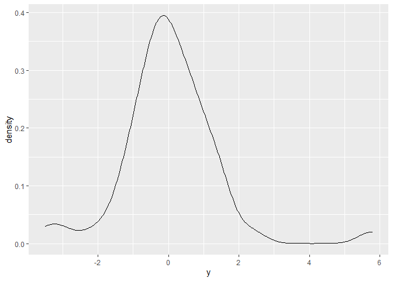
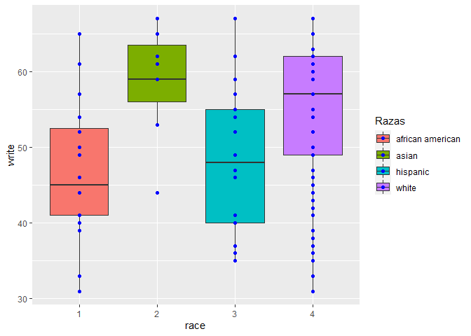
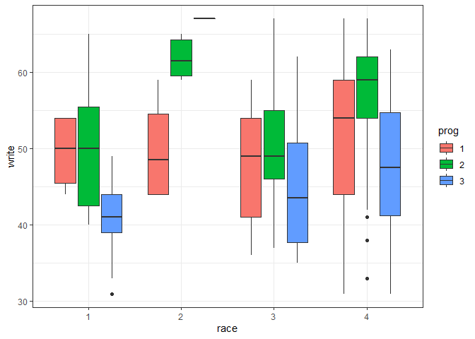

Pruebas de hipotesis
================

Para fines de esta práctica utilizaremos la base de datos siguiente,
carga en R:

``` r
hsb2 <- within(read.csv("https://stats.idre.ucla.edu/stat/data/hsb2.csv"), {
  race <- as.factor(race)
  schtyp <- as.factor(schtyp)
  prog <- as.factor(prog)
})
```

La base de datos llamada hsb2, es una base de datos de 200 observaciones
(filas) y 11 variables de estudio. Representa a una muestra aleatoria a
estudiantes de secundario de colegios, realizada por el centro nacional
de estadísticas para la educación (USA).

Las variables son las siguientes:

-   id: Identificación del alumno.
-   female: Genero del alumno (si es igual a 1 es female, si es igual a
    0, es male).
-   race: Raza del alumno (african american, asian, hispanic, and
    white).
-   ses: Nivel socioeconómico del alumno (low, middle, y high).
-   schtyp: Tipo de escuela (private o public).
-   prog: Tipo de programa (general, academic y vocational).
-   read: Notas de lectura.
-   write: Notas de escritura.
-   math: Notas de matemática.
-   science: Notas de ciencias.
-   socst: Notas de Sociales.

Activemos el paquete de tidyverse (activa en conjunto ggplot2 y dplyr al
mismo tiempo). Generalmente las pruebas de hipótesis se pueden realizar
con las pruebas básicas del paquete stats de R, salvo algunas
excepciones donde se detallará que paquete se necesita:

``` r
library(tidyverse)
```

    ## -- Attaching packages --------------------------------------- tidyverse 1.3.0 --

    ## v ggplot2 3.3.3     v purrr   0.3.4
    ## v tibble  3.1.2     v dplyr   1.0.5
    ## v tidyr   1.1.3     v stringr 1.4.0
    ## v readr   1.3.1     v forcats 0.5.0

    ## -- Conflicts ------------------------------------------ tidyverse_conflicts() --
    ## x dplyr::filter() masks stats::filter()
    ## x dplyr::lag()    masks stats::lag()

# 1. Pruebas paramétricas.

## A. Pruebas univariadas para la normalidad

### A.1. La prueba de Shapiro Wilk

Usualmente es usada para muestras pequeñas.Sin embargo, la extensión de
S-W realizada por Royston (1982) le permite ser usada hasta n = 2000
(esta versión es la que usamos en R).

Vamos a evaluar si es que la variable “notas de escritura” tiene o no
una distribución normal. Para ello, utilizamos la función
“shapiro.test()” del paquete “stats”. Antes de realizar la prueba,
recordar y revisar que nos dice la hipótesis nula y la hipótesis alterna
para la prueba de shapiro. Establezcan también el nivel de significancia
(en este caso tomaremos 5%, como es la costumbre). Los que hará la
función, es calcular el estadístico de la muestra obtenida y determinará
el valor de p-value.

``` r
shapiro.test(hsb2$write)
```

    ## 
    ##  Shapiro-Wilk normality test
    ## 
    ## data:  hsb2$write
    ## W = 0.94703, p-value = 9.867e-07

Obtenemos como resultado que el valor de p-valor (p-value) es menor a
0.05. Del resultado, rechazamos Ho, es decir, la variable nota de
escritura no sigue una distribución normal. Esto lo podemos complementar
graficando la distribución de las notas de escritura.

``` r
hsb2 %>% ggplot(aes(x=write))+
  geom_density()
```

<!-- -->

Podemos realizar el mismo ejercicio para las demás variables
(cuantitativas) de los datos de la muestra “hsb2”.

Para la variable notas de matemáticas:

``` r
shapiro.test(hsb2$math)
```

    ## 
    ##  Shapiro-Wilk normality test
    ## 
    ## data:  hsb2$math
    ## W = 0.97681, p-value = 0.002145

Aprovechamos para graficar su distribución:

``` r
hsb2 %>% ggplot(aes(x=math))+
  geom_density()
```

<!-- -->

A pesar de que la gráfica es tentativamente “mas similar” a una
distribución normal, la prueba de shapiro nos casa de dudas, ya que
rechazamos nuevamente Ho.

##### Haremos la prueba una vez mas para la variable notas de ciencias:

``` r
shapiro.test(hsb2$science)
```

    ## 
    ##  Shapiro-Wilk normality test
    ## 
    ## data:  hsb2$science
    ## W = 0.98525, p-value = 0.03478

``` r
hsb2 %>% ggplot(aes(x=science))+
  geom_density()
```

<!-- -->

Analice y exponga sus conclusiones.

##### Creamos una distribucion normal adrede para observar que pasaria. La llamaremos x:

``` r
x <- tibble(x = rnorm(120, mean = 51, sd =18))

shapiro.test(x$x)
```

    ## 
    ##  Shapiro-Wilk normality test
    ## 
    ## data:  x$x
    ## W = 0.99204, p-value = 0.7249

``` r
x %>% ggplot(aes(x=x))+
  geom_density()
```

<!-- -->

En este caso, la prueba de shapiro Wilk nos dio un p-value por encima de
0.05, lo cual indica que aceptamos Ho, y concluimos que la variable “x”
de la base de datos “x”, tiene una distribución normal.

### A.2 Prueba de kolmogorov-Smirnov-Lillefors - Paquete **nortest**

Esta variante de la prueba de kolmogorov-Smirnov mas robusta, la cual
ajusta la distribucion de los datos para la prueba a una distribución de
Lillefors. Para realizar una prueba de Kolmogorov-Smirnov, utilizaremos
la función **lillie.test()** del paquete de R **nortest**.

``` r
library(nortest)
```

Aplicamos la función tal cual la hemos aplicado en la funcion de
shapiro.test(), a continuación para la variable notas de escritura:

``` r
lillie.test(hsb2$write)
```

    ## 
    ##  Lilliefors (Kolmogorov-Smirnov) normality test
    ## 
    ## data:  hsb2$write
    ## D = 0.13433, p-value = 2.21e-09

-   Nota: El test K-S-L tiene un inconveniente, es muy sensible a las
    diferencias entre la muestra y la distribución teórica alrededor de
    sus valores medios, le cuesta detectar diferencias prominentes en un
    extremo y otro de la distribución. Ejemplo:

``` r
set.seed(100)
y <- rt(50,3)
lillie.test(y)
```

    ## 
    ##  Lilliefors (Kolmogorov-Smirnov) normality test
    ## 
    ## data:  y
    ## D = 0.10332, p-value = 0.2013

Si la gráficamos:

``` r
ggplot()+
  geom_density(aes(x=y))
```

<!-- -->

## B. Pruebas de homogeneidad de Varianzas

### B.1. Prueba de Levene

Para la prueba de Levene, necesitaremos un paquete especial, llamado
“car”, luego de instalarlo y activarlo, utilizaremos la función
“leveneTest()” del paquete. Para utilizar la función de leveneTest(),
tenemos 2 opciones, que nos van a dar el mismo resultado. Siempre el
segundo arumento va a corresponder a las categorias en las cuales vamos
a repartir al primer argumento que nosotros le brindemos. En la opción
1, va a tomar las notas de escritura y repartirlas en cuantos diferentes
valores encuentre en la cariable dos (female). En la opción 2, va a
pasar lo mismo, sin embargo, al utilizar la virgulitta (\~) estamos
indicando exactamente que la variable que vamos a utilizar para repartir
los datos de notas de escritura (write) van a ser dividios en todas las
categorias (factores en R) encontradas en la variable female. **Esto se
cumple solo para la función de leveneTest del paquete car**.

``` r
library(car)
```

    ## Loading required package: carData

    ## 
    ## Attaching package: 'car'

    ## The following object is masked from 'package:dplyr':
    ## 
    ##     recode

    ## The following object is masked from 'package:purrr':
    ## 
    ##     some

``` r
leveneTest(hsb2$write, hsb2$female) # Opción 1
```

    ## Warning in leveneTest.default(hsb2$write, hsb2$female): hsb2$female coerced to
    ## factor.

    ## Levene's Test for Homogeneity of Variance (center = median)
    ##        Df F value   Pr(>F)   
    ## group   1  9.6197 0.002206 **
    ##       198                    
    ## ---
    ## Signif. codes:  0 '***' 0.001 '**' 0.01 '*' 0.05 '.' 0.1 ' ' 1

``` r
leveneTest(hsb2$write ~ as.factor(hsb2$female)) # Opción 2
```

    ## Levene's Test for Homogeneity of Variance (center = median)
    ##        Df F value   Pr(>F)   
    ## group   1  9.6197 0.002206 **
    ##       198                    
    ## ---
    ## Signif. codes:  0 '***' 0.001 '**' 0.01 '*' 0.05 '.' 0.1 ' ' 1

Al igual que la prueba de Shapiro Wilk y como en otras pruebas que
veremos, concentremonos en interpretar el p-value y utilizarlo en
nuestro contrate de hipótesis. Acordemonos que: \* Ho: La varianza de
los grupos estudiados (write y math) nos son diferentes“. \* H1: por su
parte, nos dice que” la varianza de los grupos son diferentes".

El valor de p-value obtenido en la prueba de es 0.002206, el cual es
menor a nuestro nivel de significancia de 0.05 (nivel de confianza al
95%). De esto rechazamos la hipótesis nula. Es decir, que las varianzas
para las dos muestras aleatorias (las notas de escritura para las
mujeres y las notas de escritura para los hombres) analizadas son
diferentes.

## C. Prueba de hipotesis con una media poblacional (mu) para una variable

### C.1. Prueba de Z (varianza conocida)

En esta ocasión, es necesario utilizar el paquete “BSDA”, instalarlo y
activarlo. Utilizaremos la función z.test() del paquete BSDA.
Acordémonos que la estas pruebas se aplican a una sola variable. En este
caso la aplicaremos al la variable, notas de escritura (write). Acordase
que la prueba de Z, la utilizamos cuando conocemos la desviación
estándar poblacional (en este caso la asumiremos como 1, en el argumento
“sigma.x=”). De igual manera, en este ejemplo, estableceremos que la
hipótesis Ho como el valor de la media muestral igual a 53 (mu= 53),

Para este tipo de pruebas, no olvidar que tenemos que establecer
nuestras hipótesis, tenemos 3 opciones, que la media muestral es igual a
la poblacional, que es menor o que es mayor, esto también podemos
delimitarlo en la formula (esto lo haremos modificando el argumento
**alternative** = (“greater”, “less” or “two.sided”)).

``` r
library(BSDA)
```

    ## Loading required package: lattice

    ## 
    ## Attaching package: 'BSDA'

    ## The following objects are masked from 'package:carData':
    ## 
    ##     Vocab, Wool

    ## The following object is masked from 'package:datasets':
    ## 
    ##     Orange

``` r
z.test(hsb2$write,sigma.x = 1, mu = 53, alternative = "two.sided")
```

    ## 
    ##  One-sample z-Test
    ## 
    ## data:  hsb2$write
    ## z = -3.182, p-value = 0.001463
    ## alternative hypothesis: true mean is not equal to 53
    ## 95 percent confidence interval:
    ##  52.63641 52.91359
    ## sample estimates:
    ## mean of x 
    ##    52.775

Mayor información acerca de la función:
<https://www.rdocumentation.org/packages/BSDA/versions/1.2.0/topics/z.test>

Del resultado, obtenemos un p-value menor a 0.05 (si no determinamos el
nivel de confianza, este se asume como 95%,el nivel de confianza también
podemos modificarlo mediante el argumento, conf.level = (valores del 0
al 1)). Del resultado podemos concluir que rechazamos Ho, es decir que
la media poblacional no es igual a 53 (aceptamos la hipótesis alterna).
El resultado de la función “z.test()”, no solo nos brinda el p-valor,
sino que también ofrece el valor de la media poblacional y los
intervalos de confianza de la estimación. Aunque al rechazar la Ho,
estos ya pierden su utilidad para generar conclusiones. Nótese que si
los intervalos de confianza hubiesen contemplado el valor 53, hubiésemos
aceptado Ho.

### C.2. Prueba t de Student (varianza desconocida)

Seguimos evaluando la variable “notas de escritura”. Pero ahora
utilizaremos la t de Student (no conocemos la desviación estándar de la
población).

``` r
t.test(hsb2$write, mu = 53, alternative = "two.sided", conf.level = 0.95)
```

    ## 
    ##  One Sample t-test
    ## 
    ## data:  hsb2$write
    ## t = -0.3357, df = 199, p-value = 0.7374
    ## alternative hypothesis: true mean is not equal to 53
    ## 95 percent confidence interval:
    ##  51.45332 54.09668
    ## sample estimates:
    ## mean of x 
    ##    52.775

Al correr la prueba t de Student (con los mismo valores que la prueba de
Z anterior), podemos observar que en este caso, los intervalos de
confianza se ensanchan un poco mas. Lo cual nos permite aceptar Ho, es
decir, que la media muestral proviene de una población con un valor de
mu igual a 53 (esto se comprueba también con el p-value). Comparando
esta prueba con la prueba Z, podemos evidenciar que la segunda tiene
mayor precisión en el contraste de hipótesis (sin embargo, no siempre se
cuenta con el valor poblacional de la desviación estándar).

## D. Prueba t de Student para comparar dos medias de dos variables aleatorias independientes

Dejamos de realizar pruebas paramétricas para una sola variable, para
dedicarnos ahora al análisis de dos variables (independientes o
dependientes).

En este caso, utilizaremos la prueba t de Student para dos muestras
independientes (masculina y femenina). Los casos masculinos y femeninos
serán separados internamente por la función t.test(), establecer la
relación entre las variables “write” y “female”. En este caso estamos
separando los valores de “notas de escritura”, en dos grupos, los que
son femeninos y los que son masculinos. De estos dos grupos comparamos
sus medias, mediante:

``` r
t.test(hsb2$write ~ hsb2$female, paired = FALSE)
```

    ## 
    ##  Welch Two Sample t-test
    ## 
    ## data:  hsb2$write by hsb2$female
    ## t = -3.6564, df = 169.71, p-value = 0.0003409
    ## alternative hypothesis: true difference in means is not equal to 0
    ## 95 percent confidence interval:
    ##  -7.499159 -2.240734
    ## sample estimates:
    ## mean in group 0 mean in group 1 
    ##        50.12088        54.99083

Si usted tuviera por ejemplo las notas de escritura femenidas en una
sola variable (o vector) y las notas de escritura masculinas en otra
variable (o vector), entonces usted debe de utilizar la siguiente forma
(la base de datos no existe, es imaginaria):

``` r
# t.tes(hsb2$Notas.Femeninas, hsb2$NotasMasculinas, paired = FALSE)
```

En este caso particular, la unica diferencia es que se separará las
variables cuantitativas por una **“,”**. En el caso de separarlo por
grupos, siempre se usará para la función de t.test() la **“\~”**
(virgulilla). **ADVERTENCIA** esto no aplica para la función de
LeveneTest() del paquete **car**.

## E. Prueba t de Student para compara 2 medias poblacionales de dos muestras aleatorias relacionadas (o dependientes)

En este caso, utilizamos la misma función anterior. Sin embargo, dos
principales cambios se tiene que dar.

-   Las variables de estudio ahora provienen de dos muestras
    dependientes. Es decir, que comparten los mismos elementos
    observacionales (p.ej. las muestras seleccionadas contienen los
    mismos individuos (relacionada), ya no importa si son masculinos o
    femeninos, solo si son o no los mismos individuos). Bajo esta
    premisa, a la función original tendremos que suministrarle el
    argumente *paired* igual a verdadero (TRUE), el cual por defecto se
    encuentra siempre en falso (FALSE)

-   Al igual que el caso de las muestras indipendientes, podemos usar el
    simbolo **“\~”** si queremos relacionar una variable en razon a un
    grupo (**IMPORTANTE**: en caso de muestras dependientes, los dos
    grupos tienen que tener el mismo número de unidades ya que son los
    mismos individuos). Y también podemos utilizar **“,”** para brindar
    a la función t.test() de frente los vectores cuantitativos a
    comparar.

Teniendo en cuenta lo explicado, calculamos el p-valor, mediante el
siguiente código y luego lo interpreta (en este caso utilizaremos la
“,”):

``` r
t.test(hsb2$write, hsb2$read, paired = TRUE)
```

    ## 
    ##  Paired t-test
    ## 
    ## data:  hsb2$write and hsb2$read
    ## t = 0.86731, df = 199, p-value = 0.3868
    ## alternative hypothesis: true difference in means is not equal to 0
    ## 95 percent confidence interval:
    ##  -0.6941424  1.7841424
    ## sample estimates:
    ## mean of the differences 
    ##                   0.545

## F. ANOVA (Analisis de la Varianza)

### F.1 Los supuestos del ANOVA

Para la prueba del ANOVA (y otras pruebas paramétricas) debemos de
cumplir varios requisitos, dentro de ellos, los dos que debemos
verificar estadisticamente son la normalidad y la homogeneidad de
varianzas. Para la normalidad, debemos probar estadisticamente si
distribución de las *k* muestras siguen una distribución normal, esto
podemos realizarlo a través de la prueba de Shapiro Wilk para muestras,
que no es recomendable de usarlo para muestras mayores a 50 (en esos
casos podemos usar Kolgomorov Smirnov).Las funciones para la prueba de
shapiro, las hemos visto con anterioridad:

Para probar si existen o no homogeneidad de varianzas, podemos correr en
test de Barttlet para ANOVA de 1 vía o 1 factor. La prueba de Levene la
usaríamos para cuando hablamos de pruebas ANOVA de 2 vías o 2
factores.La prueba de Levene, se puede utilizar así mismo para pruebas
ANOVA de k factores. Así mismo, también nos permite elegir diferentes
estadístico de centralidad (por defecto elige la mediana, pero podemos
elegir la media o moda, dependiendo si sabemos si nuestras muestras de
estudio sean o no normales).

El test de Bartlett por su parte, es mas sensible (en comparación con el
de Levene) a los grupos que no presentan una distribución normal. Es
decir, que no es bueno usarlo cuando la normalidad no se cumple. Para
realizar la prueba de Barttlet, podemos utilizar la siguiente función:

En donde X es la variable de estudio y F, son los tratamientos de factor
de estudio. En caso de que queramos correr un test de Levene para un
ANOVA de 2 factores (o mas), usaremos las siguiente formula del paquete
**car**:

Donde X, es la variable de estudio, tanto **Y** como **Z** son los
factores (también podemos utilizarla de frente para ANOVA de *k*
factores). Esta función nos permite especificar la data de donde
provienen las variables de estudio (no necesitamos utilizar **$** para
ingresar a la variable).

### F.2 ANOVA de 1 factor

El anova se basa en la construcción de un modelo. En este sentido, este
es el primer modelo del curso de estadística aplicada que vamos a
utilizar. Para crear un modelo, debemos usar una función especifica de
ese modelo, para luego definir las variables de la ecuación. Para crear
un modelo ANOVA, utilizamos la función *aov()*. Esta función, espera que
nos brinden 2 variables (para el ANOVA de un factor), la variable
independiente y la dependiente. La variable independiente generalmente
va a corresponder a una variable categórica (nominal, ordinal o
discreta), y la variable dependiente es aquella que estamos evaluando en
razón a su respuesta a la variable independiente (cuantitativa
generalmente). De esta manera, para la base de datos **hsb2**
construimos un modelo ANOVA, para la variable dependiente **write** y la
variable independiente **race** de la siguiente manera:

``` r
Modelo.ANOVA <- aov(write~race, data =hsb2)
```

Luego, para obtener los resultados de la prueba de ANOVA, solo debemos
llamar al resumen (con función, **summary()**) del modelo que acabamos
de construir:

``` r
summary(Modelo.ANOVA)
```

    ##              Df Sum Sq Mean Sq F value   Pr(>F)    
    ## race          3   1914   638.1   7.833 5.78e-05 ***
    ## Residuals   196  15965    81.5                     
    ## ---
    ## Signif. codes:  0 '***' 0.001 '**' 0.01 '*' 0.05 '.' 0.1 ' ' 1

Del resultado identificaremos el p-valor y lo interpretaremos a través
del contraste de hipótesis de la prueba ANOVA. …..

El diagrama de cajas (Box Plot) es tipicamente utilizado para graficar
las diferencias que una prueba de ANOVA nos brinda. Esto lo podemos
realizar a través del paquete ggplot2, de la siguiente manera:

``` r
ggplot(data = hsb2, aes(x=race, y=write, fill = race),)+
  geom_boxplot()+
  geom_point(color = "blue")
```

<!-- -->

Algunas variaciones de nuestro gráfico, utilizando ggplot2:

``` r
ggplot(data = hsb2, aes(x=race, y=write, fill = race),)+
  geom_boxplot()+
  geom_point(color = "blue")+
  scale_fill_discrete(name = "Razas", labels = c("african american", "asian", "hispanic", "white"))
```

<!-- -->

Si gustas hacer modificaciones adicionales a la leyenda, revisar:
<https://www.datanovia.com/en/blog/ggplot-legend-title-position-and-labels/>.

### F.3 Prueba de Tukey para ANOVA de 1 factor

Del ejemplo anterior, podemos realizar una prueba de Tukey para
identificar las diferencias especificas entre cada uno de los
tratamientos en el estudio. Para ello realizamos la prueba de Tukey en
el modelo ANOVA ya creado con la función *TukeyHSD()*.

``` r
TukeyHSD(Modelo.ANOVA)
```

    ##   Tukey multiple comparisons of means
    ##     95% family-wise confidence level
    ## 
    ## Fit: aov(formula = write ~ race, data = hsb2)
    ## 
    ## $race
    ##          diff         lwr       upr     p adj
    ## 2-1 11.541667   3.0266241 20.056709 0.0030738
    ## 3-1  1.741667  -5.3387772  8.822111 0.9197990
    ## 4-1  7.596839   2.4432653 12.750413 0.0010226
    ## 3-2 -9.800000 -18.5785800 -1.021420 0.0219249
    ## 4-2 -3.944828 -11.2585205  3.368865 0.5023337
    ## 4-3  5.855172   0.2769254 11.433419 0.0355640

Una manera practica de plotear las diferencias es:

``` r
Prueba_tukey_C <- TukeyHSD(Modelo.ANOVA)
plot(Prueba_tukey_C, las = 1, col = "blue")
```

<!-- -->

**Desafió R.1**: Si queremos algo mucho mas avanzado y profesional para
graficar el test de Tukey, utilizaremos en paquete ggplot2, con la ayuda
de la siguiente pagina
<https://www.r-graph-gallery.com/84-tukey-test.html>.

Si gustan, también pueden basarse en otras paginas que tienen otra
manera de llegar a un resultado parecido al buscado (buscar dentro de
las paginas siguientes lo que se busca), estas son complementarias, si
buscan hacerlo de otra manera:

-   <https://biol607.github.io/lab/10_anova.html>
-   <https://rstudio-pubs-static.s3.amazonaws.com/47829_90657f52d9b7483b8ec502ef87f98dc9.html>
-   <https://stackoverflow.com/questions/18771516/is-there-a-function-to-add-aov-post-hoc-testing-results-to-ggplot2-boxplot>

Son libres de usar el Internet, google u otra fuente para encontrar
otras maneras de dibujar el desafió.

### F.3 ANOVA de 2 factores

``` r
Modelo.ANOVA.2 <- aov(write~race+prog, data =hsb2)

summary(Modelo.ANOVA.2)
```

    ##              Df Sum Sq Mean Sq F value   Pr(>F)    
    ## race          3   1914   638.1   9.331 8.60e-06 ***
    ## prog          2   2699  1349.6  19.738 1.58e-08 ***
    ## Residuals   194  13265    68.4                     
    ## ---
    ## Signif. codes:  0 '***' 0.001 '**' 0.01 '*' 0.05 '.' 0.1 ' ' 1

``` r
ggplot(aes(y=write, x=race, fill = prog), data = hsb2)+
  geom_boxplot()+
  theme_bw()
```

<!-- -->

Podemos correr un test de Tukey al modelo ANOVA de 2 factores o mas, de
la siguiente manera:

``` r
TukeyHSD(Modelo.ANOVA.2)
```

    ##   Tukey multiple comparisons of means
    ##     95% family-wise confidence level
    ## 
    ## Fit: aov(formula = write ~ race + prog, data = hsb2)
    ## 
    ## $race
    ##          diff         lwr       upr     p adj
    ## 2-1 11.541667   3.7391810 19.344152 0.0009747
    ## 3-1  1.741667  -4.7462706  8.229604 0.8986531
    ## 4-1  7.596839   2.8745274 12.319151 0.0002677
    ## 3-2 -9.800000 -17.8439697 -1.756030 0.0099080
    ## 4-2 -3.944828 -10.6464951  2.756840 0.4243034
    ## 4-3  5.855172   0.7437251 10.966620 0.0175914
    ## 
    ## $prog
    ##          diff        lwr        upr     p adj
    ## 2-1  5.020924   1.541111  8.5007374 0.0022873
    ## 3-1 -3.557376  -7.570493  0.4557404 0.0937925
    ## 3-2 -8.578300 -11.934111 -5.2224898 0.0000000

Se visualiza que nos dará el test de cada variable de manera individual
para cada factor de estudio.

Desafió R.2: Realizar la prueba de ANOVA de 2 factores, considerando la
interactivo entre factores. Realizar la prueba, las gráficas de boxplot
y prueba de tukey. Para generar un modelo de interacción, tenemos que
multiplicar las variables que representan a los factores en la
construcción del modelo, no sumarlas.

# 2. Pruebas NO paramétricas

Sabemos que estas pruebas pueden ser aplicadas a una gran variedad de
situaciones, ya que no requieren premisas o supuestos estrictos acerca
de la población de estudio (generalmente no nos exige que la población
tenga una distribución normal). Así mismo, pueden ser aplicadas a
variables de tipo cualitativas (sean nominales o ordinales).

## A. Pruebas para una sola muestra (o variable)

En este caso, una muestra aleatoria es tomada de la población y probamos
si se cumple, para la muestra que estamos realizando, una determinada
característica o distribución

### A.1. Prueba Binomial

Es aplicado cuando la variable de interés es de tipo binaria o
dicotómica (éxito o fracaso). En el caso de la base de datos hsb2, vamos
a poner a prueba si es que la proporción de estudiantes del genero
femenino es igual a 0.5 (
*H*<sub>0</sub>
). Acordarse que la variable female son 0 y 1. Para que la función de
**prop.test()**, que es la prueba binomial funcione, el tipo de variable
debe ser entero (no categórico, ni factor). La función **prop.test()**
nos pedirá como mínimo en su función el numero de eventos exitosos de la
muestra, la longitud de la muestra y el valor de *p* que queramos
contrastar. La prueba binomial ser corre entonces de la siguiente
manera:

``` r
prop.test(sum(hsb2$female), length(hsb2$female), p = 0.5)
```

    ## 
    ##  1-sample proportions test with continuity correction
    ## 
    ## data:  sum(hsb2$female) out of length(hsb2$female), null probability 0.5
    ## X-squared = 1.445, df = 1, p-value = 0.2293
    ## alternative hypothesis: true p is not equal to 0.5
    ## 95 percent confidence interval:
    ##  0.4733037 0.6149394
    ## sample estimates:
    ##     p 
    ## 0.545

Podemos observar que la prueba binomial nos permite determinar con un
nivel de confianza al 95% si la proporción poblacional de estudiantes de
genero femenino es igual o diferente de 0.5. Al igual que las demás
funciones de R que hemos observado con anterioridad para las pruebas
paramétricas, para la función prop.test() también podemos cambiar el
contraste de hipótesis de bilateral a que probemos si es mayor o menor
que la proporción elegida. Esto lo realizaremos con el argumento
**alternative**. Ejemplo, si nuestra hipotesiss alterna:

-   
    *H*<sub>1</sub>
    es igual a que el valor de la proporción poblacional es mayor a 0.5:

``` r
prop.test(sum(hsb2$female), length(hsb2$female), p = 0.5, alternative = "greater")
```

    ## 
    ##  1-sample proportions test with continuity correction
    ## 
    ## data:  sum(hsb2$female) out of length(hsb2$female), null probability 0.5
    ## X-squared = 1.445, df = 1, p-value = 0.1147
    ## alternative hypothesis: true p is greater than 0.5
    ## 95 percent confidence interval:
    ##  0.484374 1.000000
    ## sample estimates:
    ##     p 
    ## 0.545

Analice los resultados.

### A.2. Prueba de Chi cuadrado para una sola muestra (o variable)

Esta prueba en especial es una extensión de la prueba binomial y es
también aplicada a una sola variable. Al contrario de la binomial, puede
aceptar mas de dos valores cualitativos (nominal o ordinal).La prueba
compara las frecuencias observadas versus las frecuencias esperadas para
cada categoría.

Recordemos que la hipótesis alterna de esta prueba nos dice:

-   
    *H*<sub>1</sub>:
    Hay diferencia significativa entre las frecuencias observadas y las
    esperadas.

Para este caso utilizaremos la función **chisq.test()**, la cual espera
un tabla de frecuencias y las proporciones esperadas (contrastadas), las
cuales las define el investigador. Para realizar una tabla de
frecuencias rápida, utilizaremos siempre la función **table()**,
asignándole la variable de estudio especifica. Antes de hacer la prueba
de chi cuadrado para una sola muestra, haremos uso de la función
**table()** para la variable raza de la base de datos hsb2:

``` r
table(hsb2$race)
```

    ## 
    ##   1   2   3   4 
    ##  24  11  20 145

Se observa que nos ha brindado una tabla de frecuencias básica, contando
el numero de individuos para la raza 1 (african american), 2 (asian), 3
(hispanic) y 4 (white). Ahora que sabemos como funciona table (la cual
utilizaremos en varias funciones mas en el futuro), corremos el test de
chi cuadrado para una muestra con la función **chisq.test()**:

``` r
chisq.test(table(hsb2$race), p = c(10, 10, 10, 70)/100)
```

    ## 
    ##  Chi-squared test for given probabilities
    ## 
    ## data:  table(hsb2$race)
    ## X-squared = 5.0286, df = 3, p-value = 0.1697

En el caso de la prueba de chi cuadrado para una sola muestra, solo
podemos contratarla para la prueba de hipótesis única que se ha
establecido. Es decir, solo nos asegura si es que existe o no
diferencias entre lo observado y lo esperado.

## B. Pruebas para 2 muestras dependientes (dos variables dependientes).

### B.1. Prueba de McNemar

Para fines de este curso y en relación con su carrera, este test no lo
vamos a ver mucho, les dejo la función por si realizan en el futuro un
estudio en el que puedan implementar esta prueba no paramétrica.

``` r
# mcnemar.test(X)
```

Donde **X** espera una matriz del experimento realizado.

## C. Pruebas para 2 muestras independientes (dos variables independientes)

En estos test, intentamos comparar 2 variables de 2 poblaciones
distintas representadas por sus muestras respectivas.A diferencia de las
pruebas dependientes, aquí las muestras no tienen necesariamente el
mismo tamaño.

### C.1. Prueba de chi cuadrado de independencia

Aplicamos la prueba de chi cuadrado para una sola muestra, el donde la
variable de estudio era cualitativa. Aquí utilizaremos la prueba para
dos muestras independientes (también cualitativas). Esto lo realizamos
para comprobar si existe o no alguna asociación significativa entre dos
variables cualitativas.El test compara las frecuencias observadas en
cada una de las celdas de una tabla de contingencia con las frecuencias
esperadas, siendo su hipotesis alterna:

-   
    *H*<sub>1</sub>:
    Hay diferencias significativas entre las frecuencias observadas y
    esperadas.

Siguiendo el trabajo con nuestra base de datos **hsb2** vamos a comparar
precisamente dos muestras independientes (o dos variables que provienen
de 2 muestras independientes). En este caso en particular, compararemos
si existe asociación entre las variable de genero (**female:** femenino
o masculino) y el tipo de escuela (**schtyp:** publica o privada). Para
ello, utilizaremos nuevamente la función **chisq.test**, sin embargo en
este caso, solo debemos brindarle la tabla de frecuencias de doble
entrada (2 variables). La función, calculará automáticamente las
frecuencias esperadas, obteniendo el estadístico y el calculo de
p-valor:

``` r
chisq.test(table(hsb2$female, hsb2$schtyp))
```

    ## 
    ##  Pearson's Chi-squared test with Yates' continuity correction
    ## 
    ## data:  table(hsb2$female, hsb2$schtyp)
    ## X-squared = 0.00054009, df = 1, p-value = 0.9815

A partir de los resultados, podemos analizar el p-valor en base a las
hipótesis establecidas para este test. Analice y discuta en clase.

### C.2. Prueba de Wilcoxon-Mann-Whitney

El es test mas poderoso de todas las pruebas NO paramétricas, aplicado
para variables cuantitativas o cualitativas (ordinales). Tiene el
objetivo de verificar si dos muestras independientes son tomadas de la
misma población. Es la alternativa a la prueba t de Student, cuando la
normalidad no se cumple o la muestra es muy pequeña. Cuando usamos data
de tipo cuantitativas, debemos transformarla, perdiendo información en
el proceso. Para probar si dos muestras provienen de la misma población,
la prueba de Wilcoxon-Mann-Whitney tiene como hipotesis alterna:

-   
    *H*<sub>1</sub>:
    que las medias de las dos muestras son diferentes.

De cuerdo a lo explicado, tenemos entonces que para nuestra base de
datos **hsb2**, probaremos si las muestras de alumnos del genero
masculino y femenino (nuestras dos muestras), provienen o no de la misma
población. Para ello utilizaremos la variable de estudio (cuantitativa),
notas de escritura (**write**). Para probar esto con el test de
Wilcoxon-Mann-Whitney, utilizaremos la función **wilcox.test()**, la
cual espera que le brindemos la variable cuantitativa y la dividamos a
razón de la variable cualitativa (que divide a los dos grupos de
estudio). Esto lo realizaremos de la siguiente manera:

``` r
wilcox.test(hsb2$write ~ hsb2$female)
```

    ## 
    ##  Wilcoxon rank sum test with continuity correction
    ## 
    ## data:  hsb2$write by hsb2$female
    ## W = 3606, p-value = 0.0008749
    ## alternative hypothesis: true location shift is not equal to 0

Analizar en clase el test y concluir.

## D. Pruebas para *k* muestras dependientes (*k* variables dependientes)

Estos test analizan las diferencias entre k muestras relacionadas.

### D.1. Prueba de Cochran (Q)

-   No realizaremos la prueba de Cochran para este curso. Sin embargo,
    si esta interesado es conocer como pueden realizarla en R, revisar
    el siguiente enlace: <https://rpubs.com/Joaquin_AR/220579>

### D.2. Prueba de Friedman

Es aplicado a variables de tipo cualitativa (ordinal) y cuantitativa.
Tiene como objetivo de verificar si es que k muestras dependientes son
sacadas de una misma población. **Es una alternativa al ANOVA de
muestras dependientes** cuando la normalidad y homogeneidad de varianzas
no se cumplen o las muestras son muy pequeñas.

Para este caso, la base de datos hsb2 no esta diseñada para este tipo de
analisis, ya que no contiene muestras dependientes entre los grupos.

Evalué y concluya en clase.

## E. Pruebas para *k* muestras independientes (*k* variables independientes)

Estos test analizan las diferencias entre k muestras independientes. La
hipótesis nula:

-   
    *H*<sub>0</sub>:
    a ser probada intenta demostrar que las k muestras independientes
    han sido tomadas de la misma población (para muestras
    independientes).

### E.1. Prueba de chi cuadrado para *k* muestras independientes

No la veremos desde R. Principalmente utilizaremos la siguiente técnica
para evidenciar diferencia entre *k* muestras independientes (Kruskall
Wallis).

### E.2. Prueba de Kruskall Wallis

Busca verificar si k muestras independientes (k &gt; 2) provienen de la
misma población. Es una alternativa al ANOVA para muestras
independientes. Para el valor de K = 2, Kruskal Wallis es equivalente al
test de Wilconxon-Mann-Whitney. Comparte las mismas hipótesis que la
prueba de ANOVA (aunque se llega a rechazar o aceptar las mismas,
calculando diferentes estadísticos de contraste).

De nuestra base de datos **hsb2**, queremos probar si existen
diferencias significativas entre los estudiantes en razón al tipo de
programa que están tomando (**prog**, tipo de programa: general,
academic y vocational). Demostraremos esto a razón de la variable
cuantitativa “notas de escritura” (**write**). Para este objetivo,
utilizaremos la función **Kruskal.test()**. Esta función nos pedirá que
le entreguemos las dos variables de estudio (una cuantitativa y otra
cualitativa (con diferentes niveles)). Se realizara la prueba de Kruskal
Wallis de la siguiente manera:

``` r
kruskal.test(hsb2$write, hsb2$prog)
```

    ## 
    ##  Kruskal-Wallis rank sum test
    ## 
    ## data:  hsb2$write and hsb2$prog
    ## Kruskal-Wallis chi-squared = 34.045, df = 2, p-value = 4.047e-08

Evaluar y concluir.

# EXTRA:

Actualmente hay una serie de videos de una profesora relacionados (los
ultimos de ellos) con ANOVA en R. Algunos de ellos, se dejan en el
siguiente link, pero se aconseja revisar su canal:

-   <https://www.youtube.com/watch?v=Pc1RVwEIT5k&t=4s>
-   <https://www.youtube.com/watch?v=NoRmd0HVgDg&t=406s>
