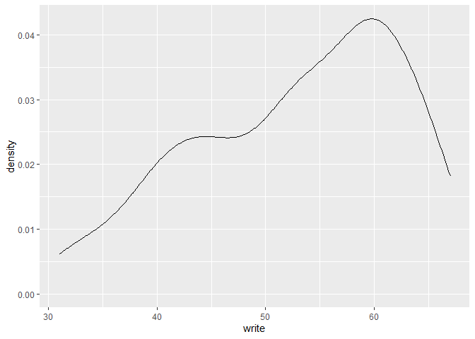
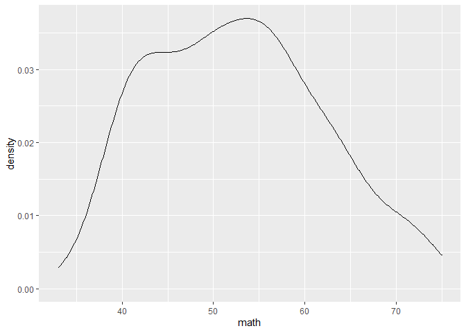
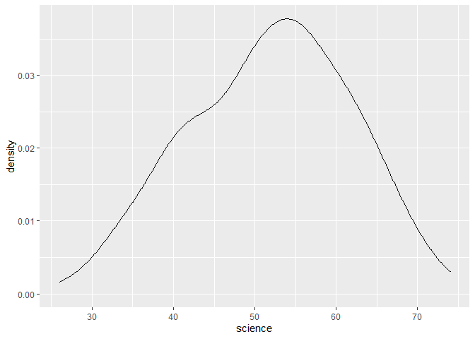
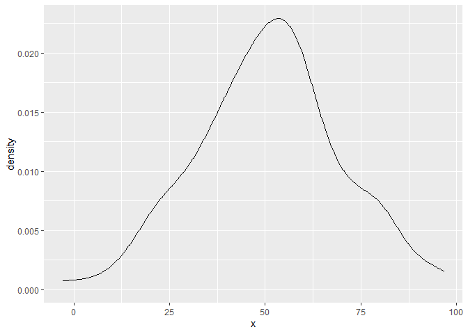
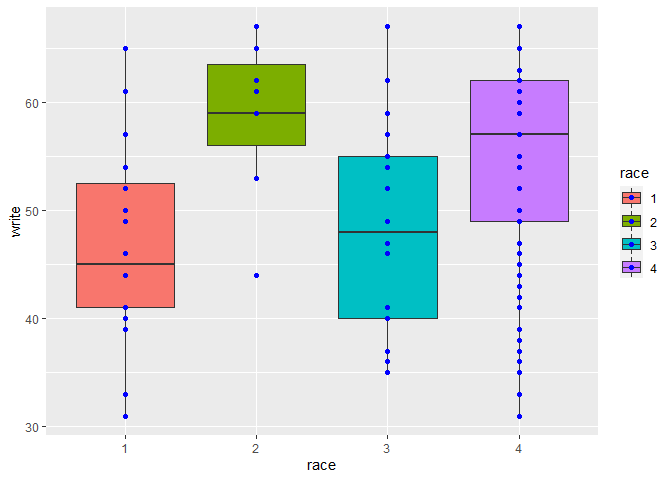
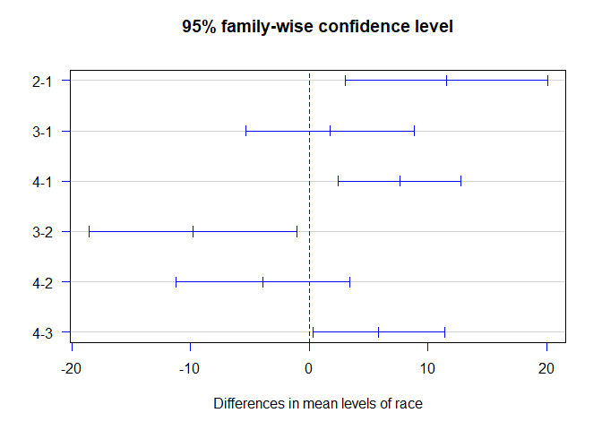
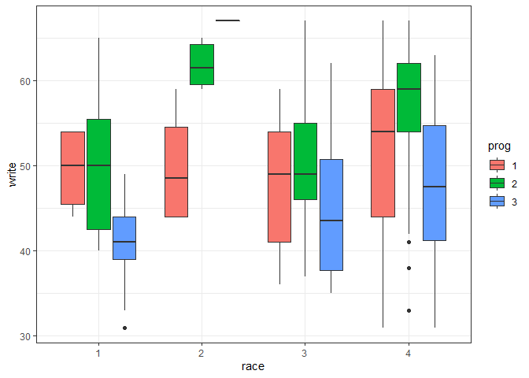

5. Pruebas de hipotesis
================

Para fines de esta práctica utilizaremos la base de datos siguiente,
carga en R:

``` r
hsb2 <- within(read.csv("https://stats.idre.ucla.edu/stat/data/hsb2.csv"), {
  race <- as.factor(race)
  schtyp <- as.factor(schtyp)
  prog <- as.factor(prog)
  female <- as.factor(female)
  ses <- as.factor(ses)
})
```

La base de datos llamada hsb2, es una base de datos de 200 observaciones
(filas) y 11 variables de estudio. Representa a una muestra aleatoria a
estudiantes de secundario de colegios, realizada por el centro nacional
de estadísticas para la educación (USA).

Las variables son las siguientes:

-   id: Identificación del alumno.
-   female: Genero del alumno (si es igual a 1 es female, si es igual a
    0, es male).
-   race: Raza del alumno (african american, asian, hispanic, and
    white).
-   ses: Nivel socioeconómico del alumno (low, middle, y high).
-   schtyp: Tipo de escuela (private o public).
-   prog: Tipo de programa (general, academic y vocational).
-   read: Notas de lectura.
-   write: Notas de escritura.
-   math: Notas de matemática.
-   science: Notas de ciencias.
-   socst: Notas de Sociales.

Activemos el paquete de tidyverse (activa en conjunto ggplot2 y dplyr al
mismo tiempo). Generalmente las pruebas de hipótesis se pueden realizar
con las pruebas básicas del paquete stats de R, salvo algunas
excepciones donde se detallará que paquete se necesita:

``` r
library(tidyverse)
```

    ## Warning: package 'tidyverse' was built under R version 4.0.3

    ## -- Attaching packages ----------------------------------------------------------------------------- tidyverse 1.3.0 --

    ## v ggplot2 3.3.3     v purrr   0.3.4
    ## v tibble  3.0.0     v dplyr   1.0.3
    ## v tidyr   1.0.2     v stringr 1.4.0
    ## v readr   1.3.1     v forcats 0.5.0

    ## Warning: package 'ggplot2' was built under R version 4.0.3

    ## Warning: package 'dplyr' was built under R version 4.0.3

    ## -- Conflicts -------------------------------------------------------------------------------- tidyverse_conflicts() --
    ## x dplyr::filter() masks stats::filter()
    ## x dplyr::lag()    masks stats::lag()

# 1. Pruebas paramétricas.

## A. Pruebas univariadas para la normalidad

### A.1. La prueba de Shapiro Wilk

Vamos a evaluar si es que la variable “notas de escritura” tiene o no
una distribución normal. Para ello, utilizamos la función
“shapiro.test()” del paquete “stats”. Antes de realizar la prueba,
recordar y revisar que nos dice la hipótesis nula y la hipótesis alterna
para la prueba de shapiro. Establezcan también el nivel de significancia
(en este caso tomaremos 5%, como es la costumbre). Los que hará la
función, es calcular el estadístico de la muestra obtenida y determinará
el valor de p-value.

``` r
shapiro.test(hsb2$write)
```

    ## 
    ##  Shapiro-Wilk normality test
    ## 
    ## data:  hsb2$write
    ## W = 0.94703, p-value = 9.867e-07

Obtenemos como resultado que el valor de p-valor (p-value) es menor a
0.05. Del resultado, rechazamos Ho, es decir, la variable nota de
escritura no sigue una distribución normal. Esto lo podemos complementar
graficando la distribución de las notas de escritura.

``` r
hsb2 %>% ggplot(aes(x=write))+
  geom_density()
```

<!-- -->

Podemos realizar el mismo ejercicio para las demás variables
(cuantitativas) de los datos de la muestra “hsb2”.

Para la variable notas de matemáticas:

``` r
shapiro.test(hsb2$math)
```

    ## 
    ##  Shapiro-Wilk normality test
    ## 
    ## data:  hsb2$math
    ## W = 0.97681, p-value = 0.002145

Aprovechamos para graficar su distribución:

``` r
hsb2 %>% ggplot(aes(x=math))+
  geom_density()
```

<!-- -->

A pesar de que la gráfica es tentativamente “mas similar” a una
distribución normal, la prueba de shapiro nos casa de dudas, ya que
rechazamos nuevamente Ho.

##### Haremos la prueba una vez mas para la variable notas de ciencias:

``` r
shapiro.test(hsb2$science)
```

    ## 
    ##  Shapiro-Wilk normality test
    ## 
    ## data:  hsb2$science
    ## W = 0.98525, p-value = 0.03478

``` r
hsb2 %>% ggplot(aes(x=science))+
  geom_density()
```

<!-- -->
Analice y exponga sus conclusiones.

##### Creamos una distribucion normal adrede para observar que pasaria. La llamaremos x:

``` r
x <- tibble(x = rnorm(120, mean = 51, sd =18))

shapiro.test(x$x)
```

    ## 
    ##  Shapiro-Wilk normality test
    ## 
    ## data:  x$x
    ## W = 0.98741, p-value = 0.3337

``` r
x %>% ggplot(aes(x=x))+
  geom_density()
```

<!-- -->

En este caso, la prueba de shapiro Wilk nos dio un p-value por encima de
0.05, lo cual indica que aceptamos Ho, y concluimos que la variable “x”
de la base de datos “x”, tiene una distribución normal.

## B. Pruebas de homogeneidad de Varianzas

### B.1. Prueba de Levene

Para la prueba de Levene, necesitaremos un paquete especial, llamado
“car”, luego de instalarlo y activarlo, utilizaremos la función
“leveneTest()” del paquete:

``` r
library(car)
```

    ## Loading required package: carData

    ## 
    ## Attaching package: 'car'

    ## The following object is masked from 'package:dplyr':
    ## 
    ##     recode

    ## The following object is masked from 'package:purrr':
    ## 
    ##     some

``` r
leveneTest(hsb2$write, hsb2$math)
```

    ## Warning in leveneTest.default(hsb2$write, hsb2$math): hsb2$math coerced to
    ## factor.

    ## Levene's Test for Homogeneity of Variance (center = median)
    ##        Df F value Pr(>F)
    ## group  39  1.0873 0.3503
    ##       160

Al igual que la prueba de Shapiro Wilk y como en otras pruebas que
veremos, concentremonos en interpretar el p-value y utilizarlo en
nuestro contrate de hipótesis. Acordemonos que la Ho de la prueba de
Levene nos dice “que la varianza de los grupos estudiados (write y math)
nos son diferentes”. La H1 por su parte, nos dice que " la varianza de
los grupos son diferentes". El valor de p-value obtenido en la prueba de
es 0.35, el cual es mayor nuestro nivel de significancia de 0.05 (nivel
de confianza al 95%). De esto concluimos que aceptamos la hipótesis nula
o rechazamos la hipótesis alterna. Es decir, que las varianzas para las
dos muestras aleatorias analizadas no son diferentes.

## C. Prueba de hipotesis con una media poblacional (mu) para una variable

### C.1. Prueba de Z (varianza conocida)

En esta ocasión, es necesario utilizar el paquete “BSDA”, instalarlo y
activarlo. Utilizaremos la función z.test() del paquete BSDA.
Acordémonos que la estas pruebas se aplican a una sola variable. En este
caso la aplicaremos al la variable, notas de escritura (write). Acordase
que la prueba de Z, la utilizamos cuando conocemos la desviación
estándar poblacional (en este caso la asumiremos como 1, en el argumento
“sigma.x=”). De igual manera, en este ejemplo, estableceremos que la
hipótesis Ho como el valor de la media muestral igual a 53 (mu= 53),

Para este tipo de pruebas, no olvidar que tenemos que establecer
nuestras hipótesis, tenemos 3 opciones, que la media muestral es igual a
la poblacional, que es menor o que es mayor, esto también podemos
delimitarlo en la formula (esto lo haremos modificando el argumento
**alternative** = (“greater”, “less” or “two.sided”)).

``` r
library(BSDA)
```

    ## Warning: package 'BSDA' was built under R version 4.0.3

    ## Loading required package: lattice

    ## 
    ## Attaching package: 'BSDA'

    ## The following objects are masked from 'package:carData':
    ## 
    ##     Vocab, Wool

    ## The following object is masked from 'package:datasets':
    ## 
    ##     Orange

``` r
z.test(hsb2$write,sigma.x = 1, mu = 53, alternative = "two.sided")
```

    ## 
    ##  One-sample z-Test
    ## 
    ## data:  hsb2$write
    ## z = -3.182, p-value = 0.001463
    ## alternative hypothesis: true mean is not equal to 53
    ## 95 percent confidence interval:
    ##  52.63641 52.91359
    ## sample estimates:
    ## mean of x 
    ##    52.775

Mayor información acerca de la función:
<https://www.rdocumentation.org/packages/BSDA/versions/1.2.0/topics/z.test>

Del resultado, obtenemos un p-value menor a 0.05 (si no determinamos el
nivel de confianza, este se asume como 95%,el nivel de confianza también
podemos modificarlo mediante el argumento, conf.level = (valores del 0
al 1)). Del resultado podemos concluir que rechazamos Ho, es decir que
la media poblacional no es igual a 53 (aceptamos la hipótesis alterna).
El resultado de la función “z.test()”, no solo nos brinda el p-valor,
sino que también ofrece el valor de la media poblacional y los
intervalos de confianza de la estimación. Aunque al rechazar la Ho,
estos ya pierden su utilidad para generar conclusiones. Nótese que si
los intervalos de confianza hubiesen contemplado el valor 53, hubiésemos
aceptado Ho.

### C.2. Prueba t de Student (varianza desconocida)

Seguimos evaluando la variable “notas de escritura”. Pero ahora
utilizaremos la t de Student (no conocemos la desviación estándar de la
población).

``` r
t.test(hsb2$write, mu = 53, alternative = "two.sided", conf.level = 0.95)
```

    ## 
    ##  One Sample t-test
    ## 
    ## data:  hsb2$write
    ## t = -0.3357, df = 199, p-value = 0.7374
    ## alternative hypothesis: true mean is not equal to 53
    ## 95 percent confidence interval:
    ##  51.45332 54.09668
    ## sample estimates:
    ## mean of x 
    ##    52.775

Al correr la prueba t de Student (con los mismo valores que la prueba de
Z anterior), podemos observar que en este caso, los intervalos de
confianza se ensanchan un poco mas. Lo cual nos permite aceptar Ho, es
decir, que la media muestral proviene de una población con un valor de
mu igual a 53 (esto se comprueba también con el p-value). Comparando
esta prueba con la prueba Z, podemos evidenciar que la segunda tiene
mayor precisión en el contraste te hipótesis (sin embargo, no siempre se
cuenta con el valor poblacional de la desviación estándar).

## D. Prueba t de Student para comparar dos medias de dos variables aleatorias independientes

Dejamos de realizar pruebas paramétricas para una sola variable, para
dedicarnos ahora al análisis de dos variables (pertenezcan a una
población o sean independientes). En este caso, utilizaremos la prueba t
de Student para dos poblaciones de independientes (masculina y
femenina). Los casos masculinos y femeninos serán separados internamente
por la función t.test(), establecer la relación entre las variables
“write” y “female”. En este caso estamos separando los valores de “notas
de escritura”, en dos grupos, los que son femeninos y los que son
masculinos. De estos dos grupos comparamos sus medias, mediante:

``` r
t.test(hsb2$write ~ hsb2$female )
```

    ## 
    ##  Welch Two Sample t-test
    ## 
    ## data:  hsb2$write by hsb2$female
    ## t = -3.6564, df = 169.71, p-value = 0.0003409
    ## alternative hypothesis: true difference in means is not equal to 0
    ## 95 percent confidence interval:
    ##  -7.499159 -2.240734
    ## sample estimates:
    ## mean in group 0 mean in group 1 
    ##        50.12088        54.99083

## E. Prueba t de Student para compara 2 medias poblacionales de dos muestras aleatorias relacionadas

En este caso, utilizamos la misma función anterior. Sin embargo, dos
principales cambios se tiene que dar.

-   Las variables de estudio ahora son dos poblaciones relacionadas. Es
    decir, que comparten los mismos elementos observacionales (p.ej.
    estas dos prueba tienen todos los alumnos del genero masculino y
    todas las alumnas del genero femenino). Bajo esta premisa, a la
    función original tendremos que suministrarle el argumente *paired*
    igual a verdadero (TRUE), el cual por defecto se encuentra en falso
    (FALSE)
-   De los explicado, ya no vamos a brindarle a la función una relación
    entre variables (\~), sino que establecemos dos variables de la data
    que queramos comparar.

Teniendo en cuenta lo explicad, calculamos el p-valor, mediante el
siguiente código:

``` r
t.test(hsb2$write, hsb2$read, paired = TRUE)
```

    ## 
    ##  Paired t-test
    ## 
    ## data:  hsb2$write and hsb2$read
    ## t = 0.86731, df = 199, p-value = 0.3868
    ## alternative hypothesis: true difference in means is not equal to 0
    ## 95 percent confidence interval:
    ##  -0.6941424  1.7841424
    ## sample estimates:
    ## mean of the differences 
    ##                   0.545

## F. ANOVA (Analisis de la Varianza)

### F.1 Los supuestos del ANOVA

Para la prueba del ANOVA (y otras pruebas paramétricas) debemos de
cumplir varios requisitos, dentro de ellos, los dos que debemos
verificar estadisticamente son la normalidad y la homogeneidad de
varianzas. Para la normalidad, debemos probar estadisticamente si
distribución de las *k* muestras siguen una distribución normal, esto
podemos realizarlo a través de la prueba de Shapiro Wilk para muestras,
que no es recomendable de usarlo para muestras mayores a 50 (en esos
casos podemos usar Kolgomorov Smirnov).Las funciones para la prueba de
shapiro, las hemos visto con anterioridad:

Para probar si existen o no homogeneidad de varianzas, podemos correr en
test de Barttlet para ANOVA de 1 vía o 1 factor. La prueba de Levene la
usaríamos para cuando hablamos de pruebas ANOVA de 2 vías o 2
factores.La prueba de Levene, se puede utilizar así mismo para pruebas
ANOVA de k factores. Así mismo, también nos permite elegir diferentes
estadístico de centralidad (por defecto elige la mediana, pero podemos
elegir la media o moda, dependiendo si sabemos si nuestras muestras de
estudio sean o no normales).

El test de Bartlett por su parte, es mas sensible (en comparación con el
de Levene) a los grupos que no presentan una distribución normal. Es
decir, que no es bueno usarlo cuando la normalidad no se cumple. Para
realizar la prueba de Barttlet, podemos utilizar la siguiente función:

En donde X es la variable de estudio y F, son los tratamientos de factor
de estudio. En caso de que queramos correr un test de Levene para un
ANOVA de 2 factores (o mas), usaremos las siguiente formula del paquete
**car**:

Donde X, es la variable de estudio, tanto **Y** como **Z** son los
factores (también podemos utilizarla de frente para ANOVA de *k*
factores). Esta función nos permite especificar la data de donde
provienen las variables de estudio (no necesitamos utilizar **$** para
ingresar a la variable).

### F.2 ANOVA de 1 factor

El anova se basa en la construcción de un modelo. En este sentido, este
es el primer modelo del curso de estadística aplicada que vamos a
utilizar. Para crear un modelo, debemos usar una función especifica de
ese modelo, para luego definir las variables de la ecuación. Para crear
un modelo ANOVA, utilizamos la función *aov()*. Esta función, espera que
nos brinden 2 variables (para el ANOVA de un factor), la variable
independiente y la dependiente. La variable independiente generalmente
va a corresponder a una variable categórica (nominal, ordinal o
discreta), y la variable dependiente es aquella que estamos evaluando en
razón a su respuesta a la variable independiente. De esta manera, para
la base de datos \*\* \*\* construimos un modelo anova, para la variable
dependiente \*\* \*\* y la variable independiente \*\* \*\* de la
siguiente manera:

``` r
Modelo.ANOVA <- aov(write~race, data =hsb2)
```

Luego, para obtener los resultados de la prueba de ANOVA, solo debemos
llamar al resumen (con función, **summary()**) del modelo que acabamos
de construir:

``` r
summary(Modelo.ANOVA)
```

    ##              Df Sum Sq Mean Sq F value   Pr(>F)    
    ## race          3   1914   638.1   7.833 5.78e-05 ***
    ## Residuals   196  15965    81.5                     
    ## ---
    ## Signif. codes:  0 '***' 0.001 '**' 0.01 '*' 0.05 '.' 0.1 ' ' 1

Del resultado identificaremos el p-valor y lo interpretaremos a través
del contraste de hipótesis de la prueba ANOVA. …..

El diagrama de cajas (Box Plot) es tipicamente utilizado para graficar
las diferencias que una prueba de ANOVA nos brinda. Esto lo podemos
realizar a través del paquete ggplot2, de la siguiente manera:

``` r
ggplot(data = hsb2, aes(x=race, y=write, fill = race),)+
  geom_boxplot()+
  geom_point(color = "blue")
```

<!-- -->
Algunas variaciones de nuestro gráfico, utilizando ggplot2:

``` r
ggplot(data = hsb2, aes(x=race, y=write, fill = race),)+
  geom_boxplot()+
  geom_point(color = "blue")+
  scale_fill_discrete(name = "Razas", labels = c("african american", "asian", "hispanic", "white"))
```

<!-- -->
Si gustas hacer modificaciones adicionales a la leyenda, revisar:
<https://www.datanovia.com/en/blog/ggplot-legend-title-position-and-labels/>.

### F.3 Prueba de Tukey para ANOVA de 1 factor

Del ejemplo anterior, podemos realizar una prueba de Tukey para
identificar las diferencias especificas entre cada uno de los
tratamientos en el estudio. Para ello realizamos la prueba de Tukey en
el modelo ANOVA ya creado con la función *TukeyHSD()*.

``` r
TukeyHSD(Modelo.ANOVA)
```

    ##   Tukey multiple comparisons of means
    ##     95% family-wise confidence level
    ## 
    ## Fit: aov(formula = write ~ race, data = hsb2)
    ## 
    ## $race
    ##          diff         lwr       upr     p adj
    ## 2-1 11.541667   3.0266241 20.056709 0.0030738
    ## 3-1  1.741667  -5.3387772  8.822111 0.9197990
    ## 4-1  7.596839   2.4432653 12.750413 0.0010226
    ## 3-2 -9.800000 -18.5785800 -1.021420 0.0219249
    ## 4-2 -3.944828 -11.2585205  3.368865 0.5023337
    ## 4-3  5.855172   0.2769254 11.433419 0.0355640

Una manera practica de plotear las diferencias es:

``` r
Prueba_tukey_C <- TukeyHSD(Modelo.ANOVA)
plot(Prueba_tukey_C, las = 1, col = "blue")
```

<!-- -->
Desafió R en clase: Si queremos algo mucho mas avanzado y profesional
para graficar el test de Tukey, utilizaremos en paquete ggplot2, con la
ayuda de la siguiente pagina
<https://www.r-graph-gallery.com/84-tukey-test.html>.

### F.3 ANOVA de 2 factores

``` r
Modelo.ANOVA.2 <- aov(write~race+prog, data =hsb2)

summary(Modelo.ANOVA.2)
```

    ##              Df Sum Sq Mean Sq F value   Pr(>F)    
    ## race          3   1914   638.1   9.331 8.60e-06 ***
    ## prog          2   2699  1349.6  19.738 1.58e-08 ***
    ## Residuals   194  13265    68.4                     
    ## ---
    ## Signif. codes:  0 '***' 0.001 '**' 0.01 '*' 0.05 '.' 0.1 ' ' 1

``` r
ggplot(aes(y=write, x=race, fill = prog), data = hsb2)+
  geom_boxplot()+
  theme_bw()
```

<!-- -->

Podemos correr un test de Tukey al modelo ANOVA de 2 factores o mas, de
la siguiente manera:

``` r
TukeyHSD(Modelo.ANOVA.2)
```

    ##   Tukey multiple comparisons of means
    ##     95% family-wise confidence level
    ## 
    ## Fit: aov(formula = write ~ race + prog, data = hsb2)
    ## 
    ## $race
    ##          diff         lwr       upr     p adj
    ## 2-1 11.541667   3.7391810 19.344152 0.0009747
    ## 3-1  1.741667  -4.7462706  8.229604 0.8986531
    ## 4-1  7.596839   2.8745274 12.319151 0.0002677
    ## 3-2 -9.800000 -17.8439697 -1.756030 0.0099080
    ## 4-2 -3.944828 -10.6464951  2.756840 0.4243034
    ## 4-3  5.855172   0.7437251 10.966620 0.0175914
    ## 
    ## $prog
    ##          diff        lwr        upr     p adj
    ## 2-1  5.020924   1.541111  8.5007374 0.0022873
    ## 3-1 -3.557376  -7.570493  0.4557404 0.0937925
    ## 3-2 -8.578300 -11.934111 -5.2224898 0.0000000

Se visualiza que nos dará el test de cada variable de manera individual
para cada factor de estudio.

Desafió R.2: Realizar la prueba de ANOVA de 2 factores, considerando la
interactivo entre factores. Realizar la prueba, las gráficas de boxplot
y prueba de tukey. Para generar un modelo de interacción, tenemos que
multiplicar las variables que representan a los factores en la
construcción del modelo, no sumarlas.
