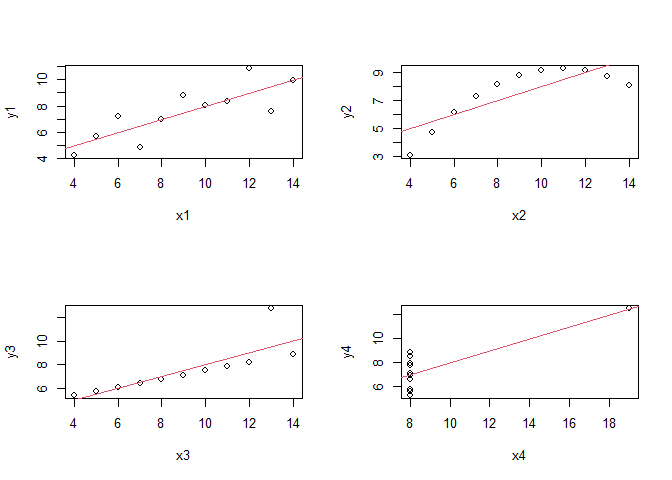
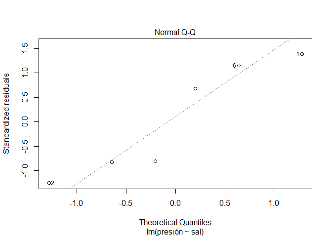

Modelos de regresión Lineal
================

# 1. Modelo de regresión lineal simple

## A. Creando el modelo de regresión lineal

En un experimento donde se quería estudiar la asociación entre consumo
de sal y presión arterial, se asignó aleatoriamente a algunos individuos
una cantidad diaria constante de sal en su dieta, y al cabo de un mes se
les midio la presión arterial media. Los resultados fueron:

``` r
library(tidyverse)
```

    ## -- Attaching packages --------------------------------------------------------------- tidyverse 1.3.0 --

    ## v ggplot2 3.3.3     v purrr   0.3.4
    ## v tibble  3.0.0     v dplyr   1.0.3
    ## v tidyr   1.0.2     v stringr 1.4.0
    ## v readr   1.3.1     v forcats 0.5.0

    ## -- Conflicts ------------------------------------------------------------------ tidyverse_conflicts() --
    ## x dplyr::filter() masks stats::filter()
    ## x dplyr::lag()    masks stats::lag()

``` r
Presión.Arterial <- tibble( sal = c(1.8, 2.2, 3.5, 4.0, 4.3, 5.0),
                            presión = c(100,98,110, 110, 112, 120))
```

Como clases previas, para la creación de modelos, tenemos funciones
especializadas, las cuales generalmente estan ya dentro de nuetro
paquete básico de “stats”. Como es el caso de la función lm(), para
crear modelos de regresión lineal:

``` r
?lm
```

    ## starting httpd help server ... done

Para utilizar **lm()** en nuestro problema:

``` r
lm(Presión.Arterial$presión ~ Presión.Arterial$sal)
```

    ## 
    ## Call:
    ## lm(formula = Presión.Arterial$presión ~ Presión.Arterial$sal)
    ## 
    ## Coefficients:
    ##          (Intercept)  Presión.Arterial$sal  
    ##               86.371                 6.335

En los resultados, veremos que hemos hayado el intercepto (valor de
alfa).

Para visualizar los detalles del modelo, podemos optar por la función
**summary()**, pero antes, asignemosle un nombre a nuestro modelo.

``` r
Modelo.Lineal.Simple <- lm(data=Presión.Arterial, formula = presión ~ sal )
```

``` r
summary(Modelo.Lineal.Simple)
```

    ## 
    ## Call:
    ## lm(formula = presión ~ sal, data = Presión.Arterial)
    ## 
    ## Residuals:
    ##      1      2      3      4      5      6 
    ##  2.226 -2.309  1.455 -1.712 -1.613  1.952 
    ## 
    ## Coefficients:
    ##             Estimate Std. Error t value Pr(>|t|)    
    ## (Intercept)  86.3708     3.0621  28.206  9.4e-06 ***
    ## sal           6.3354     0.8395   7.546  0.00165 ** 
    ## ---
    ## Signif. codes:  0 '***' 0.001 '**' 0.01 '*' 0.05 '.' 0.1 ' ' 1
    ## 
    ## Residual standard error: 2.332 on 4 degrees of freedom
    ## Multiple R-squared:  0.9344, Adjusted R-squared:  0.918 
    ## F-statistic: 56.95 on 1 and 4 DF,  p-value: 0.001652

De esta manera podemos ver de manera general alguno de los detalles de
nuestro modelo. Por el momento, observemos que el coeficiente de
determinación se puede observar en la parte inferior y tiene un valor de
0.9344.

## B. El cuarteto de **anscombe**: Cuando el R2 no es suficiente.

Carguemos la base de datos **anscombe**

``` r
?anscombe
data("anscombe")
```

Hallemos la relacion entre cada xi con su yi, y calculemos su R2:

``` r
summary(lm(y1~x1, data = anscombe))$r.squared
```

    ## [1] 0.6665425

``` r
summary(lm(y2~x2, data = anscombe))$r.squared
```

    ## [1] 0.666242

``` r
summary(lm(y3~x3, data = anscombe))$r.squared
```

    ## [1] 0.666324

``` r
summary(lm(y4~x4, data = anscombe))$r.squared
```

    ## [1] 0.6667073

Nos daremos cuenta que los valores del coeficiente de correlación son
muy similares. Pero, que pasa ahora si evaluamos lo que serian sus
gráficas:

``` r
par(mfrow =c(2,2))
plot(y1~x1, data = anscombe)
abline(lm(y1~x1, data = anscombe), col=2)
plot(y2~x2, data = anscombe)
abline(lm(y2~x2, data = anscombe), col=2)
plot(y3~x3, data = anscombe)
abline(lm(y3~x3, data = anscombe), col=2)
plot(y4~x4, data = anscombe)
abline(lm(y4~x4, data = anscombe), col=2)
```

<!-- -->

Evalue y discuta los que observa. Y responda si es suficiente el R2 para
saber si nuestro modelo lineal es el correcto.

## C. Intervalos de confianza

Para hallar los intervalos de confianza de los estimadores de una
regresion lineal en R, utilizaremos la siguiente función **confint()**
de la siguiente manera:

``` r
confint(Modelo.Lineal.Simple, level = 0.95)
```

    ##                 2.5 %    97.5 %
    ## (Intercept) 77.869064 94.872509
    ## sal          4.004434  8.666266

Para hallar el intervalo de confianza de un determinado valor de X (sal
= 4.5):

``` r
predict(object = Modelo.Lineal.Simple, newdata = data.frame(sal = c(4.5)),
        interval = "confidence", level = 0.95)
```

    ##        fit      lwr      upr
    ## 1 114.8799 111.3041 118.4556

Para hallar el intervalo de predicción de un determinado valor de X (sal
= 4.5):

``` r
predict(object = Modelo.Lineal.Simple, newdata = data.frame(sal = c(4.5)),
        interval = "prediction", level = 0.95)
```

    ##        fit      lwr      upr
    ## 1 114.8799 107.4843 122.2754

## D. Contraste de hipótesis sobre la pendiente de la recta Beta

Para analizar el contraste de hipotesis, podemos evaluar los intervalos
de confianza o podemos evaluar los resultados de p-valor en el resumen
de nuestro modelo:

``` r
summary(Modelo.Lineal.Simple)
```

    ## 
    ## Call:
    ## lm(formula = presión ~ sal, data = Presión.Arterial)
    ## 
    ## Residuals:
    ##      1      2      3      4      5      6 
    ##  2.226 -2.309  1.455 -1.712 -1.613  1.952 
    ## 
    ## Coefficients:
    ##             Estimate Std. Error t value Pr(>|t|)    
    ## (Intercept)  86.3708     3.0621  28.206  9.4e-06 ***
    ## sal           6.3354     0.8395   7.546  0.00165 ** 
    ## ---
    ## Signif. codes:  0 '***' 0.001 '**' 0.01 '*' 0.05 '.' 0.1 ' ' 1
    ## 
    ## Residual standard error: 2.332 on 4 degrees of freedom
    ## Multiple R-squared:  0.9344, Adjusted R-squared:  0.918 
    ## F-statistic: 56.95 on 1 and 4 DF,  p-value: 0.001652

Los valores Pr(&gt;\|t\|), son los p-value, y nos indican en ambos casos
(aunque solo en B1 tiene sentido) que se rechaza Ho (es decir, que B1 es
diferente de 0).

## E. Representación gráfica del modelo lineal:

La creación de un modelo de regresión lineal simple suele acompañarse de
una representación gráfica superponiendo las observaciones con el
modelo. Además de ayudar a la interpretación, es el primer paso para
identificar posibles violaciones de las condiciones de la regresión
lineal.

Una manera simple de realizarlo con el paquete ggplot2, seria:

``` r
Presión.Arterial %>% ggplot(aes(x=sal, y=presión))+
  geom_point()+
  geom_smooth(method="lm")
```

    ## `geom_smooth()` using formula 'y ~ x'

<!-- -->

Sin embargo, no solo el gráfico de la recta nos ayuda a interpretar
nuestro modelo. Tambien podemos visualizar la distribución de los
errores o residuos del modelo. Estos se almacenan como *residuals* en
nuestro modelo. Podemos gráficar la distribucion de los residuos,
mediante:

``` r
plot(Modelo.Lineal.Simple)
```

<!-- --><!-- --><!-- --><!-- -->

Los residuos confirman que los datos no se distribuyen de forma lineal,
ni su varianza constante (plot1). Además se observa que la distribución
de los residuos se aleja de la normalidad debido a algunos de los puntos
(plot2). Solo nos concentraremos en evaluar el plot 1 y 2. Todo este
analisis reduce en gran medida la robustez de la estimación del error
estándar de los coeficientes de correlación estimados y con ello la del
modelo es su conjunto.

## F. Ejercicios de regresión lineal simple:

##### 1. Para este ejercicio, trabajaremos con la base de datos “Boston” del paquete MASS. Aqui la descripción de las variables:

-   crim: ratio de criminalidad per cápita de cada ciudad.
-   zn: Proporción de zonas residenciales con edificaciones de más de
    25.000 pies cuadrados.
-   indus: proporción de zona industrializada.
-   chas: Si hay río en la ciudad (= 1 si hay río; 0 no hay).
-   nox: Concentración de óxidos de nitrógeno (partes per 10 millón).
-   rm: promedio de habitaciones por vivienda.
-   age: Proporción de viviendas ocupadas por el propietario construidas
    antes de 1940.
-   dis: Media ponderada de la distancias a cinco centros de empleo de
    Boston.
-   rad: Índice de accesibilidad a las autopistas radiales.
-   tax: Tasa de impuesto a la propiedad en unidades de $10,000.
-   ptratio: ratio de alumnos/profesor por ciudad.
-   black: 1000(Bk - 0.63)^2 donde Bk es la proporción de gente de color
    por ciudad.
-   lstat: porcentaje de población en condición de pobreza.
-   medv: Valor mediano de las casas ocupadas por el dueño en unidades
    de $1000s.

Realice lo siguiente:

1.  Analice la base y luego realice un modelo de regresión para predecir
    el valor de la vivienda en función del porcentaje de la población.
    Empleando la funcion **lm()** se generará un modelo por minimos
    cuadrados donde la variable respuesta sera *medv* y el predictor
    *lstat*.

2.  Evalue el modelo creado con las funciones: **names()** y
    **summary()**. ¿Qué valores de importancia encuentra y como los
    interpreta?

3.  Calcule usted el los intervalos de confianza para los estimadores
    con la función **confint()** a un nivel de confianza del 95%.

4.  Prediga el valor de la vivienda sabiendo el estatus de la población
    en la que se encuetra. Toda predicción tiene asociado un error y por
    lo tanto un intervalo. Analice e interprete los resultados.

5.  Gráficar la relacion de las variables mediante una regresión lineal.
    Adicionalmente analizar los residuos del modelo.
