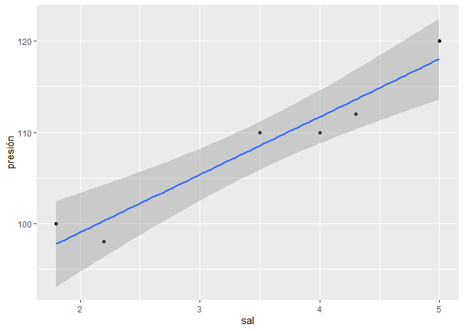
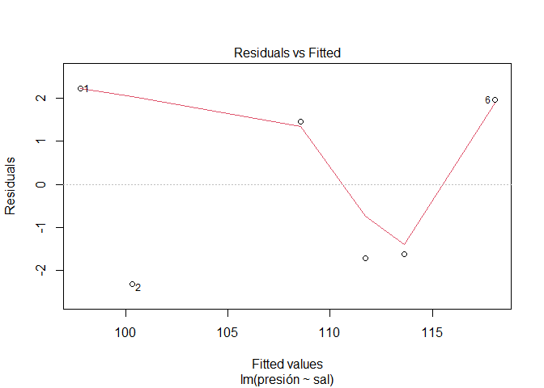
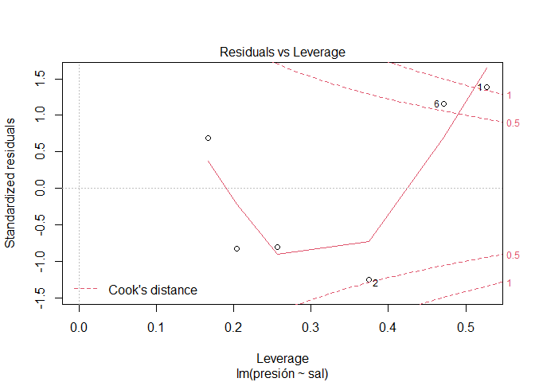
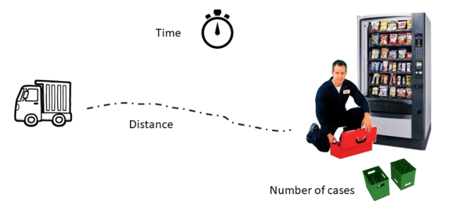
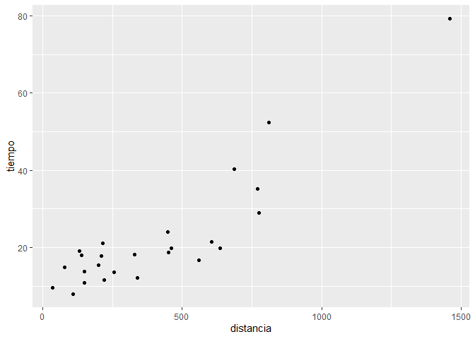

Modelos de regresión Lineal - Simple y múltiple
================

# 1. Modelo de regresión lineal simple

## A. Creando el modelo de regresión lineal

En un experimento donde se quería estudiar la asociación entre consumo
de sal y presión arterial, se asignó aleatoriamente a algunos individuos
una cantidad diaria constante de sal en su dieta, y al cabo de un mes se
les midio la presión arterial media. Los resultados fueron:

``` r
library(tidyverse)
```

    ## -- Attaching packages --------------------------------------------------- tidyverse 1.3.0 --

    ## v ggplot2 3.3.3     v purrr   0.3.4
    ## v tibble  3.0.0     v dplyr   1.0.3
    ## v tidyr   1.0.2     v stringr 1.4.0
    ## v readr   1.3.1     v forcats 0.5.0

    ## -- Conflicts ------------------------------------------------------ tidyverse_conflicts() --
    ## x dplyr::filter() masks stats::filter()
    ## x dplyr::lag()    masks stats::lag()

``` r
Presión.Arterial <- tibble( sal = c(1.8, 2.2, 3.5, 4.0, 4.3, 5.0),
                            presión = c(100,98,110, 110, 112, 120))
```

Como clases previas, para la creación de modelos, tenemos funciones
especializadas, las cuales generalmente estan ya dentro de nuetro
paquete básico de “stats”. Como es el caso de la función lm(), para
crear modelos de regresión lineal. Para utilizar **lm()** en nuestro
problema:

``` r
lm(Presión.Arterial$presión ~ Presión.Arterial$sal)
```

    ## 
    ## Call:
    ## lm(formula = Presión.Arterial$presión ~ Presión.Arterial$sal)
    ## 
    ## Coefficients:
    ##          (Intercept)  Presión.Arterial$sal  
    ##               86.371                 6.335

En los resultados, veremos que hemos hayado el intercepto (valor de
alfa).

Para visualizar los detalles del modelo, podemos optar por la función
**summary()**, pero antes, asignemosle un nombre a nuestro modelo.

``` r
Modelo.Lineal.Simple <- lm(data=Presión.Arterial, formula = presión ~ sal )
```

``` r
summary(Modelo.Lineal.Simple)
```

    ## 
    ## Call:
    ## lm(formula = presión ~ sal, data = Presión.Arterial)
    ## 
    ## Residuals:
    ##      1      2      3      4      5      6 
    ##  2.226 -2.309  1.455 -1.712 -1.613  1.952 
    ## 
    ## Coefficients:
    ##             Estimate Std. Error t value Pr(>|t|)    
    ## (Intercept)  86.3708     3.0621  28.206  9.4e-06 ***
    ## sal           6.3354     0.8395   7.546  0.00165 ** 
    ## ---
    ## Signif. codes:  0 '***' 0.001 '**' 0.01 '*' 0.05 '.' 0.1 ' ' 1
    ## 
    ## Residual standard error: 2.332 on 4 degrees of freedom
    ## Multiple R-squared:  0.9344, Adjusted R-squared:  0.918 
    ## F-statistic: 56.95 on 1 and 4 DF,  p-value: 0.001652

De esta manera podemos ver de manera general alguno de los detalles de
nuestro modelo. Por el momento, observemos que el coeficiente de
determinación se puede observar en la parte inferior y tiene un valor de
0.9344.

## B. El cuarteto de **anscombe**: Cuando el R2 no es suficiente.

Carguemos la base de datos **anscombe**

``` r
data("anscombe")
```

Hallemos la relacion entre cada xi con su yi, y calculemos su R2:

``` r
summary(lm(y1~x1, data = anscombe))$r.squared
```

    ## [1] 0.6665425

``` r
summary(lm(y2~x2, data = anscombe))$r.squared
```

    ## [1] 0.666242

``` r
summary(lm(y3~x3, data = anscombe))$r.squared
```

    ## [1] 0.666324

``` r
summary(lm(y4~x4, data = anscombe))$r.squared
```

    ## [1] 0.6667073

Nos daremos cuenta que los valores del coeficiente de correlación son
muy similares. Pero, que pasa ahora si evaluamos lo que serian sus
gráficas:

``` r
par(mfrow =c(2,2))
plot(y1~x1, data = anscombe)
abline(lm(y1~x1, data = anscombe), col=2)
plot(y2~x2, data = anscombe)
abline(lm(y2~x2, data = anscombe), col=2)
plot(y3~x3, data = anscombe)
abline(lm(y3~x3, data = anscombe), col=2)
plot(y4~x4, data = anscombe)
abline(lm(y4~x4, data = anscombe), col=2)
```

<!-- -->

Evalue y discuta los que observa. Y responda si es suficiente el R2 para
saber si nuestro modelo lineal es el correcto.

## C. Intervalos de confianza

Para hallar los intervalos de confianza de los estimadores de una
regresion lineal en R, utilizaremos la siguiente función **confint()**
de la siguiente manera:

``` r
confint(Modelo.Lineal.Simple, level = 0.95)
```

    ##                 2.5 %    97.5 %
    ## (Intercept) 77.869064 94.872509
    ## sal          4.004434  8.666266

Para hallar el intervalo de confianza de un determinado valor de X (sal
= 4.5):

``` r
predict(object = Modelo.Lineal.Simple, newdata = data.frame(sal = c(4.5)),
        interval = "confidence", level = 0.95)
```

    ##        fit      lwr      upr
    ## 1 114.8799 111.3041 118.4556

Para hallar el intervalo de predicción de un determinado valor de X (sal
= 4.5):

``` r
predict(object = Modelo.Lineal.Simple, newdata = data.frame(sal = c(4.5)),
        interval = "prediction", level = 0.95)
```

    ##        fit      lwr      upr
    ## 1 114.8799 107.4843 122.2754

## D. Contraste de hipótesis sobre la pendiente de la recta Beta

Para analizar el contraste de hipotesis, podemos evaluar los intervalos
de confianza o podemos evaluar los resultados de p-valor en el resumen
de nuestro modelo:

``` r
summary(Modelo.Lineal.Simple)
```

    ## 
    ## Call:
    ## lm(formula = presión ~ sal, data = Presión.Arterial)
    ## 
    ## Residuals:
    ##      1      2      3      4      5      6 
    ##  2.226 -2.309  1.455 -1.712 -1.613  1.952 
    ## 
    ## Coefficients:
    ##             Estimate Std. Error t value Pr(>|t|)    
    ## (Intercept)  86.3708     3.0621  28.206  9.4e-06 ***
    ## sal           6.3354     0.8395   7.546  0.00165 ** 
    ## ---
    ## Signif. codes:  0 '***' 0.001 '**' 0.01 '*' 0.05 '.' 0.1 ' ' 1
    ## 
    ## Residual standard error: 2.332 on 4 degrees of freedom
    ## Multiple R-squared:  0.9344, Adjusted R-squared:  0.918 
    ## F-statistic: 56.95 on 1 and 4 DF,  p-value: 0.001652

Los valores Pr(&gt;\|t\|), son los p-value, y nos indican en ambos casos
(aunque solo en B1 tiene sentido) que se rechaza Ho (es decir, que B1 es
diferente de 0).

## E. Representación gráfica del modelo lineal:

La creación de un modelo de regresión lineal simple suele acompañarse de
una representación gráfica superponiendo las observaciones con el
modelo. Además de ayudar a la interpretación, es el primer paso para
identificar posibles violaciones de las condiciones de la regresión
lineal.

Una manera simple de realizarlo con el paquete ggplot2, seria:

``` r
Presión.Arterial %>% ggplot(aes(x=sal, y=presión))+
  geom_point()+
  geom_smooth(method="lm")
```

    ## `geom_smooth()` using formula 'y ~ x'

<!-- -->

Sin embargo, no solo el gráfico de la recta nos ayuda a interpretar
nuestro modelo. Tambien podemos visualizar la distribución de los
errores o residuos del modelo. Estos se almacenan como *residuals* en
nuestro modelo. Podemos gráficar la distribucion de los residuos,
mediante:

``` r
plot(Modelo.Lineal.Simple)
```

<!-- --><!-- --><!-- --><!-- -->

Los residuos confirman que los datos no se distribuyen de forma lineal,
ni su varianza constante (plot1). Además se observa que la distribución
de los residuos se aleja de la normalidad debido a algunos de los puntos
(plot2). Solo nos concentraremos en evaluar el plot 1 y 2. Todo este
analisis reduce en gran medida la robustez de la estimación del error
estándar de los coeficientes de correlación estimados y con ello la del
modelo es su conjunto.

## F. Ejercicios de regresión lineal simple:

##### 1. Para este ejercicio, trabajaremos con la base de datos “Boston” del paquete MASS. Aqui la descripción de las variables:

-   crim: ratio de criminalidad per cápita de cada ciudad.
-   zn: Proporción de zonas residenciales con edificaciones de más de
    25.000 pies cuadrados.
-   indus: proporción de zona industrializada.
-   chas: Si hay río en la ciudad (= 1 si hay río; 0 no hay).
-   nox: Concentración de óxidos de nitrógeno (partes per 10 millón).
-   rm: promedio de habitaciones por vivienda.
-   age: Proporción de viviendas ocupadas por el propietario construidas
    antes de 1940.
-   dis: Media ponderada de la distancias a cinco centros de empleo de
    Boston.
-   rad: Índice de accesibilidad a las autopistas radiales.
-   tax: Tasa de impuesto a la propiedad en unidades de $10,000.
-   ptratio: ratio de alumnos/profesor por ciudad.
-   black: 1000(Bk - 0.63)^2 donde Bk es la proporción de gente de color
    por ciudad.
-   lstat: porcentaje de población en condición de pobreza.
-   medv: Valor mediano de las casas ocupadas por el dueño en unidades
    de $1000s.

Realice lo siguiente:

1.  Analice la base y luego realice un modelo de regresión para predecir
    el valor de la vivienda en función del porcentaje de la población.
    Empleando la funcion **lm()** se generará un modelo por minimos
    cuadrados donde la variable respuesta sera *medv* y el predictor
    *lstat*.

2.  Evalue el modelo creado con las funciones: **names()** y
    **summary()**. ¿Qué valores de importancia encuentra y como los
    interpreta?

3.  Calcule usted el los intervalos de confianza para los estimadores
    con la función **confint()** a un nivel de confianza del 95%.

4.  Prediga el valor de la vivienda sabiendo el estatus de la población
    en la que se encuetra. Toda predicción tiene asociado un error y por
    lo tanto un intervalo. Analice e interprete los resultados.

5.  Gráficar la relacion de las variables mediante una regresión lineal.
    Adicionalmente analizar los residuos del modelo.

# 2. Analisis de Regresión Lineal Múltiple

Para el analisis de la regresión lineal múltiple, utilizaremos la base
de datos “softdrink” del paquete “MPV”

``` r
library(MPV)
```

    ## Loading required package: lattice

    ## Loading required package: KernSmooth

    ## KernSmooth 2.23 loaded
    ## Copyright M. P. Wand 1997-2009

``` r
data("softdrink")
```

En el ejemplo los autores ajustaron un modelo de regresión lineal
múltiple para explicar el Tiempo necesario para que un trabajador haga
el mantenimiento y surta una máquina dispensadora de refrescos en
función de las variables Número de Cajas y Distancia.



Antes de trabajar con la data, vamos a modificar su nombre, para tener
un mejor manejo:

``` r
library(tidyverse)
softdrink <- softdrink %>% rename(tiempo = y, cantidad = x1, distancia = x2)
```

## A. Creamos el mejor modelo lineal multiple con el metodo de los minimos cuadrados

``` r
mod <- lm(tiempo ~ cantidad + distancia, data=softdrink)
```

Al igual que con el modelo lineal simple, utilizamos summary() para ver
los resultados principales del modelo:

``` r
summary(mod)
```

    ## 
    ## Call:
    ## lm(formula = tiempo ~ cantidad + distancia, data = softdrink)
    ## 
    ## Residuals:
    ##     Min      1Q  Median      3Q     Max 
    ## -5.7880 -0.6629  0.4364  1.1566  7.4197 
    ## 
    ## Coefficients:
    ##             Estimate Std. Error t value Pr(>|t|)    
    ## (Intercept) 2.341231   1.096730   2.135 0.044170 *  
    ## cantidad    1.615907   0.170735   9.464 3.25e-09 ***
    ## distancia   0.014385   0.003613   3.981 0.000631 ***
    ## ---
    ## Signif. codes:  0 '***' 0.001 '**' 0.01 '*' 0.05 '.' 0.1 ' ' 1
    ## 
    ## Residual standard error: 3.259 on 22 degrees of freedom
    ## Multiple R-squared:  0.9596, Adjusted R-squared:  0.9559 
    ## F-statistic: 261.2 on 2 and 22 DF,  p-value: 4.687e-16

## B. Comparacion de modelos: AIC y BIC

Para calcular el AIC y BIC de un modelos, utilizamos las funciones
**AIC()** o **BIC()**

``` r
AIC(mod)
```

    ## [1] 134.8294

``` r
BIC(mod)
```

    ## [1] 139.7049

Sin embargo, no nos brindan mucha información si es que solo tenemos un
modelo. Tenemos que comparar diferentes modelos (que difieran en el
numero de variables independientes).

## C. Intervalos de confianza de los estimadores

Al igual que en la regresión lineal simple, podemos hallar los
intervalos de confianza de los estimadores del modelo.

``` r
confint(mod, level = 0.95)
```

    ##                   2.5 %     97.5 %
    ## (Intercept) 0.066751987 4.61571030
    ## cantidad    1.261824662 1.96998976
    ## distancia   0.006891745 0.02187791

Y también los intervalos de confianza de los valores medios :

``` r
predict(mod, data= softdrink, interval = "confidence", level = 0.95)
```

    ##          fit       lwr       upr
    ## 1  21.708084 19.551297 23.864872
    ## 2  10.353615  8.556216 12.151013
    ## 3  12.079794  9.955744 14.203843
    ## 4   9.955646  7.980522 11.930770
    ## 5  14.194398 12.343039 16.045757
    ## 6  18.399574 17.000017 19.799132
    ## 7   7.155376  5.222061  9.088692
    ## 8  16.673395 14.966973 18.379818
    ## 9  71.820294 67.048610 76.591977
    ## 10 19.123587 16.128667 22.118507
    ## 11 38.092507 36.108636 40.076378
    ## 12 21.593041 19.314141 23.871941
    ## 13 12.472991 10.801755 14.144227
    ## 14 18.682464 16.791631 20.573297
    ## 15 23.328798 21.958209 24.699388
    ## 16 29.662928 26.909298 32.416559
    ## 17 14.913640 13.265705 16.561574
    ## 18 15.551379 13.454112 17.648645
    ## 19  7.706807  5.607492  9.806121
    ## 20 40.887970 38.732422 43.043518
    ## 21 20.514179 17.766059 23.262299
    ## 22 56.006528 51.776559 60.236497
    ## 23 23.357568 21.984492 24.730644
    ## 24 24.402854 22.055286 26.750421
    ## 25 10.962584  9.217532 12.707636

Y por ultimo los intervalos de confianza de los valores predecidos:

``` r
predict(mod, data= softdrink, interval = "prediction", level = 0.95)
```

    ## Warning in predict.lm(mod, data = softdrink, interval = "prediction", level = 0.95): predictions on current data refer to _future_ responses

    ##          fit        lwr      upr
    ## 1  21.708084 14.6126113 28.80356
    ## 2  10.353615  3.3589989 17.34823
    ## 3  12.079794  4.9942032 19.16538
    ## 4   9.955646  2.9132656 16.99803
    ## 5  14.194398  7.1857225 21.20307
    ## 6  18.399574 11.4964758 25.30267
    ## 7   7.155376  0.1246073 14.18615
    ## 8  16.673395  9.7016031 23.64519
    ## 9  71.820294 63.5460584 80.09453
    ## 10 19.123587 11.7301065 26.51707
    ## 11 38.092507 31.0476684 45.13735
    ## 12 21.593041 14.4595011 28.72658
    ## 13 12.472991  5.5097274 19.43625
    ## 14 18.682464 11.6632578 25.70167
    ## 15 23.328798 16.4315145 30.22608
    ## 16 29.662928 22.3638539 36.96200
    ## 17 14.913640  7.9559322 21.87135
    ## 18 15.551379  8.4737709 22.62899
    ## 19  7.706807  0.6285915 14.78502
    ## 20 40.887970 33.7928734 47.98307
    ## 21 20.514179 13.2171816 27.81118
    ## 22 56.006528 48.0324043 63.98065
    ## 23 23.357568 16.4597897 30.25535
    ## 24 24.402854 17.2470809 31.55863
    ## 25 10.962584  3.9812364 17.94393

## D. Contraste de hipotesis

Como hemos observado, la prueba de ANOVA del modelo, nos permite
determinar si es que el modelo en si, tiene significancia o no (evalúa a
todas las variables independientes). Por otro lado, podemos ver
específicamente el efecto de cada una de las variables independientes en
el modelo creado.Ambas evaluaciones se pueden observar mediante el
resumen ofrecido por la función **summary()**

``` r
summary(mod)
```

    ## 
    ## Call:
    ## lm(formula = tiempo ~ cantidad + distancia, data = softdrink)
    ## 
    ## Residuals:
    ##     Min      1Q  Median      3Q     Max 
    ## -5.7880 -0.6629  0.4364  1.1566  7.4197 
    ## 
    ## Coefficients:
    ##             Estimate Std. Error t value Pr(>|t|)    
    ## (Intercept) 2.341231   1.096730   2.135 0.044170 *  
    ## cantidad    1.615907   0.170735   9.464 3.25e-09 ***
    ## distancia   0.014385   0.003613   3.981 0.000631 ***
    ## ---
    ## Signif. codes:  0 '***' 0.001 '**' 0.01 '*' 0.05 '.' 0.1 ' ' 1
    ## 
    ## Residual standard error: 3.259 on 22 degrees of freedom
    ## Multiple R-squared:  0.9596, Adjusted R-squared:  0.9559 
    ## F-statistic: 261.2 on 2 and 22 DF,  p-value: 4.687e-16

## E. Diagnostico de los residuos

#### E.1. Diagnostico de homocedasticidad de residuos: Test de White

``` r
library(lmtest)
```

    ## Loading required package: zoo

    ## 
    ## Attaching package: 'zoo'

    ## The following objects are masked from 'package:base':
    ## 
    ##     as.Date, as.Date.numeric

``` r
bptest(mod, varformula = ~ cantidad+tiempo+I(cantidad^2)+I(tiempo^2)+cantidad*tiempo, data = softdrink)
```

    ## 
    ##  studentized Breusch-Pagan test
    ## 
    ## data:  mod
    ## BP = 13.436, df = 5, p-value = 0.01962

Teniendo como hipótesis:

-   
    *H*<sub>0</sub>
    : Las varianzas de los residuos son iguales (homocedasticidad)
-   
    *H*<sub>1</sub>
    : Las varianzas de los residuos no son iguales (heterocedasticidad)

Con un p-valor mayor a el nivel de significancia, concluimos
consecuentemente que no tenemos indicios suficientes para rechazar la
homocedasticidad de los errores en este caso. Lo cual, no es lo que
ocurre para nuestro ejemplo.

Adicionalmente, al aplicar el test de White, podemos observar que la
regresión de análisis contiene 5 variables. Es importante saber que el
numero de variables total no puede exceder la muestra **“n”** de nuestra
base de datos. Siendo 5 &lt; 25 (n de softdrink igual a 25), no hay
problema con usar este test. Sin embargo, en caso de muestras pequeñas
lo recomendable seria utilizar el test de Breusch-Pagan.

#### E.2. Diagnostico de homocedasticidad de residuos: Test de Breusch-Pagan

En el caso de nuestro ejemplo, no es necesario realizar este Test, ya
que el los supuestos se cumplen para el Test de White, sin embargo, a
manera de ejemplo se presenta a continuación. Realizamos este test con
la funcion **bptest()**, pero sin especificar la formula (como sí lo
hicimos en el test de White).

``` r
library(lmtest)
bptest(mod)
```

    ## 
    ##  studentized Breusch-Pagan test
    ## 
    ## data:  mod
    ## BP = 11.988, df = 2, p-value = 0.002493

Teniendo como hipotesis:

-   
    *H*<sub>0</sub>
    : Las varianzas de los residuos son iguales (homocedasticidad)
-   
    *H*<sub>1</sub>
    : Las varianzas de los residuos no son iguales (heterocedasticidad)

#### E.3. Diagnostico de normalidad de residuos: Test de Shapiro Wilk + Q-Qplot

Para ellos, aplicamos el test de Shapiro-Wilk a los residuos de nuestro
modelo:

``` r
shapiro.test(mod$residuals)
```

    ## 
    ##  Shapiro-Wilk normality test
    ## 
    ## data:  mod$residuals
    ## W = 0.95151, p-value = 0.2711

En este caso particular, podemos observar que los residuos del modelo se
distribuyen normalmente, ya que el p-valor es mayor al nivel de
significancia y se acepta la Ho. Gráficamente lo podemos observar de la
siguiente manera:

``` r
plot(mod, 2)
```

<!-- -->
Fijenseque a pesar de que existen desviaciones respecto a la
distribución normal, el test de Shapiro-wilk nos ha brindado los
resultados para evidenciar que los residuos se distribuyen normalmente.
Es importante por eso siempre, no solo analizar los gráficos.

#### E.4. Correlación de residuos: Test de Durbin-Watson

Este test nos permite saber si existe o no correlación entre los
errores. Es preciso saber si existen correlacion positiva o negativa,
por lo que los dos test se deben de correr para contrastar las
siguientes hipotesis: +
*H*<sub>0</sub>
: No existe correlacion entre los residuos (
*B**e**t**a*<sub>1</sub> = 0
) +
*H*<sub>1</sub>
: Exixte correlacion entre los residuos

En este test, para cumplir nuestros supuestos de regresion, esperamos
que se rechaze
*H*<sub>1</sub>
. Para este test, utilizaremos la función **dwtest()**:

``` r
library(lmtest)
dwtest(mod, alternative = "greater")
```

    ## 
    ##  Durbin-Watson test
    ## 
    ## data:  mod
    ## DW = 1.1696, p-value = 0.01202
    ## alternative hypothesis: true autocorrelation is greater than 0

En donde el parametro alternative= nos indica si se testea que la
autocorrelación es positiva (greater) o negativa (less). El parametro
que tenemos que brindar a la funcion **dwtest()**, es nuestro modelo.

``` r
dwtest(mod, alternative = "less")
```

    ## 
    ##  Durbin-Watson test
    ## 
    ## data:  mod
    ## DW = 1.1696, p-value = 0.988
    ## alternative hypothesis: true autocorrelation is less than 0

Al obtener un p-valor mayor a alfa, podemos concluir que no hay
autocorrelacion positiva (negativa)en los residuos.

Apesar de no existir correlacion negativa en nuestros datos, si existen
una correlación positiva. Bajo este escenario, concluimos que los
residuos no son incorrelacionados, faltando al supuesto de la regresion
lineal.

### F. Aditividad y linealidad: Prueba de Tukey

Si bien nuestro modelo ya nos brinda la linealidad de las variables de
estudio. Esta prueba responde a el analisis de linealidida y aditividad
del modelo de regresión que realizamos entre los residuos. De esta
manera, se evalua:

``` r
library(car)
```

    ## Loading required package: carData

    ## 
    ## Attaching package: 'car'

    ## The following object is masked from 'package:dplyr':
    ## 
    ##     recode

    ## The following object is masked from 'package:purrr':
    ## 
    ##     some

``` r
residualPlots(mod, plot=FALSE)
```

    ##            Test stat Pr(>|Test stat|)    
    ## cantidad      2.9807        0.0071298 ** 
    ## distancia     4.4317        0.0002315 ***
    ## Tukey test    3.8494        0.0001184 ***
    ## ---
    ## Signif. codes:  0 '***' 0.001 '**' 0.01 '*' 0.05 '.' 0.1 ' ' 1

Evaluaremos el valor de Tukey test para tomar una decisión. Con un
p-valor pequeño, no podemos aceptar la aditividad. Como era de esperarse
(debido a los analisis de correlación realizados previamente), los
residuos estan afectandose unos con otros para este ejemplo. Esto impide
concluir que el modelo es lineal o aditivo.

Tambien podemos utilizar la función **crPlots()** para gráficar los
residuos parciales:

``` r
library(car)
crPlots(mod)
```

<!-- -->

### G. Analisis de valores atípicos o “outliers” en la regresión lineal

#### G.1. Cálculo de leverages:

``` r
D.L <- hatvalues(mod)
k=2
n=25
which(D.L > 2*(k+1)/n)
```

    ##  9 22 
    ##  9 22

#### G.2. Cálculo de outliers

Teniendo como hipotesis (tomar la decisión en base a el p-valor ajustado
de Bonferroni): +
*H*<sub>0</sub>
: No hay outliers +
*H*<sub>1</sub>
: Hay outliers

``` r
library(car)
outlierTest(mod)
```

    ##   rstudent unadjusted p-value Bonferroni p
    ## 9  4.31078         0.00030902    0.0077256

En este test, observamos el p-valor, si es menor a nuestro alfa (0.05)
podemos concluir que no existen outliers. Adicionalmente, tambien nos
brinda aquel individuo con el residuo estandarizado mas alto.

#### G.3. Cálculo de observaciones influyentes: Distancia de Cook

``` r
D.C <- cooks.distance(mod)
k=2
n=25
which(D.C > 4/(n-k-1))
```

    ##  9 22 
    ##  9 22

Gráficos de apoyo (sin embargo, lo ideal seria visualizarlo en 3D par
ver efectivamente los outliers):

``` r
softdrink %>% ggplot(aes(y=tiempo, x=cantidad))+
  geom_point()
```

<!-- -->

``` r
softdrink %>% ggplot(aes(y=tiempo, x=distancia))+
  geom_point()
```

<!-- -->
