```{r setup, include=FALSE}
knitr::opts_chunk$set(echo = TRUE)
```

Antes de comenzar a escribir códigos y interactuar con R, debemos de crear un nuevo proyecto. Para ello, iremos a la ventada de Archivo (File) -> Nuevo proyecto (New Project).

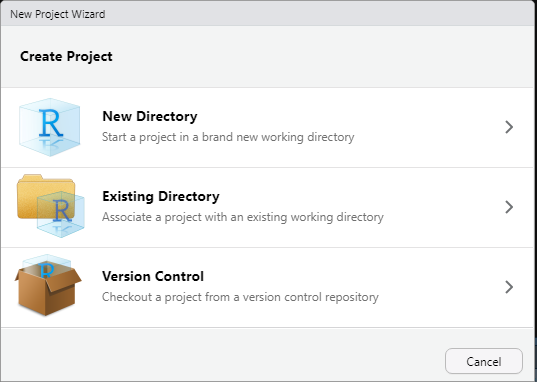
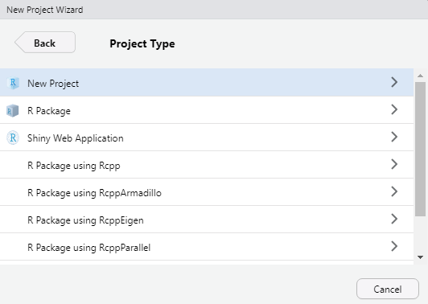


Si seguimos correctamente la correlación de figuras y creamos sin problemas un nuevo proyecto, tendremos como resultado la siguiente figura (quizá con otros colores de fondo y letras):

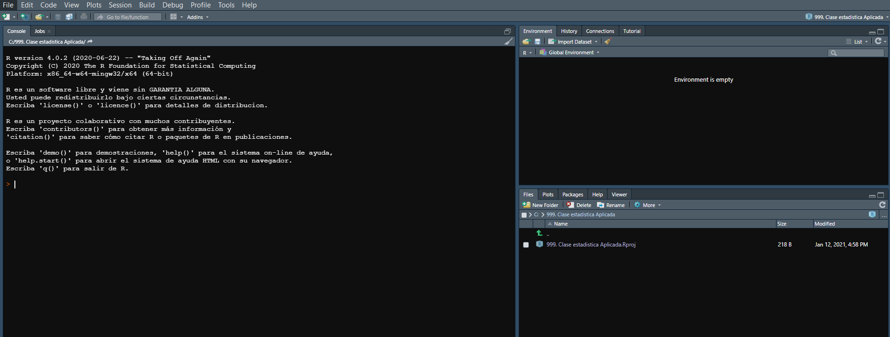

Sin bien, pueden comenzar a escribir en la consola, no es lo normal, ni recomendable. Normalmente cuando aprendemos a usar el lenguaje de programación R, utilizando Rstudio, escribimos todo nuestro código en un formato especial llamado "script" el cual es un tipo de archivo ".R". Por muchos años este tipo de archivo ha sido usado en el software Rstudio para escribir nuestros códigos y tiene sus características. Sin embargo, en los últimos años, una actualización de este "script" (manuscrito) esta tomando relevancia y apunta a reemplazar la manera en que trabajamos. Este nuevo tipo de formato se llama Rmarkdown y es el que se ha usado para esta clase. 

Repasemos algunos concepto básicos de un script. Para su creación vamos a la opción Archivo (File) del programa y colocamos nuevo archivo -> Script. 

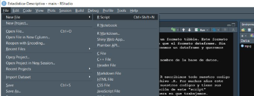

Esto abrirá un script en blanco sin nombre y sin guardarse automáticamente, tendremos que seleccionarlo e ir a archivo -> Guardar como (colocamos el nombre de nuestro archivo y la terminación .R). Cuando guardemos, este nuevo archivo aparecerá en nuestra pestaña de Archivos donde antes solo estaba el proyecto. 

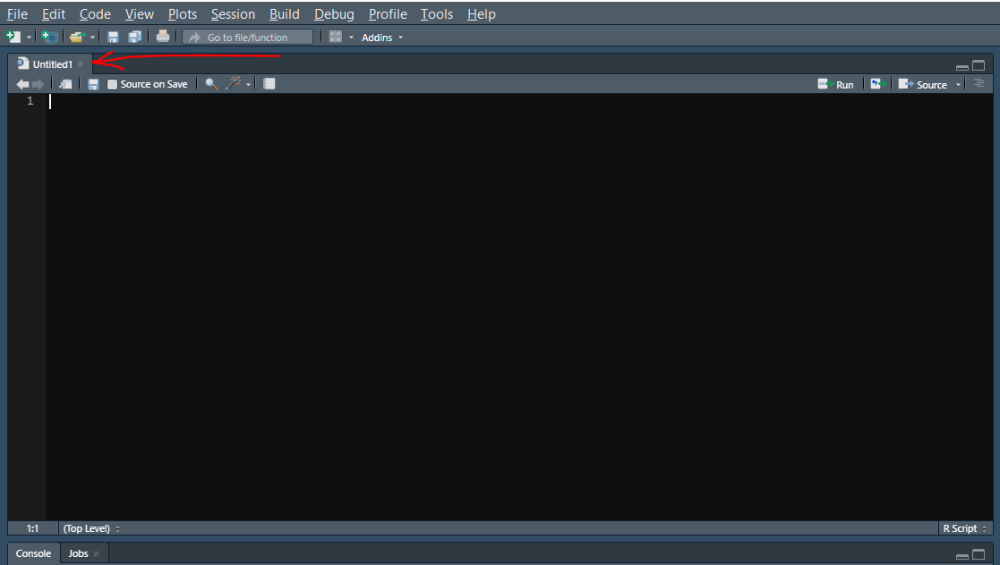
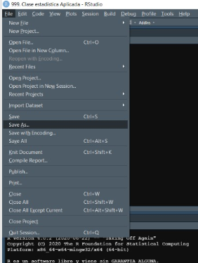

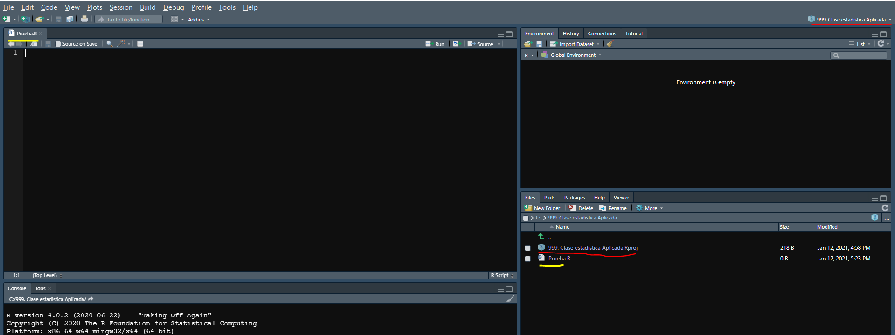

Una vez creado el script y guardado, podemos comenzar a codificar y obtener resultados fantásticos con nuestras bases de datos.

Por otro lado, para crear un archivo Rmarkdown, los pasos son muy parecidos. Vamos a Archivo -> Nuevo archivo -> 

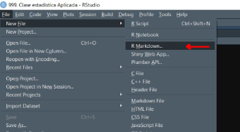
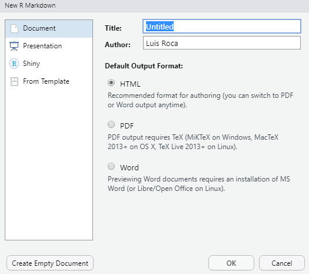
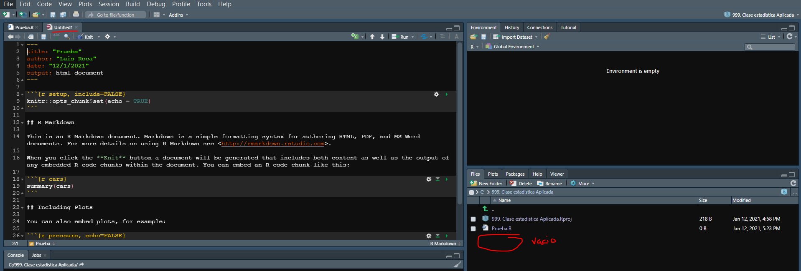

Para guardar el archivo Rmarkdown, se deben realizar los mismos pasos. Archivo -> Guardar como. Colocaremos el nombre y le daremos guardar. Nota: el tipo de archivo ya no es un archivo ".R", es en cambio un tipo de archivo ".Rmd".

En clase, los estudiantes trabajaran inicialmente en scripts normales, mientras que van incursionando en archivos Rmarkdown. Los archivos tipo script son mejores para hacer borradores y los Rmarkdown se han creado principalmente para comunicar resultados de formas elegantes (mas acerca de este tipo de formato se aprenderá a final del curso de estadística aplicada para la ingeniería).

Una vez tengamos un script abierto, guardado y en blanco, podemos comenzar con los primeros pasos en R, la instalación de paquetes y los conceptos generales de este maravilloso lenguaje de programación. 

# A. Primeros pasos: Como funciona Rstudio

Cuando trabajamos con formatos script, normalmente interactuamos constantemente con la consola (pestaña en una de las cuatro ventanas de Rstudio). Por ejemplo, una función para entender esta interacción es el comando *print()*, este nos permite escribir cualquier cosa en el script y tenerlo como resultado en la consola: 

```{r}
print("Esto es un ejemplo")
```
Cuando escriban esto en su script y le den al botón de Correr o "Run" en la parte superior del Script, después de unos segundos de carga, lo verán aparecer como resultado en la consola. Podemos escribir mucho código en nuestros scripts pero si no damos click en "Run", este código nunca se ejecutará y nunca veremos el resultado. En la figura se puede ver el botón de Run resaltado. 

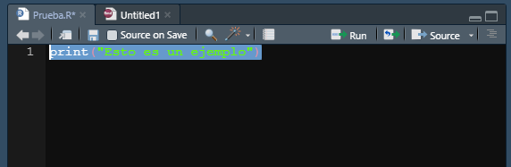
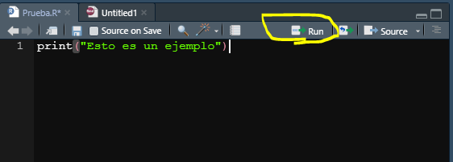

Como se puede ver, para correr un "pedazo" de código especifico tenemos dos opciones, sombrear todo lo que queremos "Correr" o colocar el cursor del "mouse" en alguna parte de la linea de código que queramos correr (que es quizá lo mas práctico, solo asegurémonos que el curso del texto esta en alguna parte de la linea de código). Para trabajar de manera práctica, sin depender del mouse, podemos utilizar el comando rápido para "Correr" códigos, este es usando las teclas *Ctrl + Enter*. De esta manera no tendremos que recurrir a apretar siempre el botón de "Run". 

Listo, ahora sabemos como interactuar desde nuestro script a nuestra consola o como veremos mas adelante con nuestra pestaña de "Ambiente", "Plots", entre otros. Todo los manejamos desde el Script, y mandamos las ordenes desde allí. 

# B. Lo mas importante: Instalación y activación de paquetes
Las bases de datos se guardan en formatos Data Frames o tibbles, almacenados de manera tabular. Cualquier base de datos esta generalmente en alguna de estas versiones. Es importante en consecuencia saber manejar las bases de datos, saber observar su contenido abrir la pagina de ayuda de las bases de datos guardadas en R y identificar el tipo de variable y tipos en los dos formatos.

Trabajaremos con dos bases de datos para aprender los conceptos básico su manejo.

+ mpg
+ flights

## 1. Instalación de paquetes (o librerias) de R

Las bases de datos generalmente se importan de nuestra computadora o web (formatos csv, xlsx, github, otros). Sin embargo, para facilitar el aprendizaje y enseñanza muchos de los paquetes de R ya vienen con bases de datos pre instaladas a las que podemos ingresar rápidamente, luego de instalar y activar el paquete (o librería). Para instalar un paquete podemos utilizar el interfaz de Rstudio. 

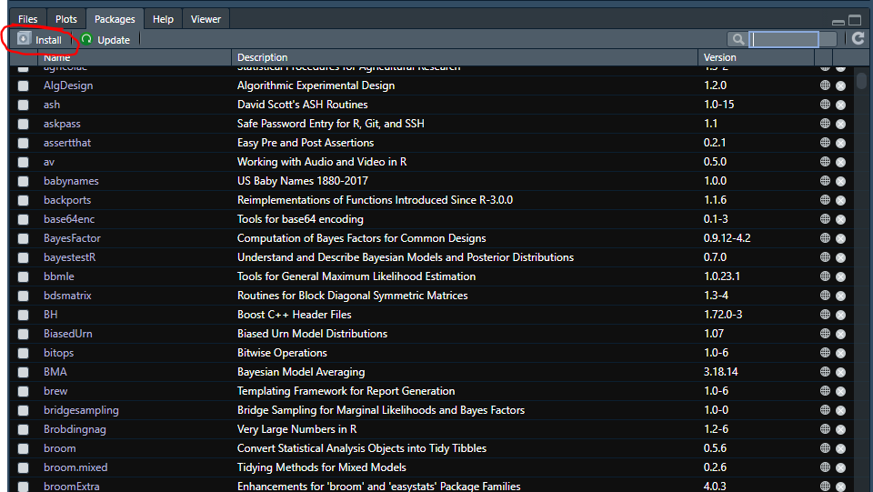

En la pestaña de paquetes ("Packages") damos click. En esta aparecerá un botón de instalación ("Install") al cual daremos click. Esto abrirá una nueva pestaña en la que podemos colocar el nombre del paquete que queramos instalar. Los nombres de los paquetes son únicos y se tienen que saber de antemano para poder buscarlos. Es por tal motivo importante familiarizarse con los principales paquetes de R e ir adicionando mas conforme nuestros objetivos específicos. 

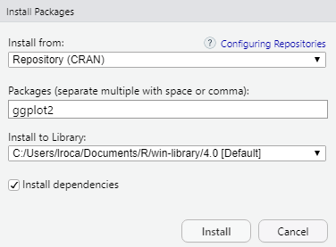

De igual manera, podemos instalar cualquier paquete mediante código, para esto se coloca dentro de la función install.packages() el nombre del paquete entre comillas. Por ejemplo, si quisiéramos instalar el paquete llamado "ggplot2" utilizaríamos el siguiente código:

+ install.packages("ggplot2")

Al correr esta linea de código, el paquete comenzara automáticamente en Rstudio e instalara. 

## 2. Activación de paquetes (o librerias) en R

Una vez instalado un paquete en nuestra computadora, siempre estará disponible al abrir R o Rstudio (a menos que exista algún inconveniente que no pida desinstalar e instalar nuevamente el paquete o si instalamos una nueva versión de R, etc.). Sin embargo, que este activado, no significa que este disponible para su uso. Cada vez que iniciamos una nueva sesión o un nuevo proyecto o un nuevo script(manuscrito) debemos activar la librería que usaremos. Por ejemplo, si queremos activar el paquete ggplot2, lo haremos utilizando la función library(): 

```{r}
library(ggplot2)
```
Una vez activado, podemos verificarlo que la pestaña de paquetes. Si el nombre del paquete aparece con un check, significa que esta activado, como se puede visualizar en la siguiente figura: 

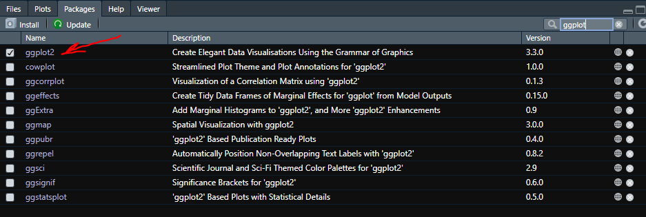

# C. Cargando bases de datos provenientes de paquetes de R

La primera base de datos que cargaremos se encuentra dentro del paquete ggplot2, ya que esta instalado y activado, podemos aumentar la base de datos a nuestro ambiente de trabajo mediante la función data():

```{r}
data(mpg)
```

Podrá visualizar que en la pestaña de ambiente, apareció la nueva base de datos llamada mpg. Si le damos click encima, podemos visualizar en que consiste esta base. Recordar que solo hace falta llamar una vez la base de datos, luego permanecerá disponible para su uso. 

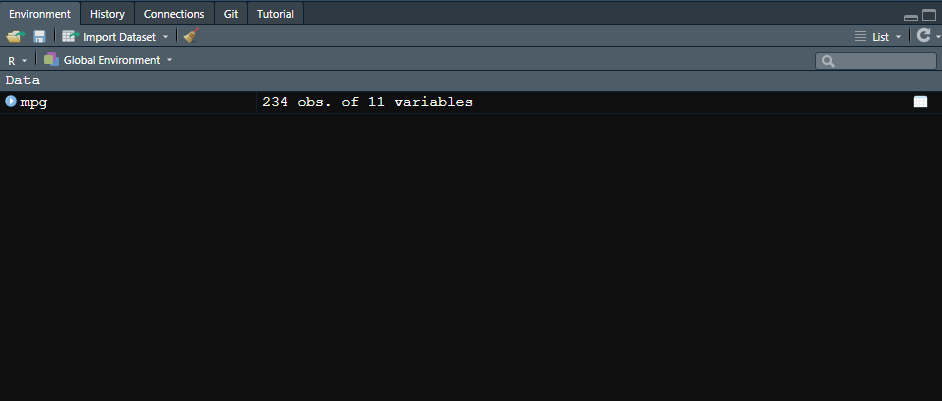

Podemos visualizar la data con tan solo llamarla por su nombre:

```{r}
mpg
```

Todas las bases de datos guardadas en cualquier paquete de R, siempre tiene una pagina de ayuda que nos permite saber a mayor detalle en que consiste la base de datos. Para acceder fácilmente a ella podemos escribir el símbolo "?" adelante de la base de datos, por ejemplo:

+ ?mpg

Lo cual cargará y nos dará como resultado en que consiste la base de datos, como observamos en la figura:


Regresando a la base de datos mpg, pudimos observar que al cargarla nos ofrece información general, como el numero de filas (individuos) y columnas (variables). 


En la figura observamos por ejemplo que tiene 234 filas y 11 columnas (rojo). También podemos observar que cada una de las variables tiene una etiqueta de tres letras, por ejemplo <chr>, <dbl>, <int>, etc. Las cuales hemos visto en clase y nos da la información de que tipo de variables tenemos en nuestra base de datos (aunque a veces hay que modificar la interpretación del software ya que se puede equivocar o tener objetivos diferentes a los del investigador).

También podemos observar al comienzo de la tabla que se trata de un formato tibble. Este formato brinda detalle adicional y mantiene la base de datos mas ordenada que el formato dataframe. Sin embargo, ambos formatos se siguen utilizando el día de hoy. Si tenemos un dataframe y queremos pasarlo a formato tibble, usaremos el comando:

+ as_tibble() : donde el argumento que colocaremos será igual al nombre de la base de datos.

# D. Conceptos del lenguaje de programación R:

## 1. Definiendo variables

A estas alturas estarán familiarizados con las pestañas de Rstudio. Habrán podido observar una en particular llamada "Environment" o "Ambiente". En esta ventana se van a ir depositando todas las bases de datos que carguemos y vayamos guardando, esto para su posterior uso. Es como nuestra mochila, donde guardamos cosas de valor en un viaje para tenerlas a la mano. Así como cuando preparamos la mochila para un viaje e incorporamos objeto por objeto, también lo hacemos en nuestra ventana de "Environment". Sin embargo, en vez de herramientas y objetos personales, principalmente almacenamos bases de datos, variables, vectores o funciones. Es decir, todo aquello que podemos utilizar para correr una técnica estadística o realizar un gráfico en Rstudio. 

Ya hemos visto como cargar bases de datos a nuestro ambiente con la función(data), pero esto solo funciona cuando nosotros cargamos bases de datos previamente cargados en paquetes de R. Existen otras maneras de cargar bases de datos como se menciono anteriormente, pero se les debe de asignar una variable. Antes de hacer este ejercicio, es muy importante aprender a asignar valores a una variable. Para esto, comenzaremos con un ejemplo simple. Supongamos que nuestra variable se llama X y es igual al numero 3. Para asignar este valor a X, utilizaremos los símbolos "<-". Entonces seria de la siguiente manera:

```{r}
 X <- 3
```
Una vez corramos este código (no aparecerá ningún resultado en la consola), verán que después de uno segundo, aparecerá en nuestra ventana de "Environment" en valor de X y se le asignará el numero 3. 


Nota: Es importante reconocer desde ya, que el lenguaje R es super susceptible a los caracteres y diferencia entre mayúsculas y minúsculas, espacios, etc. Por ejemplo si ahora queremos asignarla a una nueva variable "x" (**minúscula**) el valore de 5, podremos hacerlo de la siguiente manera:

```{r}
x <- 5
```

Podremos ver que efectivamente hay un nuevo valor llamado x (minúscula) y que se le asigno el valore de 5. 

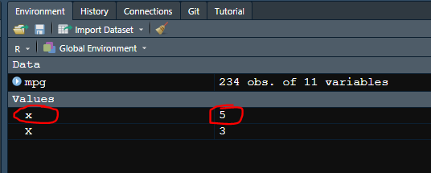

¿Qué pasa si le asignamos un nuevo valor a la variable X o x? Lo que ocurrirá es que el nuevo valor que le asignamos reemplazará al anterior y esto lo podremos ver en la ventana de "Ambiente" una vez corramos el siguiente código (donde asignamos el valore de 6 a X: 

```{r}
X <-6
```

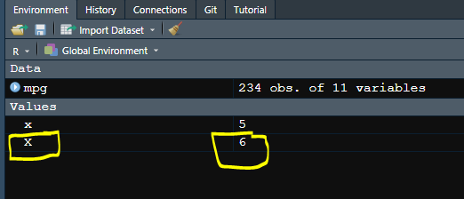

De esta manera sencilla hemos aprendido como asignar valores a las variables. Los valores que podemos asignar a una variable son diversos y de gran numero. Podemos asignar a una variable un gráfico, un modelo, una base de datos, un vector, etc. ¿Qué es precisamente un vector?. Un vector es un conjunto de datos para una sola variable, de una longitud determinada por el investigador o la base de datos evaluada. Para crear un vector de valores (sean cualitativos o cuantitativos) debemos de usar el comando **c()** y dentro de este, colocaremos el conjunto de valores que tiene el vector. Por ejemplo, si queremos crear un vector llamado "Vector_Ejemplo" lo haremos de la siguiente manera: 

```{r}
Vector_Ejemplo <- c(1, 2, 3, 4, 5, 6, 7, 8, 9, 10)
```

Veremos que en nuestra ventana "Environment" apareció este nuevo vector con todos los valores que le hemos dado. Podemos hacer ahora un vector de solo valores cualitativos, como por ejemplo colores (al que llamaremos Vector_Ejemplo2):

```{r}
Vector_Ejemplo2 <- c("azul", "rojo", "amarillo", "celeste", "marrón")
```

En esta oportunidad se creo el vector con los colores, que son datos cualitativos, en R hay dos formas de tratar datos cualitativos, por muchos años se a usado el tipo de dato *chr* (character), el cual nos indica que es un dato de tipo *texto*. Pero en los últimos años se prefiere a utilizar la unidad *fct* (factor), de uso especial para el trato de variables categóricas. La diferencia es bien marcada, ya que los datos tipo texto, son eso, datos que nos sirven para evaluar texto (investigaciones cualitativas, análisis de sentimiento, etc.). Sin embargo, las variables tipo *fct* son estrictamente variables categóricas que nos permiten correr análisis estadísticos sin errores. Por el momento trabajaremos con datos tipo texto y aprenderemos un paquete especializado en factores mas adelante. Las variables tipo texto, nos permiten hasta cierto margen utilizarlas como variables categóricas. 

Existen otro tipo de variable, como el boleano, que indica si algo es verdadero o falso. Por ejemplo podemos crear un tercer vector ejemplo con este tipo de unidades:

```{r}
Vector_Ejemplo3 <- c(TRUE, TRUE, FALSE, TRUE, FALSE)
```
Este tipo de vector, tiene variables del tipo *logi* (lógicos), los cuales nos permiten realizar operaciones con operadores boleano de lógica (visto en clase teórica).

Como vimos en clases, existen otros tipos de variables que iremos usando durante el curso. A manera de repaso se enseñan a continuación:

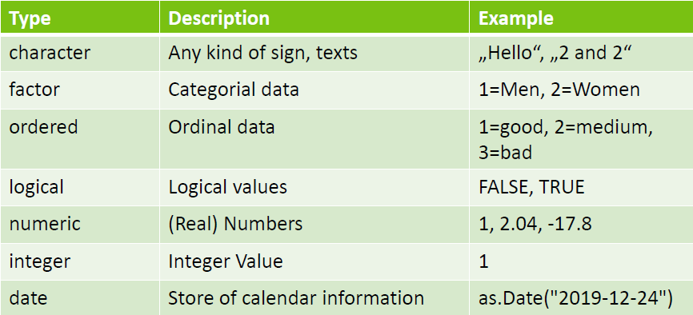

Nota: Al momento de crear una variable es una buena práctica utilizar nombres cortos de una sola palabra. En caso sea necesario usar mas de 1 palabra, se estila utilizar guion bajo para unirlas, ya que el lenguaje R considera a los espacios en blanco como errores si es que no son dentro de una función. Los estilos para crear una variable compuesta pueden ser los siguientes: 

+ Vector_Ejemplo
+ Vector_ejemplo
+ vector_ejemplo
+ VectorEjemplo

Vemos sutiles diferencias, trabajar con la forma que le parezca mas práctica o una nueva que usted se le acomode, la regla es no dejar espacios en blanco al momento de asignar un nombre a una variable, base de datos u otro tipo de información en R. 

## 2. Operacdores aritmeticos y logicos

Para recordar, tenemos operadores aritméticos en lenguaje R:

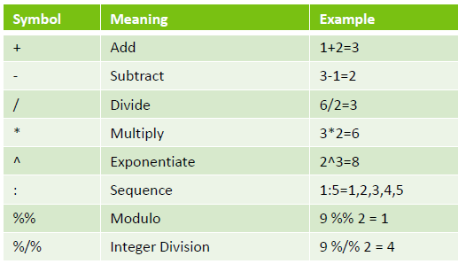

Como también operadores lógicos o de relación: 

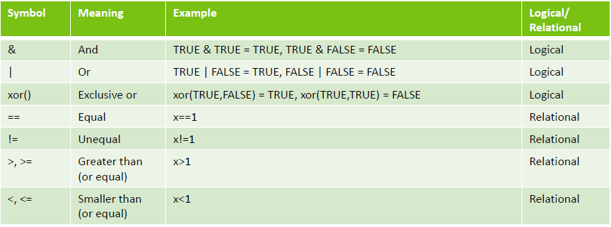

## 3. Operaciones entre unidades, vectores, matrices, listas y bases de datos

Las operaciones tanto aritméticas, como lógicas se pueden realizar en los diferentes tipos de bases de datos, en R, podemos tener unidades, vectores, matrices, listas y bases de datos. A continuación un resumen: 


Trabajaremos principalmente con bases de datos de tipo dataframe o tibbles. En algunos casos utilizaremos también vectores, por lo cual es importante manejarlos correctamente. 

## 4. Manejo de bases de datos básico, acceder a una variable específica

Mas adelante veremos el paquete "dplyr" que nos permitirá modificar y manipular bases de datos, hay sin embargo dos maneras "antiguas" pero aun útiles al momento de ingresar a una variable de una base de datos.

Podemos ingresar utilizando el símbolo de dolar **"$"** o utilizando dobles corchetes ***[[]]***. Tenemos la base de datos "mpg" cargada. Podemos observar al detalle que hay adentro con la función View():

```{r}
View(mpg)
```
Este comando nos abrirá un formato ordenado de la base de datos, donde entre otras cosas podremos observar los nombres de las variables en la parte superior. Por ejemplo, el año ("year") es una de estas variables. Podemos acceder a esta variable mediante los operadores señalados, pero antes vamos a asignar el resultado de la elección de una variable a una variable que crearemos llamada Seleccion_variable1

```{r}
Seleccion_variable1 <- mpg$year
```
Para visualizar el resultado en la consola tenemos que llamar a la variable por su nombre y correrla ("Run")

```{r}
Seleccion_variable1
```
Como pueden ver, hemos seleccionado solo un vector de la base de datos original "mpg", mediante el operador dolar **$**. Esto se puede realizar del mismo modo utilizando dobles corchetes (***[[]]***), y dentro de los corchetes colocaremos la posición de la variable que queramos seleccionar, en este caso la variable año ("year") se encuentra en la cuarta posición, seria de la siguiente manera: 

```{r}
Seleccion_variable2 <- mpg[[4]]
```
Llamamos a la variable con nombre "Seleccion_variable2":
```{r}
Seleccion_variable2
```


# CONCLUSIONES

Hemos visto de manera general como funciona Rstudio y como podemos utilizar el lenguaje de programación dentro de el. Existen adicionalmente otras funciones claves dentro del lenguaje de programación básico de R, pero es probable que no los necesitemos en el curso de estadística aplicada o los veamos sutilmente en los últimos temas. Con lo aprendido en esta primera parte introductoria basta para comenzar a aprender específicamente que hacen diferentes paquetes y para que los podemos usar. Durante el curso, veremos los principales paquetes básicos de R, pero en la actualidad existe un sin numero de paquetes almacenados en los servidores de R (repositorio CRAN) o paquetes piloto almacenados en GitHub (los que aun tienen que pasar pruebas y ensayos para ser oficiales).

En el siguiente link, ustedes podrán encontrar todas la "hojas de trucos" o "Cheatsheets" creados por la comunidad de Rstudio. En esta pagina, encontraran un sin numero de hojas de truco con el resumen de las principales funciones para cada paquete en particular o para procesos en particular. Una de estas hojas de truco que pueden descargar para esta primera parte, es la que dice "Base R". El link de la pagina: <https://rstudio.com/resources/cheatsheets/>

Nota: Algunas de las guías se encuentran traducidas a diferentes idiomas (entre ellos el español) en la parte inferior de la pagina. 


## EJERCICIOS

#### 1. Calculadora. Realice los siguientes calculos y asignelos a una variable (con el nombre de su elección):

+ 5 más 4
+ 6 menos 2
+ 4 entre 2
+ 10 elevado a la potencia 2
+ 5 multiplicado por 5
+ Halle la raíz cuadrada de 25

#### 2. Cree un vector de tipo texto (chr) con 5 tipos de fruta, el nombre del vector sera Fruta:

#### 3. Cree un vector de tipo numero con 5 numeros del 10 al 40 y asignelo a un vector del nombre de su elección. 

#### 4. Carge la base de datos "mpg" en su ambiente y diga cual es el valor maximo y el valor minimo de la variable displ (dezplazamiento del motor). Acuerdese que puede ingresar *?mpg* en su manuscrito para saber mas de la base de datos. Adicionalmente, encuentre el promedio *mean()*, desviacion estandar *sd()*, y cuantiles *quantile()*, el tipo de clase*class* de la variable **displ**. De igual manera que con las bases de datos, ustede puede colocar el signo de interrogación ? delante de cualquier función para darse una idea de como fuciona (por ejemplo: "?sd")

#### 5. Obtenga los nombres de las variables de la base de datos "mpg" con la ayuda de la función *names()* 

#### 6. Visualice los primeros valores de la base de datos "mpg" con ayuda de la función *head()*, asi mismo use la función *tail()* y determine para que sirve. 

#### 7. Podemos convertir un vector tipo texto en un vector numerico mediante la función *as.numeric()*. Compruebelo de la siguiente manera:

+ x <- c("a","b","a","c","b")
+ y <- as.numeric(x)

#### 8. Con los siguientes números: 7.3, 6.8, 0.005, 9, 12, 2.4, 18.9, 0.9
a) Calcula la media.
b) Calcula la raíz cuadrada de los números.
c) Obtenga los números que son mayores que su raíz cuadrada.
d) ¿Cuántos valores son mayores que 1?
e) Obtenga la raíz cuadrada de los números redondeados con dos cifras decimales.
f) ¿Cuánto difieren los números redondeados de los originales?

#### 9. La función *unique(x)* devuelve un vector como x, pero con los elementos duplicados eliminados.La función *duplicated(x)* determina que elementos de un vector que estan duplicados anteriormente y devuelve un vector logico. Utilicelas en la base de datos mpg en alguna variable de su interes. 

#### 10. Corran las siguientes operaciones en su Script y analicen los resultados. 

+ 2 == 1
+ 1 != 2
+ 2 > 1
+ 1 < 2
+ 2 >= 1
+ 2 <= 3

## SOLUCIONES
#### 1

+ 5+4
+ 6-2
+ 4/2
+ 10^2
+ 5*5
+ sqrt(25)

#### 2

+ Frutas <- c("Manzana", "Pera", "Melocotón", "Mango", "Granadilla")

#### 3

+ Números <- c(11, 12, 13, 14, 15)

#### 4

+ data("mpg")
+ p <- mpg$displ
+ max(p)
+ min(p)
+ mean(p)
+ sd(mpg$displ)
+ quantile(mpg$displ)

#### 5

+ names(mpg)

#### 6

+ head(mpg)
+ tail(mpg)

#### 7

+ x <- c("a","b","a","c","b")
+ y <- as.numeric(x)

#### 8

+ Números <- c(7.3, 6.8, 0.005, 9, 12, 2.4, 18.9, 0.9)
+ a)mean(Números)
+ b)sqrt(Números)
+ c)Números[Números>sqrt(Números)]
+ d)sum(Números>1)
+ e)sqrt(Númerosr<-round(Números,2))
+ f)Números-Númerosr

#### 9

+ data(mpg)
+ unique(mpg$year)
+ duplicated(mpg$year)

#### 10

+ 2 == 1
+ 1 != 2
+ 2 > 1
+ 1 < 2
+ 2 >= 1
+ 2 <= 3
+ Mediante este ejercicio puede comprobar como funcionan los operadores lógicos, cuyo resultado sera siempre VERDADERO o FALSO.
