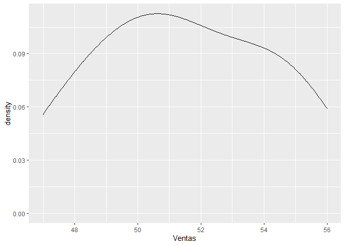
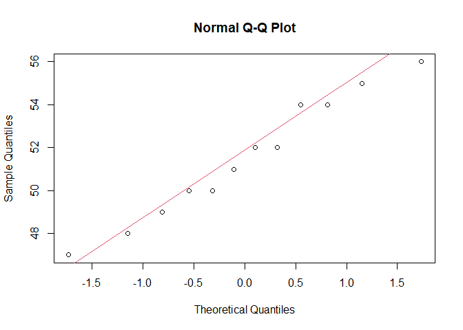
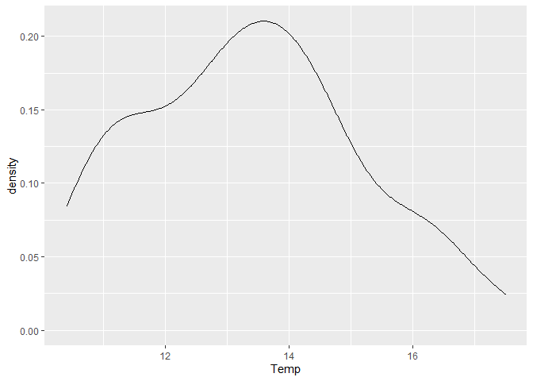
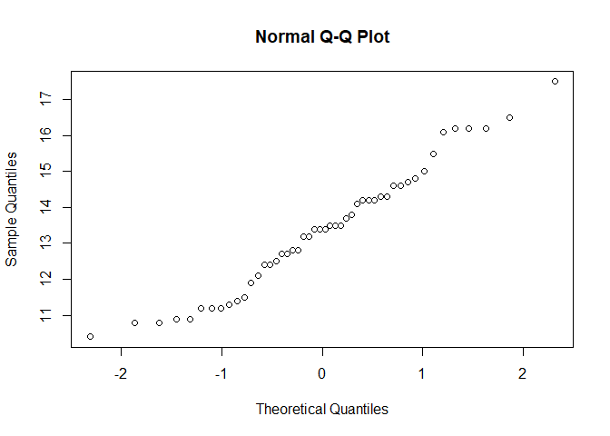
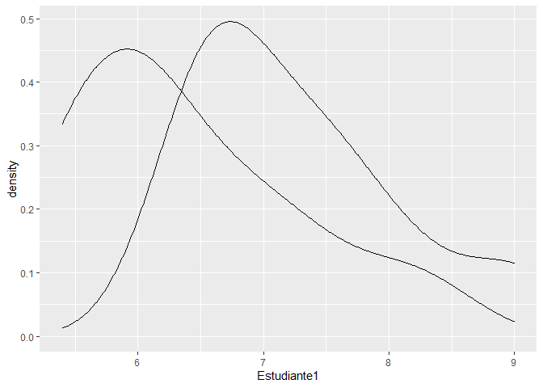
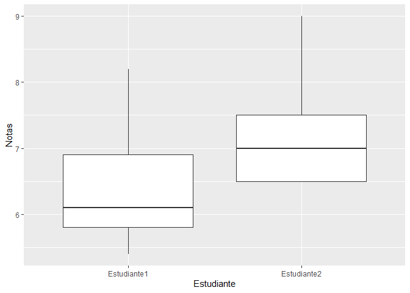
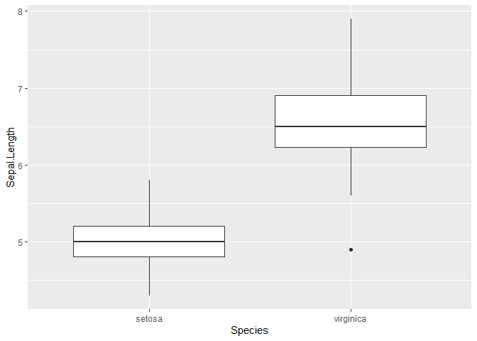

Resolución Practica 3
================

Librerias

``` r
library(tidyverse)
library(car)
library(nortest)
```

Bases de datos

``` r
Ventas.Aviones <- tibble(Mes = c("Enero", "Febrero", "Marzo", "Abril", "Mayo", "Junio", "Julio", "Agosto", "Setiembre", "Octubre", "Noviembre", "Diciembre"),
                         Ventas = c(48, 52, 50, 49, 47, 50, 51, 54, 54, 56, 52, 55))

Temperatura <- tibble(Temp = c(12.5,14.2,13.4, 14.6, 12.7, 10.9, 16.5, 14.7, 11.2, 10.9, 12.1, 12.8, 13.8, 13.5, 13.2, 14.1, 15.5, 16.2, 10.8, 14.3, 12.8, 12.4, 11.4, 16.2, 14.3, 14.8, 14.6, 13.7, 13.5, 10.8, 10.4, 11.5, 11.9, 11.3, 14.2, 11.2, 13.4, 16.1, 13.5, 17.5, 16.2, 15.0, 14.2, 13.2, 12.4, 13.4, 12.7, 11.2))

Estudiantes <- tibble(Estudiante1 = c(6.4, 5.8, 6.9, 5.4, 7.3, 8.2, 6.1, 5.5, 6.0),
                      Estudiante2 = c(6.5, 7.0, 7.5, 6.5, 8.1, 9.0, 7.5, 6.5, 6.8))


Hospital <- tibble(Hospital1 = c(72, 58, 91, 88, 70, 76, 98, 101, 65, 73, 79, 82, 80, 91, 93, 88, 97, 83, 71, 74),
                   Hospital2 = c(66, 40, 55, 70, 76, 61, 53, 50, 47, 61, 52, 48, 60, 72, 57, 70, 66, 55, 46, 51))
```

Resolución:

Ejercicio 1. La ventas de aviones del año pasado se puede obtener en la
base de datos “Ventas.Aviones”. Comprobar y analizar si los dato de
ventas siguen una distribución normal. Considera un nivel de confianza
del 95%. Realizar un gráfico (s) para interpretar los resultados de ser
posible para complementar sus resultados.

``` r
shapiro.test(Ventas.Aviones$Ventas)
```

    ## 
    ##  Shapiro-Wilk normality test
    ## 
    ## data:  Ventas.Aviones$Ventas
    ## W = 0.96726, p-value = 0.8801

``` r
lillie.test(Ventas.Aviones$Ventas)
```

    ## 
    ##  Lilliefors (Kolmogorov-Smirnov) normality test
    ## 
    ## data:  Ventas.Aviones$Ventas
    ## D = 0.14361, p-value = 0.7075

Aplicando DAgostino normality test:

Con un p-valor del 0.1509 y un nivel de significancia del 0.05, podemos
aceptar que la distribución de la venta de los aviones del año pasado es
de tipo normal.

Graficando:

``` r
ggplot(Ventas.Aviones)+
  geom_density(aes(x=Ventas))
```

<!-- -->

``` r
qqnorm(Ventas.Aviones$Ventas)
qqline(Ventas.Aviones$Ventas, col = 2)
```

<!-- -->

Ejercicio 2. Realizar un contraste de hipotesis para determinar si la
variable temperatura sigue una distribución normal (alfa = 5%). Realizar
un gráfico (s) para interpretar los resultados de ser posible para
complementar sus resultados.

``` r
shapiro.test(Temperatura$Temp)
```

    ## 
    ##  Shapiro-Wilk normality test
    ## 
    ## data:  Temperatura$Temp
    ## W = 0.96884, p-value = 0.2281

Graficando

``` r
ggplot(Temperatura)+
  geom_density(aes(x=Temp))
```

<!-- -->

``` r
qqnorm(Temperatura$Temp)
```

<!-- -->

Ejercicio 3 Utilizar la base de datos starwars del paquete dplyr y
realizar un contraste de hipotesis para determinar si la variable peso y
altura siguen o no una distribución normal. Realizar un gráfico (s) para
interpretar los resultados de ser posible para complementar sus
resultados.

``` r
data("starwars")

starwars_1 <-
  starwars %>% 
  select(mass, height) 

Peso <- starwars_1 %>% 
  select(mass) %>% 
  drop_na(mass)

Altura <- starwars_1 %>% 
  select(height) %>% 
  drop_na(height)

shapiro.test(Peso$mass)
```

    ## 
    ##  Shapiro-Wilk normality test
    ## 
    ## data:  Peso$mass
    ## W = 0.23458, p-value = 6.255e-16

``` r
shapiro.test(Altura$height)
```

    ## 
    ##  Shapiro-Wilk normality test
    ## 
    ## data:  Altura$height
    ## W = 0.8782, p-value = 1.446e-06

Ejercicio 4 La base de datos “Estudiantes” muestra las notas finales de
2 estudiantes en 9 materias academicas. Probar y analizar si es que
existe homogeneidad de varianzas entre los estudiantes (alfa = 5%).
Realizar un gráfico (s) para interpretar los resultados de ser posible
para complementar sus resultados.

``` r
leveneTest(Estudiantes$Estudiante1, Estudiantes$Estudiante2)
```

    ## Warning in leveneTest.default(Estudiantes$Estudiante1, Estudiantes$Estudiante2):
    ## Estudiantes$Estudiante2 coerced to factor.

    ## Levene's Test for Homogeneity of Variance (center = median)
    ##       Df F value Pr(>F)
    ## group  5  0.3616 0.8491
    ##        3

Graficando un gráfico de densidad para visualizar la distribución de los
datos:

``` r
ggplot(Estudiantes)+
  geom_density(aes(x=Estudiante1))+
  geom_density(aes(x=Estudiante2))
```

<!-- -->

En este caso particular hay que realizar un cambio en la base de datos
original para poder utilizar el boxplot de manera sencilla, eso usando
la función **pivot\_longer()**:

``` r
Estudiantes_1 <- 
  Estudiantes %>% 
  pivot_longer(
    cols = Estudiante1:Estudiante2,
    names_to = "Estudiante",
    values_to = "Notas"
  ) %>% 
  arrange(Estudiante)
```

Ahora si podemos dibujar el boxplot:

``` r
ggplot(Estudiantes_1)+
  geom_boxplot(aes(x=Estudiante, y = Notas))
```

<!-- -->

Ejercicio 5 Del paquete datasets utilice la base de datos iris y
corrobore si existen o no homogeneidad de varianzas para todas las
variables cuantitativas entre las especies (considere, especies como los
grupos a comparar, son 3 especies en total). Realice el analisis para
cada una de las variables cuantitativas (Sepal.Length, Sepal.With,
Petal.Length y Petal.Width). Realizar un gráfico (s) para interpretar
los resultados de ser posible para complementar sus resultados.

``` r
data(iris)
```

Cuando utulizamos la función **leveneTest()** siempre el segundo
argumento representarán los grupos que queremos comparar. Podemos
utiliza tanto el simbolo **“,”** o **“\~”**. Da los mismo. Para este
ejercicio, necesariamente necesitamos crear bases de datos con la
combinación de las dos variables (ya que aun no hemos aprendido para mas
de dos variables, lo veremos en ANOVA):

``` r
Virginica_Setosa <- 
  iris %>% 
  filter(Species != "versicolor")

Setosa_Versicolor <- 
  iris %>% 
  filter(Species != "virginica")

Versicolor_Virginica <- 
  iris %>% 
  filter(Species != "setosa")
```

Una vez creadas las 3 bases de datos podemos realizar el test.t() con la
**“\~”** o con **“,”** separando cada variable a estudiar en relación a
los grupos de especies. Esto de la siguiente manera:

Para las variables entre virginica y Setosa, podemos testear las 4
variables continuas:

``` r
leveneTest(Virginica_Setosa$Sepal.Length, Virginica_Setosa$Species)
```

    ## Levene's Test for Homogeneity of Variance (center = median)
    ##       Df F value   Pr(>F)   
    ## group  1  11.454 0.001027 **
    ##       98                    
    ## ---
    ## Signif. codes:  0 '***' 0.001 '**' 0.01 '*' 0.05 '.' 0.1 ' ' 1

``` r
leveneTest(Virginica_Setosa$Petal.Length, Virginica_Setosa$Species)
```

    ## Levene's Test for Homogeneity of Variance (center = median)
    ##       Df F value    Pr(>F)    
    ## group  1  39.571 8.871e-09 ***
    ##       98                      
    ## ---
    ## Signif. codes:  0 '***' 0.001 '**' 0.01 '*' 0.05 '.' 0.1 ' ' 1

``` r
leveneTest(Virginica_Setosa$Sepal.Width, Virginica_Setosa$Species)
```

    ## Levene's Test for Homogeneity of Variance (center = median)
    ##       Df F value Pr(>F)
    ## group  1  0.9699 0.3271
    ##       98

``` r
leveneTest(Virginica_Setosa$Petal.Width, Virginica_Setosa$Species)
```

    ## Levene's Test for Homogeneity of Variance (center = median)
    ##       Df F value    Pr(>F)    
    ## group  1  38.995 1.095e-08 ***
    ##       98                      
    ## ---
    ## Signif. codes:  0 '***' 0.001 '**' 0.01 '*' 0.05 '.' 0.1 ' ' 1

Lo mismo realizariamos para las dos otras bases de datos,
**Setosa\_Versicolor** y **Versicolor\_Virginica**.

Graficamos para longitud de petalo en cada especie (base de datos
Virginica - Setosa) un boxplot (gráfico mas indicado en este analisis)

``` r
ggplot(Virginica_Setosa)+
  geom_boxplot(aes(x=Species, y = Sepal.Length))
```

<!-- -->

Ejercicio 6 Se quiere comparar el tiempo medio de espera para ser
atendido por un médico (en minutos) en dos hospitales diferentes. Para
ello, recolectamos una muestra de 20 pacientes en cada hospital (los
datos están disponibles en la base de datos “Hospital”). Realizar la
prueba de hipotesis correspondiente para evidenciar si existen o no
diferencias significativas entre los tiempos de espera promedio en ambos
hospitales. Considere alfa igual al 5% y considere que no conoce la
varianza poblacional. Realizar un gráfico (s) para interpretar los
resultados de ser posible para complementar sus resultados.

Realizamos la prueba de t.test para dos muestras independientes, en esta
ocasión al no tener categorias en la base de datos original, podemos
correr el t.test de la siguiente manera:

``` r
t.test(Hospital$Hospital1, Hospital$Hospital2, paired = F)
```

    ## 
    ##  Welch Two Sample t-test
    ## 
    ## data:  Hospital$Hospital1 and Hospital$Hospital2
    ## t = 6.9208, df = 36.877, p-value = 3.678e-08
    ## alternative hypothesis: true difference in means is not equal to 0
    ## 95 percent confidence interval:
    ##  16.76063 30.63937
    ## sample estimates:
    ## mean of x mean of y 
    ##      81.5      57.8

Interpreten: minimo sepan como rechazar y aceptar la H0 y que significa
esto para la prueba de hipotesis que estan probando.

Ejercicio 7 Utilice la base de datos airquality del paquete datasets
para este problema. Compare si existe diferencias significativas de la
temperatura media entre dos meses de su elección. Considere un nivel de
confianza del 95%. Realizar un gráfico (s) para interpretar los
resultados de ser posible para complementar sus resultados.

``` r
data("airquality")
```

Vamos a comparar los meses de Mayo (5) con los de Julio (7)

En este caso particular vamos a tomarlo como dos muestras
independientes, ya que no estamos evaluando las estaciones, estamos
evaluando los dias. Los dias en este caso no son los mismos, al ser
meses diferentes, son dias diferentes (muestras no relacionadas o
independientes)

Tenemos dos opciones en este caso para realizar el t-test de 2 muestras
independientes.

**Primera forma**. Podemos separa dos bases de datos para cada uno de
los meses:

``` r
Mes5 <- airquality %>% 
  filter(Month == 5)

Mes7 <- airquality %>% 
  filter(Month == 7)
```

Con estas dos bases de datos separadas, podemos colocarlas de frente en
el t.test(), y separarlas po una “,”. Es super importante que coloquen
paired igual a FALSE, lo cual estará diciendo que no se tratan de
muestras relacionadas, es decir que son independientes

``` r
t.test(Mes5$Temp, Mes7$Temp, paired = F)
```

    ## 
    ##  Welch Two Sample t-test
    ## 
    ## data:  Mes5$Temp and Mes7$Temp
    ## t = -12.616, df = 50.552, p-value < 2.2e-16
    ## alternative hypothesis: true difference in means is not equal to 0
    ## 95 percent confidence interval:
    ##  -21.27617 -15.43351
    ## sample estimates:
    ## mean of x mean of y 
    ##  65.54839  83.90323

**Segunda forma**. Podemos realizar la prueba de test para dos muestra
indpendientes de frente desde una sola base de datos. Pero tenemos que
filtrat exclusivamente los mese que vamos a comparar (el 5 y 7). Creamos
la base de datos **Mes5\_Mes7** para ello. Es importante que utilicen el
operador **%in**, si solo colocan ==, no corresponde a lo que deseamos
(revisar dplyr):

``` r
Mes5_Mes7 <- select(airquality,Month,Temp) %>% 
  filter(Month %in% c("5","7")) #Es importante que utilicen el operador %in% y no "==", revisen paquete dplyr. 
```

Luego podemos realizar la prueba de t.test con la vergulilla (\~) la
cual indicará que estamos partiendo a la variable temperatura (Temp) en
razon a los meses dentro de la base de datos (por eso es importante
dejar solo 2 meses en la base de datos):

``` r
t.test(Mes5_Mes7$Temp ~ Mes5_Mes7$Month, paired = F)
```

    ## 
    ##  Welch Two Sample t-test
    ## 
    ## data:  Mes5_Mes7$Temp by Mes5_Mes7$Month
    ## t = -12.616, df = 50.552, p-value < 2.2e-16
    ## alternative hypothesis: true difference in means is not equal to 0
    ## 95 percent confidence interval:
    ##  -21.27617 -15.43351
    ## sample estimates:
    ## mean in group 5 mean in group 7 
    ##        65.54839        83.90323

Pueden percatarse que el resultado de los dos test, es completamente
igual. Sin embargo, la manera en la que corremos el t.test es diferente.

Interpreten: minimo sepan como rechazar y aceptar la H0 y que significa
esto para la prueba de hipotesis que estan probando.
