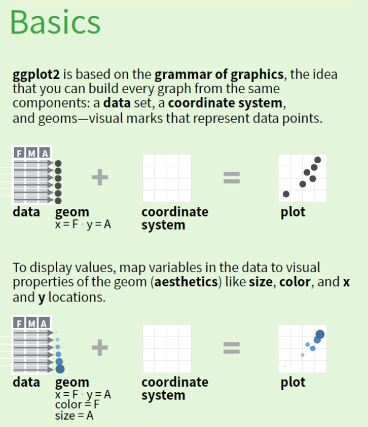
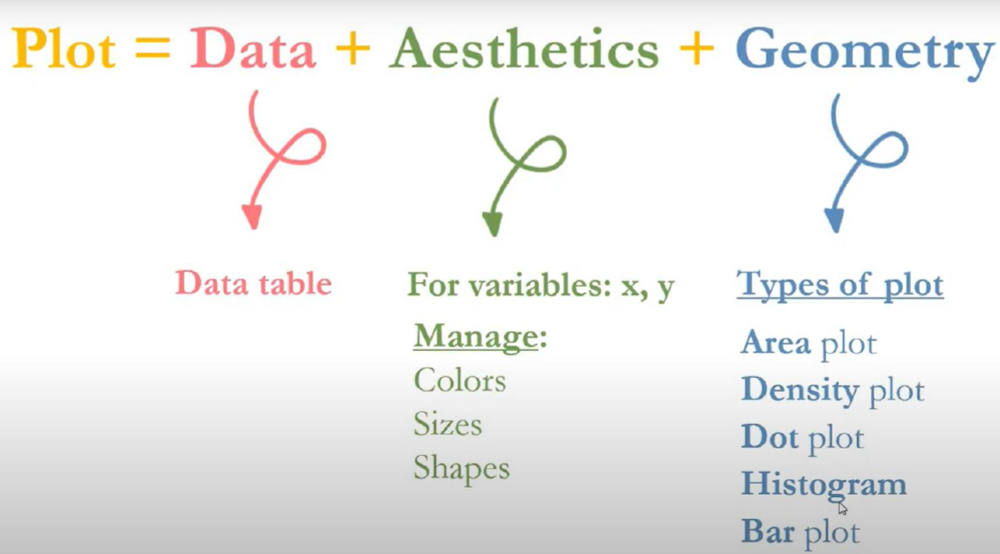

```{r setup, include=FALSE}
knitr::opts_chunk$set(echo = TRUE)
```

# A.Instalacion del paquete ggplot2 y su grámatica

## 1. Instalación y activación de ggplot2

Instalamos el paquete ggplot2 a través del interfaz de Rstudio o utilizando:

-   install.packages("ggplot2")

No olvidar luego activarlo mediante un check en la ventana de paquetes o mediante el código:

-   library(ggplot2)

Una vez instalado y activado podemos comenzar a utilizar las funciones dentro del paquete (recordar que solo tenemos que instalarlo una sola vez, pero debemos activarlo cada vez que abrimos Rstudio).

Nota: Al igual que el paquete dplyr, el paquete ggplot2 también viene con algunas bases de datos interesantes y con las que se pueden aprender diferentes técnicas especificas. Algunas de estas bases de datos son "diamonds", "mpg" y "midwest". No olvidar que para cargar una base de datos proveniente de un paquete utilizaremos la función: data(), el argumento que usaremos es el nombre del paquete.

## 2. La gramática de ggplot2

Antes de aprender la gramática de ggplot2 tenemos que tener muy en claro como funciona. No hemos aprendido el paquete de dplyr en primer lugar de **casualidad**. Esto lo hemos hecho debido a que es un requisito tener una base de datos limpia, ordenada y editada para poder visualizarla sin problemas.

En este sentido, es primordial siempre conocer nuestra base de datos, conocer cuantas variables y observaciones contiene. Conocer cada uno de los tipos de variable con los que vamos a trabajar. Reconocer cualquier tipo de error antes de visualizarla o hacer algún análisis estadístico. Una vez tengamos esta base de datos, podemos visualizarla y es para ellos que el paquete ggplot2 nos ayudará. La siguiente figura traslada esta dinámica entre bases de datos y visualización de datos.



El lenguaje utilizado por el ggplot2 es muy parecido al sistema de "pipes" ( %\>% ) aprendido y utilizado en el paquete *dplyr*. Sin embargo, al contrario de utilizar el operador **%\>%** utilizaremos solamente el símbolo **+** para concatenar diferentes "planos". Como se puede observar en la siguiente figura, la gramática de ggplot2 puede parecer difícil y confusa, pero les aseguro que una vez la dominen sera 100% intuitiva:



El "plot" o gráfico sera visualizado cuando mínimo hayamos cumplido con brindarle a nuestro código:

1.  Una base de datos
2.  La estética especifica (las variables con las que trabajamos, colores, tamaños y/o formas)
3.  La geometría que buscamos dibujar (gráficos de barras, de dispersión, de líneas, etc.)

Las geometrías definirán que tipo de gráfico estamos buscando, desde un gráfico de dispersión, de líneas, de cajas, etc. El siguiente gráfico nos brinda una lista pequeña de los principales gráficos utilizados en estadística, muchos de estos los realizaremos mas adelante con la base de datos starwars.


Dentro de estética o la geometría, podemos personalizar cada uno de nuestros gráficos a través del uso de argumentos que modificarán la transparencia, el color de las lineas, en color interno de las barras, el tipo de linea utilizado, el tamaño, etc. Algunas de estas se pueden visualizar en la siguiente figura:


Adicional a las 3 partes mínimas en la gramática de ggplot2 (datos, estéticas y geometría), podemos añadir otros elementos que nos permitirán modificar las gráficas originales y personalizar nuestros gráficos de maneras únicas. Algunas de estas funciones se ven en la siguiente figura, como por ejemplo coordinate_función(), la cual cambia el sistema de coordenadas; facet_function(), la cual nos permite generar un mismo gráfico pero agrupado por una característica especifica; theme_function(), la cual nos permite cambiar el fondo de nuestro plano cartesiano; entre muchas otras. Estas no son necesarias para graficar, sin embargo permiten un nivel de personalización del gráfico únicos. El gráfico a continuación adicionalmente les da la idea exacta de como se escribe una linea de código para graficar con ggplot2, tratar de recordar y memorizar.


**Nota**: Si han manejado un software de fotografía, pintura o de mapas georeferenciales, se habrán percatado que conforme avanzamos en el trabajo, generamos varias capas y en cada una de las diferentes capas dibujamos algo diferente que va sobreponiéndose en la imagen inicial. Eso es precisamente lo que hacemos con ggplot2. Comenzamos con un plano cartesiano (un lienzo en blanco) sobre el cual podemos "dibujar" diferentes puntos, lineas, mapas y otros gráficos que representaran el comportamiento de la base de datos que estamos estudiando y una o dos variables especificas.

# B. Manos a la obra: Graficando con ggplot2

En esta sección utilizaremos para todos los ejemplos, la base de starwars que hemos estado utilizando para el manejo de datos con el paquete dplyr (acordarse que la base de datos starwars es parte del paquete dplyr, y para poder usarla necesitamos que este activada y previamente instalada).

## 1. Gráfico de Barras, realizando nuestro primer grafico o "plot"

Tal como aprendimos en las clases de teoría, el gráfico de barras lo utilizaremos para representar las frecuencias absolutas o relativas de una variable cualitativa (categórica) de una base de datos. Para este fin cargaremos por primera ves la base de datos starwars y trabajemos específicamente con las variables categóricas dentro de esta base de datos.

```{r}
library(dplyr)
data("starwars")
```

Simplemente comenzamos con la gramática mas simple, enseñada en la primera parte de este documento y vista en la ultima figura. Comenzamos siempre escribiendo ggplot() y dentro del paréntesis escribimos el nombre de la base de datos que queramos trabajar (en nuestro caso "starwars_barra"). A partir de aquí, colocamos el símbolo "+" y colocaremos la función geométrica especifica para el tipo de gráfico especifico que queramos dibujar. En este caso,utilizamos la función geométrica para un gráfico de barras, el cual es "geom_bar()". Dentro de esta función, necesitamos colocar que variables queremos dibujar, para el gráfico de barras es una sola variable con sus frecuencias respectivas. Es decir que el valor de las coordinadas "x", tomará el valor de la variable "sex" y el valor de las coordinadas "y" tomará el valor de las frecuencias del sexo de los personajes. El resultado lo verán después de correr el siguiente código (no olvidar activar el paquete ggplot2).

```{r}
library(ggplot2)

ggplot(data = starwars)+
  geom_bar(mapping = aes(x=sex))
  
```

La función geom_bar(), reconoce automáticamente que tiene que encontrar las frecuencias de la variable de estudio. Pueden notar que incluso podemos observar las frecuencias de todos los "NA" de la base de datos original para esta variable. Los NA podemos eliminarlos mediante diferentes métodos, uno de ellos seria filtrar la base de datos y sacar todos los datos NA. Pero otra opción mas especifica seria utilizar la siguiente función, drop_na(), del paquete tidyr (que aun no hemos visto):

```{r}
library(tidyr)

starwars %>% 
  drop_na(sex) %>% 
  ggplot()+
  geom_bar(mapping = aes(x=sex))
```

### 1.1 Modificaciones en los argumentos, personalizando nuestro diagrama de barras.

Una vez tengamos nuestro diagrama base, podemos ir añadiendo argumentos que cambiaran su aspecto. Por ejemplo, si queremos cambiar el color de las lineas o el color interior de las barras utilizaremos los argumentos "color" y "fill" respectivamente:

```{r}
starwars %>% 
  drop_na(sex) %>% 
  ggplot()+
  geom_bar(mapping = aes(x=sex), color = "red", fill = "blue")
```

Así mismo, si es que quisiéramos cambiar la transparencia de las barras utilizaríamos el argumento "alpha":

```{r}
starwars %>% 
  drop_na(sex) %>% 
  ggplot()+
  geom_bar(mapping = aes(x=sex), color = "red", fill = "blue", alpha = 0.5)
```

De esta manera podemos ir modificando ciertos atributos de los gráficos. Estos los iremos aprendiendo poco a poco con los siguientes tipos de gráficos.

## 2. Gráfico de puntos o de dispersión 

Al igual que el gráficos de barras, utilizaremos la misma gramática anterior, pero en este caso en particular utilizaremos la función geométrica "geom_point()". Así mismo, trabajaremos esta vez con dos variables de tipo cuantitativas (discretas o continuas). Vamos entonces a graficar en un plano cartesianos las variables de peso y altura. Aprovecharemos para evaluar su potencial relación. 

```{r}
starwars %>% 
  drop_na(mass, height) %>% 
  ggplot()+
  geom_point(mapping = aes(x=mass, y=height))
```

Podemos observar que nos ha graficado la intersección entre las dos variables. Rápidamente podemos ver que hay un punto que rompe toda la estructura del gráfico, es nuestro amigo Jabba con su gran peso (el cual al parecer no guarda relación con su altura, al compararlo con todos los demás personajes). Eliminando en nuestra imaginación a Jabba podemos observar cierta tendencia, y hipotetizar que a mayor altura, mayor mas. Esto posteriormente tendremos que comprobarlo con los estadísticos aprendidos en clase. 

Regresando al paquete ggplot2, podemos quizá comenzar a añadir nuevas lineas de código, que nos permitan diferenciar mas cosas a través del gráfico. Compute el siguiente código, y analice que pasa:

```{r}
starwars %>% 
  drop_na(mass, height) %>% 
  ggplot()+
  geom_point(mapping = aes(x=mass, y=height))+
               ggtitle("Relacion entre peso y altura de personajes de starwars")+
               xlab("Peso(kg)")+
               ylab("Altura(cm)")
```

Como se puede observar, hemos añadido nombres, un titulo, y los nombres de las ejes. Aprovechando, añadiremos y aprenderemos para que sirve la función "facet_wrap()"

```{r}
starwars %>% 
  drop_na(mass, height,sex) %>% 
  ggplot()+
  geom_point(mapping = aes(x=mass, y=height))+
               ggtitle("Relacion entre peso y altura de personajes de starwars")+
               xlab("Peso(kg)")+
               ylab("Altura(cm)")+
  facet_wrap(~sex)
```
Podemos visualizar que la función "facet_wrap()" lo que nos permite es divisor los datos en subgrupos. El subgrupo lo dividimos a razón de una variable de interés. En este caso, le dijimos a facet_wrap() que nos grafique la misma relación pero para los 4 grupos determinados por su sexo. El símbolo **~** indica relación o pueden traducirlo como "en base a" o "en función a". Si su teclado esta configurado al español, pueden escribirlo mediante Alt+(botón superior al costado de la tecla Enter).

## 3. Graficos de cajas, visualizando la diferencia grupos. 

Recordar que un gráfico de barras necesitamos una variable cualitativa (o cuantitativa discreta) mas una variable cuantitativa (puede ser discreta o continua). Para realizar un gráfico de cajas (boxplot) en ggplot utilizaremos la función "geom_boxplot()". Vamos por ejemplo a evaluar la diferencia en peso (mass) entre los diferentes personajes en función a su sexo (sex). Esto lo realizaremos de la siguiente manera:

```{r}
starwars %>% 
  drop_na(mass, sex) %>% 
  ggplot()+
  geom_boxplot(mapping = aes(x=sex, y=mass))
```

Al parecer nuestro amigo Jabba esta generando que la visualización de datos sea no tan amigable. Vamos a probar que sucede si lo eliminamos.
```{r}
starwars %>% 
  drop_na(mass, sex) %>% 
  filter(sex != c("hermaphroditic")) %>% 
ggplot()+
  geom_boxplot(mapping = aes(x=sex, y=mass))
```
Ahora si podemos observar la diferencia entre los grupos, es mas, también podríamos eliminar a los de sexo no definido (none) para solo evaluar los sexos masculino y femenino. 

```{r}
starwars %>% 
  drop_na(mass, sex) %>% 
  filter(sex %in% c("female", "male")) %>% 
  ggplot()+
  geom_boxplot(mapping = aes(x=sex, y=mass))+
  ggtitle("Comparación entre el peso de personajes segun su sexo")+
  xlab("Sexo")+
  ylab("Peso(kg)")
```

A partir de este gráfico podemos concluir varias cosas ¿Qué se les ocurre por ejemplo? Analice y discuta en clase. 

Hasta este punto hemos aprendido a gráfica diferentes plots básicos de la estadística. Esto no es mas que una pequeña muestra de las potencialidades de R para adaptarnos a su gramática y flujo de trabajo. Sin darnos cuenta, hemos utilizado funciones aprendidas del paquete dplyr y comprobar como estos dos paquetes se complementan de manera eficiente y dinámica. 

### EJERCICIOS

Utilice la base de datos de starwars u otra base de datos de su preferencia (y de preferencia dentro de alguno de los paquetes de R, puede encontrarlos aquí: <https://vincentarelbundock.github.io/Rdatasets/datasets.html>)

##### 1. Realice un grafico de barras (Si utiliza la base de datos de starwars, realice el grafico con otras variables no realizadas en este documento).  

##### 2. Realice un grafico de cajas o boxplot (Si utiliza la base de datos de starwars, realice el grafico con otras variables no realizadas en este documento).  

##### 3. Realice un grafico de puntos o de dispersión ((Si utiliza la base de datos de starwars, realice el grafico con otras variables no realizadas en este documento).  

##### 4. Realice un grafico de lineas. 

##### 5. Realice un gradico de torta o radial

##### 6. Realice un histograma.

##### 7. Realice un grafico de violin.

##### 8. Intente realizar mas gráficos y práticar. Sino puede hacer alguno de los gráficos propuestos, consulte a la siguiente pagina como referencia <https://www.r-graph-gallery.com/index.html>. Sino entiende, comente en los foros de la clase o a su profesor. 
 
Referencias: 

El libro de Hadley Wickhman, creador del paquete ggplot2 en el año 2005, se puede obtener gratis en el siguiente enlace:
<https://ggplot2-book.org/statistical-summaries.html>


