Gráficos adicionales en ggplot2 + Otros
================

# 1. Gráficos de Correlación

## 1.1. Correlación con la libreria corrplot

Realizamos una correlación de entre todas la variables cuantitativas.
Esta matriz la realizamos con la función **"cor()**:

``` r
mtcars.cor <- cor(mtcars, method = "pearson")
mtcars.cor
```

    ##             mpg        cyl       disp         hp        drat         wt
    ## mpg   1.0000000 -0.8521620 -0.8475514 -0.7761684  0.68117191 -0.8676594
    ## cyl  -0.8521620  1.0000000  0.9020329  0.8324475 -0.69993811  0.7824958
    ## disp -0.8475514  0.9020329  1.0000000  0.7909486 -0.71021393  0.8879799
    ## hp   -0.7761684  0.8324475  0.7909486  1.0000000 -0.44875912  0.6587479
    ## drat  0.6811719 -0.6999381 -0.7102139 -0.4487591  1.00000000 -0.7124406
    ## wt   -0.8676594  0.7824958  0.8879799  0.6587479 -0.71244065  1.0000000
    ## qsec  0.4186840 -0.5912421 -0.4336979 -0.7082234  0.09120476 -0.1747159
    ## vs    0.6640389 -0.8108118 -0.7104159 -0.7230967  0.44027846 -0.5549157
    ## am    0.5998324 -0.5226070 -0.5912270 -0.2432043  0.71271113 -0.6924953
    ## gear  0.4802848 -0.4926866 -0.5555692 -0.1257043  0.69961013 -0.5832870
    ## carb -0.5509251  0.5269883  0.3949769  0.7498125 -0.09078980  0.4276059
    ##             qsec         vs          am       gear        carb
    ## mpg   0.41868403  0.6640389  0.59983243  0.4802848 -0.55092507
    ## cyl  -0.59124207 -0.8108118 -0.52260705 -0.4926866  0.52698829
    ## disp -0.43369788 -0.7104159 -0.59122704 -0.5555692  0.39497686
    ## hp   -0.70822339 -0.7230967 -0.24320426 -0.1257043  0.74981247
    ## drat  0.09120476  0.4402785  0.71271113  0.6996101 -0.09078980
    ## wt   -0.17471588 -0.5549157 -0.69249526 -0.5832870  0.42760594
    ## qsec  1.00000000  0.7445354 -0.22986086 -0.2126822 -0.65624923
    ## vs    0.74453544  1.0000000  0.16834512  0.2060233 -0.56960714
    ## am   -0.22986086  0.1683451  1.00000000  0.7940588  0.05753435
    ## gear -0.21268223  0.2060233  0.79405876  1.0000000  0.27407284
    ## carb -0.65624923 -0.5696071  0.05753435  0.2740728  1.00000000

Para visualizarlo mejor, podemos redondear los números a solo dos
digitos:

``` r
round(mtcars.cor, digits = 2)
```

    ##        mpg   cyl  disp    hp  drat    wt  qsec    vs    am  gear  carb
    ## mpg   1.00 -0.85 -0.85 -0.78  0.68 -0.87  0.42  0.66  0.60  0.48 -0.55
    ## cyl  -0.85  1.00  0.90  0.83 -0.70  0.78 -0.59 -0.81 -0.52 -0.49  0.53
    ## disp -0.85  0.90  1.00  0.79 -0.71  0.89 -0.43 -0.71 -0.59 -0.56  0.39
    ## hp   -0.78  0.83  0.79  1.00 -0.45  0.66 -0.71 -0.72 -0.24 -0.13  0.75
    ## drat  0.68 -0.70 -0.71 -0.45  1.00 -0.71  0.09  0.44  0.71  0.70 -0.09
    ## wt   -0.87  0.78  0.89  0.66 -0.71  1.00 -0.17 -0.55 -0.69 -0.58  0.43
    ## qsec  0.42 -0.59 -0.43 -0.71  0.09 -0.17  1.00  0.74 -0.23 -0.21 -0.66
    ## vs    0.66 -0.81 -0.71 -0.72  0.44 -0.55  0.74  1.00  0.17  0.21 -0.57
    ## am    0.60 -0.52 -0.59 -0.24  0.71 -0.69 -0.23  0.17  1.00  0.79  0.06
    ## gear  0.48 -0.49 -0.56 -0.13  0.70 -0.58 -0.21  0.21  0.79  1.00  0.27
    ## carb -0.55  0.53  0.39  0.75 -0.09  0.43 -0.66 -0.57  0.06  0.27  1.00

En este caso, los datos de esta manera no son muy “digeribles” y tenemos
la función del paquete básico de R, para visualizarlas de la siguiente
manera:

``` r
corrplot(mtcars.cor)
```

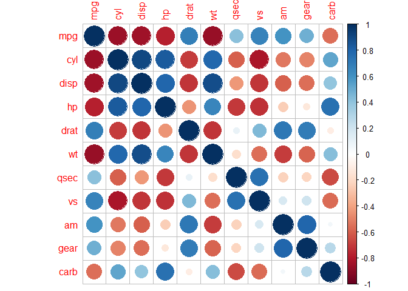<!-- -->

También tenemos variantes de este mismo gráfico, cambiando detalles en
los argumentos:

``` r
corrplot(mtcars.cor, method = "shade", shade.col = NA, tl.col = "black", tl.srt = 45)
```

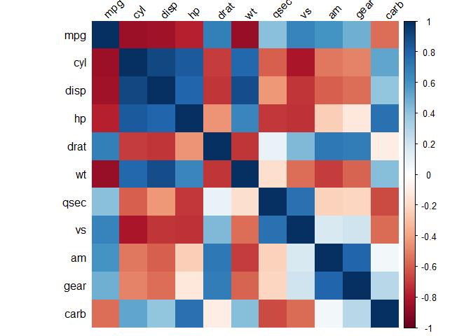<!-- -->

Vamos a cambiar ahora la paleta de colores:

``` r
col <- colorRampPalette(c("#BB4444", "#EE9988", "#FFFFFF", "#77AADD", "#4477AA"))
```

La usamos en nuestra matriz

``` r
corrplot(mtcars.cor, method = "shade", shade.col =NA, tl.col = "black", tl.srt = 45, col = col(200), addCoef.col = "black", order = "AOE")
```

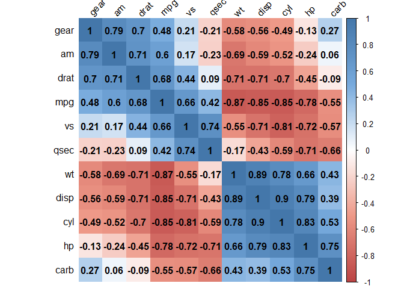<!-- -->

Una variante más:

``` r
corrplot(mtcars.cor, method = "shade", shade.col =NA, tl.col = "black", tl.srt = 45, col = col(200), addCoef.col = "black", order = "AOE", type = "lower")
```

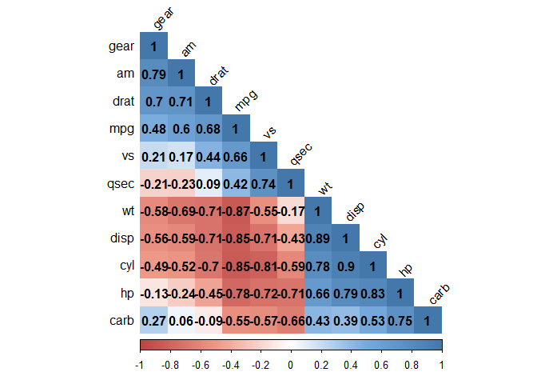<!-- -->

o también:

``` r
corrplot(mtcars.cor, method = "shade", shade.col =NA, tl.col = "black", tl.srt = 45, col = col(200), addCoef.col = "black", order = "AOE", type = "upper")
```

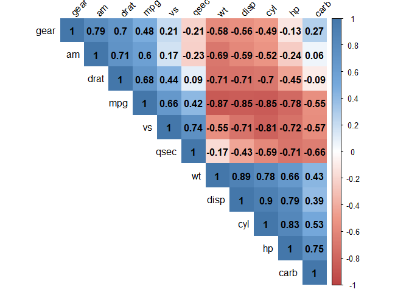<!-- -->

También podemos evitar visualizar la diagonal con los valore
correlacionales iguales a 1 (la misma variable correlacionada consigo
misma):

``` r
corrplot(mtcars.cor, method = "shade", shade.col =NA, tl.col = "black", tl.srt = 45, col = col(200), addCoef.col = "black", order = "AOE", type = "upper", diag = F)
```

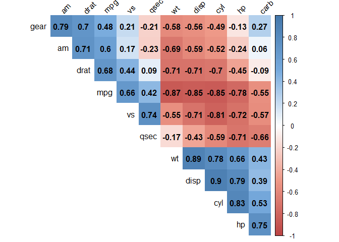<!-- -->

El metodo por defecto es el de circulos (el primero que hicimos), lo
podemos establecer como tal de la siguiente manera:

``` r
corrplot(mtcars.cor, method = "circle", shade.col =NA, tl.col = "black", tl.srt = 45, col = col(200), addCoef.col = "black", order = "AOE", type = "upper", diag = F)
```

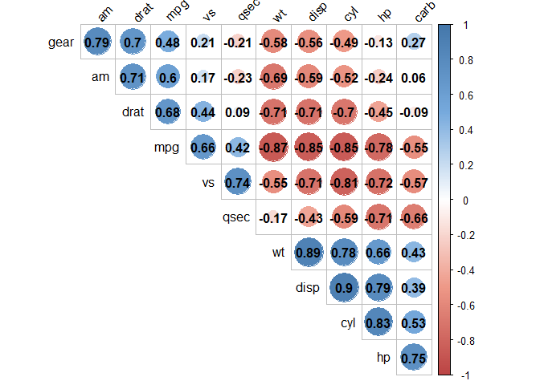<!-- -->

Podemos probar también con elipses:

``` r
corrplot(mtcars.cor, method = "ellipse", shade.col =NA, tl.col = "black", tl.srt = 45, col = col(200), addCoef.col = "black", order = "AOE", type = "upper", diag = F)
```

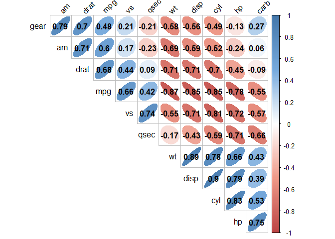<!-- -->

Fijese que la orientación de las elipses, determina también la dirección
de la correlación. Otra forma:

``` r
corrplot(mtcars.cor, method = "pie", shade.col =NA, tl.col = "black", tl.srt = 45, col = col(200), addCoef.col = "black",  order = "AOE", type = "upper", diag = F)
```

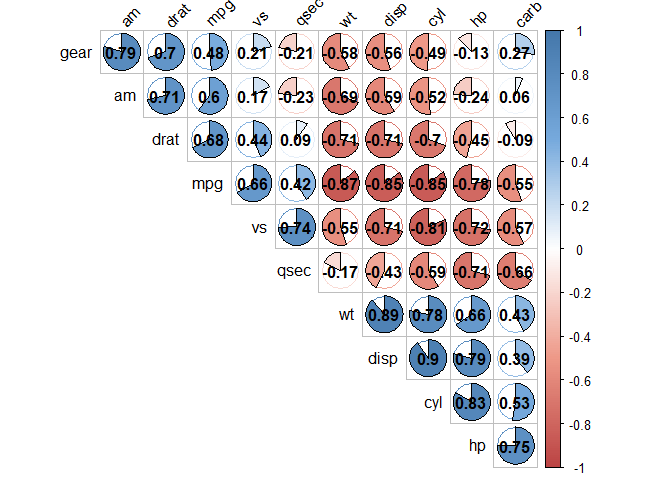<!-- -->

Por último también tenemos “square”:

``` r
corrplot(mtcars.cor, method = "square", shade.col =NA, tl.col = "black", tl.srt = 45, col = col(200), addCoef.col = "black",  order = "AOE", type = "upper", diag = F)
```

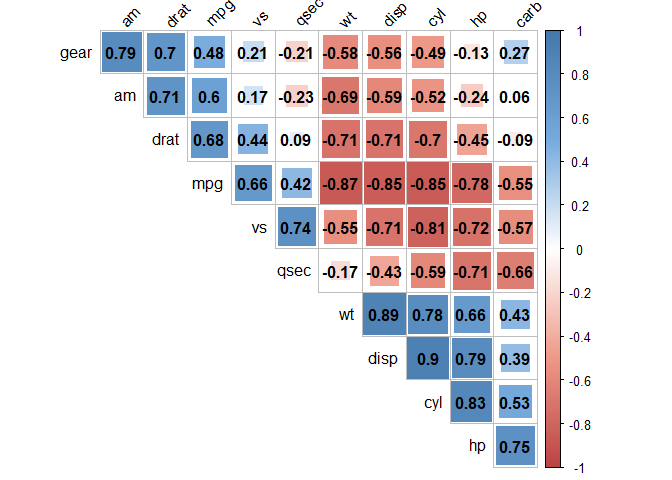<!-- -->

Adicionalmente, no solo podemos agruparlos por correlaciones positivas o
negativas, también podemos agruparlos en relación a su primer componente
principal (PCA), lo cambiamos en el argumento **order = **:

``` r
corrplot(mtcars.cor, method = "shade", shade.col =NA, tl.col = "black", tl.srt = 45, col = col(200), addCoef.col = "black",  order = "FPC", type = "upper", diag = F)
```

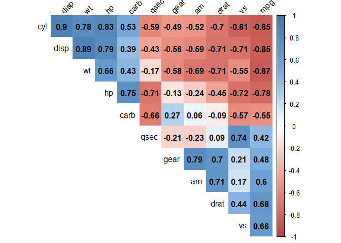<!-- -->

O también, agrupados en relacion a su agrupamiento herarquico.

``` r
corrplot(mtcars.cor, method = "shade", shade.col =NA, tl.col = "black", tl.srt = 45, col = col(200), addCoef.col = "black",  order = "hclust", type = "upper", diag = F)
```

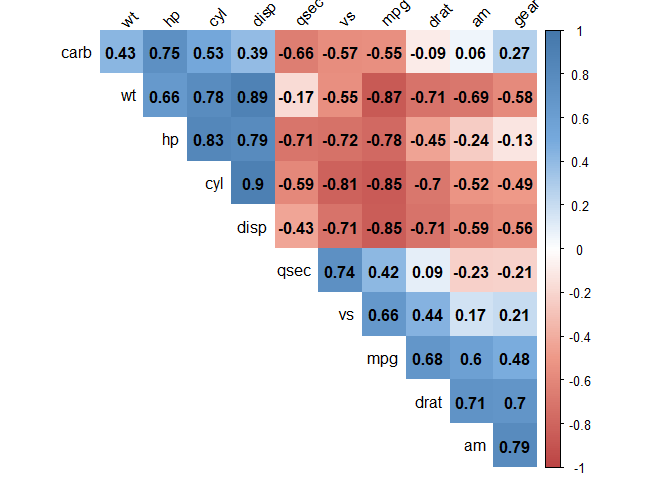<!-- -->

## 1.2. Correlación con la libreria ggplot2:

Antes de usar ggplot2 para gráficar correlaciones, necesitamos
**fundir** la matriz en un data.frame de dos variables. Esto lo
realizaremos con la función **metl()** del paquete **reshape2** de la
siguiente manera:

``` r
library(ggplot2)
library(reshape2)
mtcars.fundido <- melt(mtcars.cor)
```

Ahora si podemos hacer uso del paquete ggplot2:

``` r
ggplot(data = mtcars.fundido, 
       aes(x = Var1, y = Var2, fill = value))+
  geom_tile()
```

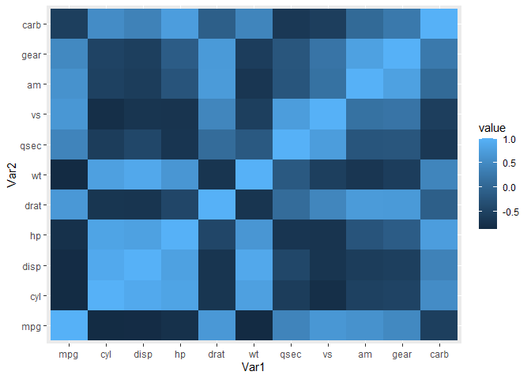<!-- -->

Para editar los colores y realizar gráficos similares a los anteriores,
necesitaremos las siguientes tres funciones:

``` r
get_lower_triangle <- function(cormat){
  cormat[upper.tri(cormat)] <- NA
  return(cormat)
}

get_upper_triangle <- function(cormat){
  cormat[lower.tri(cormat)] <- NA
  return(cormat)
}

reorder_cormat <- function(cormat){
  dd <- as.dist((1-cormat)/2)
  hc <- hclust(dd)
  cormat <- cormat[hc$order, hc$order]
}
```

Luego, crearemos nuestra matriz de correlación, usando la función
**reorder\_cormat()** que acabamos de crear. En esta función
utilizaremos la matriz de correlación creada en un inicio (mtcars.cor):

``` r
cormat <- reorder_cormat(mtcars.cor)
cormat.ut <- get_upper_triangle(cormat)
```

hemos creado nuestro triangulo de correlaciones en la parte inferior
derecha, ahora lo *fundiremos* a una matriz con la función **melt()**:

``` r
cormat.ut.melted <- melt(cormat.ut, na.rm = T)
```

Con ello, podemos ahora dibujar en ggplot:

``` r
ggplot(cormat.ut.melted, aes(Var2, Var1, fill = value))+
  geom_tile(color = "white")
```

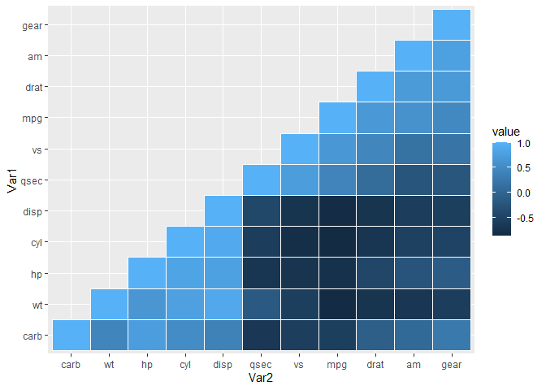<!-- -->

Podemos editarlo de diferentes maneras, como por ejemplo:

``` r
ggplot(cormat.ut.melted, aes(Var2, Var1, fill = value))+
  geom_tile(color = "white")+
  scale_fill_gradient2(low = "blue", high = "green",
                       mid = "white", midpoint = 0, 
                       limit = c(-1,1), space = "Lab", 
                       name = "Correlación de Pearson")+
  theme_minimal()+
  theme(axis.text.x = element_text(angle = 45, vjust = 1, size = 12, hjust = 1))+
  coord_fixed()
```

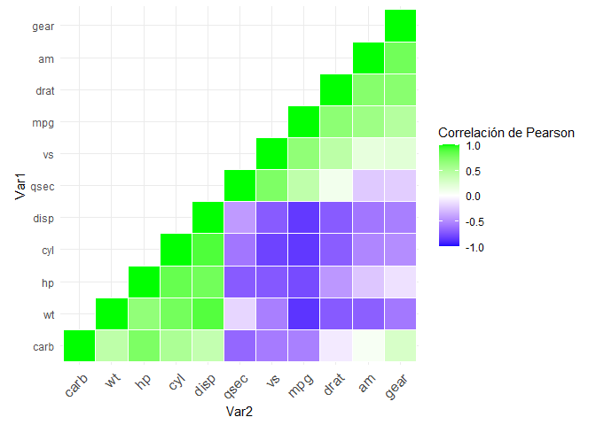<!-- -->

# 2. Etiquetas y leyendas en ggplot2

``` r
library(ggplot2)
```

Vamos a trabajar con una base de datos del crecimiento de dientes:

``` r
Dientes <- read.csv("https://raw.githubusercontent.com/luiqs/r-course/master/data/tema7/ToothGrowth.csv")
```

Realizamos un boxplot simple y modificamos sus etiquetas:

``` r
ggplot(Dientes, aes(x=dose, y = len))+
  geom_boxplot()+
  ggtitle("Crecimiento dental en función de la dosis (mg/día)")+
  xlab("Dosis de vitamina C (mg/día)")+
  ylab("Crecimiento dental (en mm)")
```

    ## Warning: Continuous x aesthetic -- did you forget aes(group=...)?

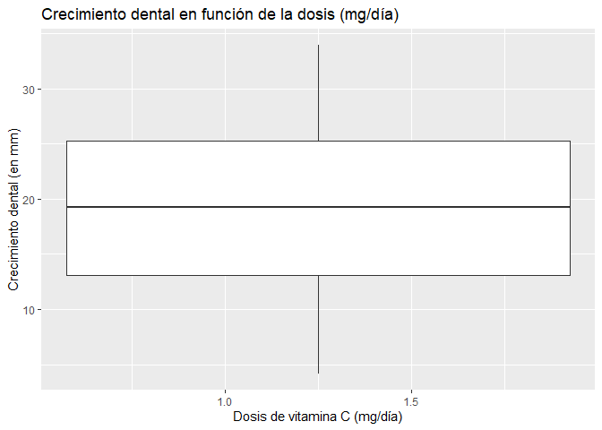<!-- -->

La variable dosis, es númerica, especificamente un tipo de variable
double en en R, el box plot espera que la variable del eje x sea
cualitativa (en R, generalmente representamos este tipo de variables
como factores). De esto, podemos hacer un artificio en el mismo ggplot
para que dibujemos las 3 cajas (3 dosis), sin modificar la data:

``` r
ggplot(Dientes, aes(x=dose, y = len, fill = as.factor(dose)))+
  geom_boxplot()+
  ggtitle("Crecimiento dental en función de la dosis (mg/día)")+
  xlab("Dosis de vitamina C (mg/día)")+
  ylab("Crecimiento dental (en mm)")
```

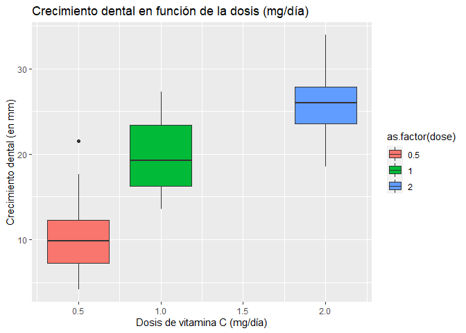<!-- -->

Podemos añadir detalles a la legendam, como por ejemplo, colocarle un
nombre:

``` r
ggplot(Dientes, aes(x=dose, y = len, fill = as.factor(dose)))+
  geom_boxplot()+
  ggtitle("Crecimiento dental en función de la dosis (mg/día)")+
  xlab("Dosis de vitamina C (mg/día)")+
  ylab("Crecimiento dental (en mm)")+
  labs(fill = "Dosis en mg/día")
```

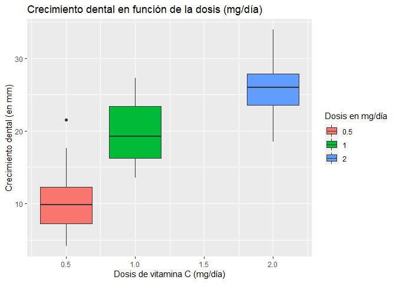<!-- -->

En ves de usar estos argumentos, puede usarse la función **theme()**,
por ejemplo, podemos mover donde sale nuestra leyenda:

``` r
ggplot(Dientes, aes(x=dose, y = len, fill = as.factor(dose)))+
  geom_boxplot()+
  ggtitle("Crecimiento dental en función de la dosis (mg/día)")+
  xlab("Dosis de vitamina C (mg/día)")+
  ylab("Crecimiento dental (en mm)")+
  labs(fill = "Dosis en mg/día")+
  theme(legend.position = "bottom")
```

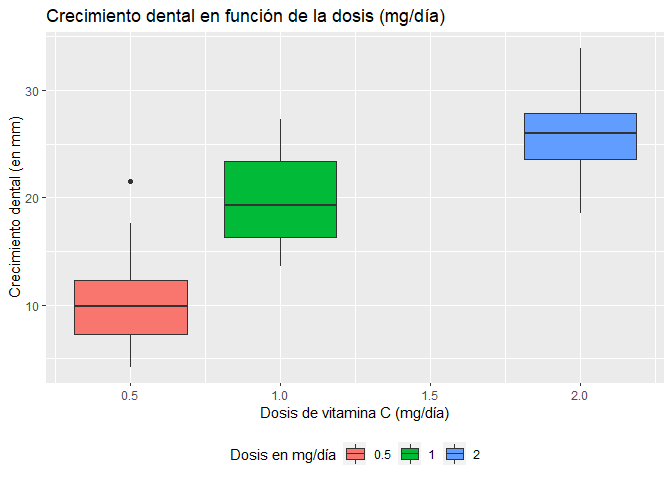<!-- -->

## 2.1. Temas

Utilizando temas, o **theme\_bw()**

``` r
ggplot(Dientes, aes(x=dose, y = len, fill = as.factor(dose)))+
  geom_boxplot()+
  theme_bw()
```

<!-- -->

Otro:

``` r
ggplot(Dientes, aes(x=dose, y = len, fill = as.factor(dose)))+
  geom_boxplot()+
  theme_dark()
```

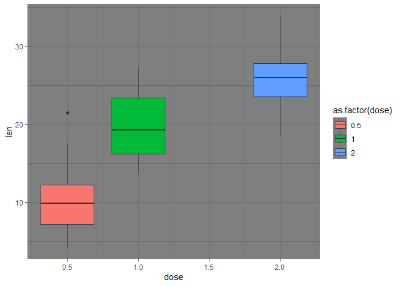<!-- -->

o también:

``` r
ggplot(Dientes, aes(x=dose, y = len, fill = as.factor(dose)))+
  geom_boxplot()+
  theme_classic()
```

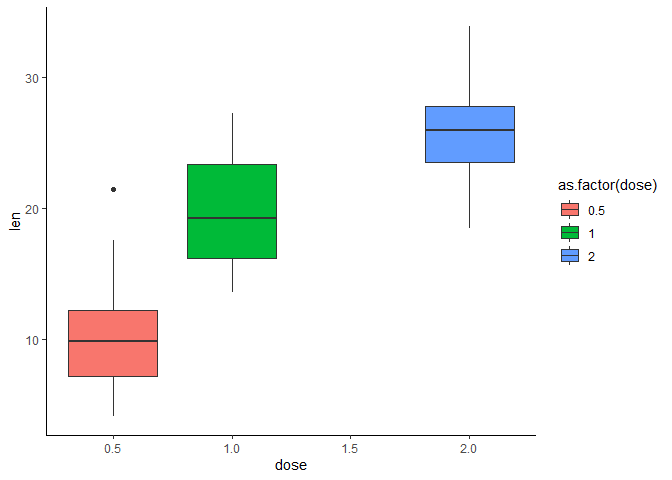<!-- -->

o también:

``` r
ggplot(Dientes, aes(x=dose, y = len, fill = as.factor(dose)))+
  geom_boxplot()+
  theme_grey()
```

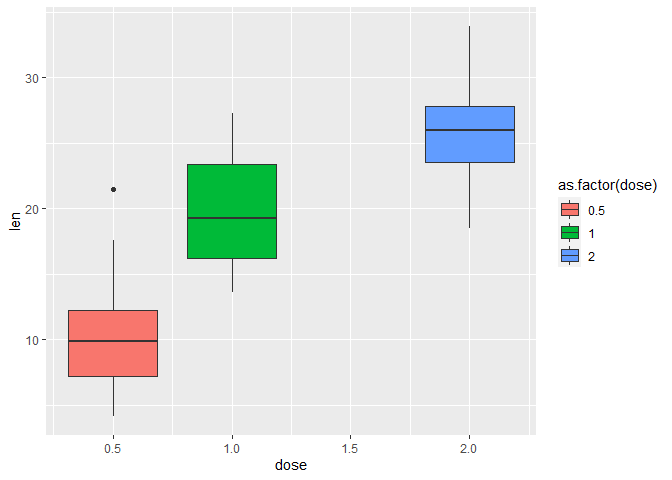<!-- -->

Como adelantamos, dentro de la función theme (sea cuál sea), podemos
determinar un sin número de argumento que cambiaran la apariencia de
nuestro gráfico:

``` r
ggplot(Dientes, aes(x=dose, y = len, fill = as.factor(dose)))+
  geom_boxplot()+
  #theme(plot.background = element_rect(fill = "darkblue"))
  theme(axis.text.x = element_text(face = "bold",
                                   family = "mono",
                                   size = 13,
                                   angle = 0,
                                   color = "red"),
        axis.text.y = element_text(face = "italic",
                                   family = "serif",
                                   size = 20,
                                   angle = 0,
                                   color = "green"))
```

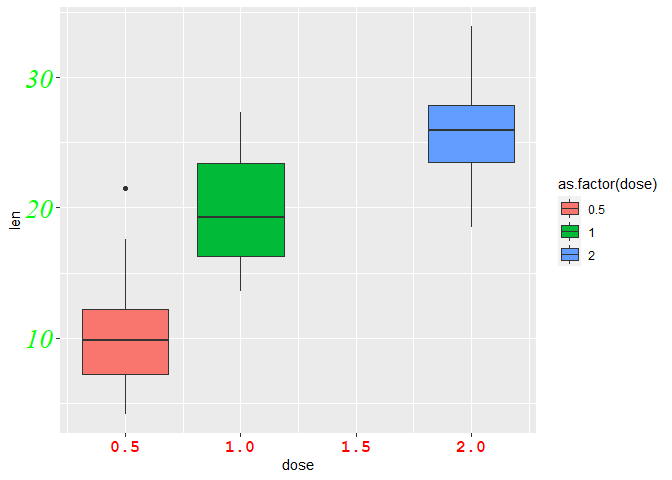<!-- -->

Información adicional de fuentes de letra:
<https://www.stat.auckland.ac.nz/~paul/R/fontfamily.pdf>

# 3. Gráfico de Radar

Utilizaremos para ello la librería **fmsb**. Para este ejemplo,
crearemos una base de datos de alumnos del colegio con sus repectivas
notas en diferentes cursos:

``` r
library(tidyverse)
```

    ## -- Attaching packages --------------------------------------------------------------------------- tidyverse 1.3.0 --

    ## v tibble  3.0.0     v dplyr   1.0.3
    ## v tidyr   1.0.2     v stringr 1.4.0
    ## v readr   1.3.1     v forcats 0.5.0
    ## v purrr   0.3.4

    ## -- Conflicts ------------------------------------------------------------------------------ tidyverse_conflicts() --
    ## x dplyr::filter() masks stats::filter()
    ## x dplyr::lag()    masks stats::lag()

``` r
Notas <- tibble::tibble(Matemática = sample(0:20 , 3 , replace=F),
                Ingles = sample(0:20 , 3, replace=F),
                Programacion.R = sample(0:20 ,3 , replace=F),
                Biología = sample(0:20 ,3 , replace=F), 
                Música = sample(0:20 ,3 , replace=F))
Notas <- as.data.frame(Notas)
rownames(Notas) <- c("Francisco", "Cesar", "Fernando")
```

Para utilizar el paquete fmsb, tenemos que añadir dos filas, con los
valores maximos y minimos de todos los valores, esto lo realizamos:

``` r
Notas1 <- rbind(rep(20,5) , rep(0,5) , Notas)
```

Luego, gráficamos el radar:

``` r
library(fmsb)
radarchart(Notas1)
```

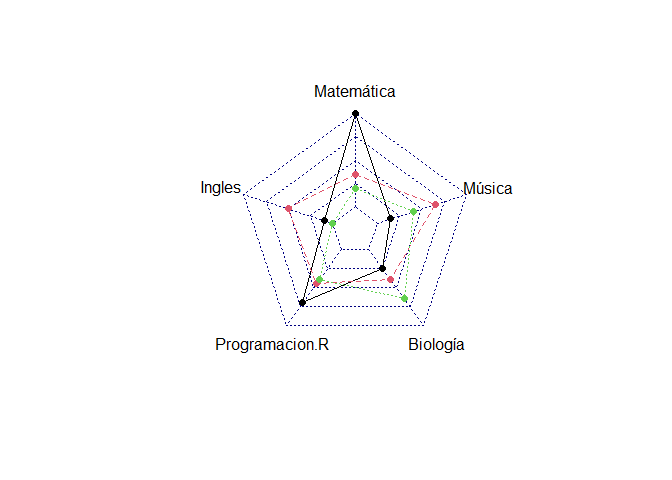<!-- -->

Podemos editar el gráfico, de la siguiente manera:

``` r
radarchart(Notas1, axistype = 1,
           pcol = c(rgb(0.2,0.5,0.5,0.9), rgb(0.8,0.2,0.5,0.9) , rgb(0.7,0.5,0.1,0.9)),
           pfcol = c( rgb(0.2,0.5,0.5,0.4), rgb(0.8,0.2,0.5,0.4) , rgb(0.7,0.5,0.1,0.4)),
           plwd = 4,
           plty = 1,
           cglcol = "grey",
           cglty = 4,
           axislabcol = "grey",
           caxislabels = seq(0,20,5),
           cglwd = 0.8,
           vlcex = 0.8)
legend(x=0.7, y=1, legend = rownames(Notas1[-c(1,2),]), bty = "n", pch=20 , col=c(rgb(0.2,0.5,0.5,0.9), rgb(0.8,0.2,0.5,0.9) , rgb(0.7,0.5,0.1,0.9)) , text.col = "grey", cex=1.2, pt.cex=3)
```

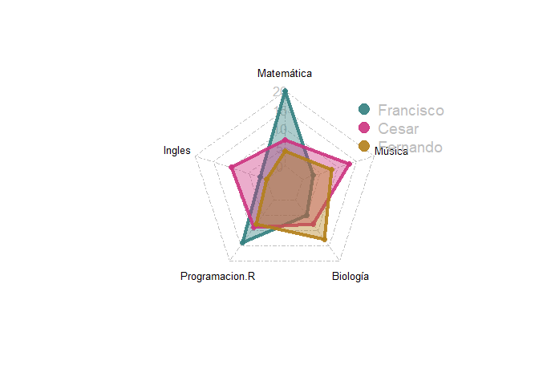<!-- -->

# 4. Paquete interesante: ggpburr

``` r
library(ggpubr)
```

Vamos a usar la base de datos de Dientes, una vez mas:

``` r
Dientes
```

    ##     X  len supp dose
    ## 1   1  4.2   VC  0.5
    ## 2   2 11.5   VC  0.5
    ## 3   3  7.3   VC  0.5
    ## 4   4  5.8   VC  0.5
    ## 5   5  6.4   VC  0.5
    ## 6   6 10.0   VC  0.5
    ## 7   7 11.2   VC  0.5
    ## 8   8 11.2   VC  0.5
    ## 9   9  5.2   VC  0.5
    ## 10 10  7.0   VC  0.5
    ## 11 11 16.5   VC  1.0
    ## 12 12 16.5   VC  1.0
    ## 13 13 15.2   VC  1.0
    ## 14 14 17.3   VC  1.0
    ## 15 15 22.5   VC  1.0
    ## 16 16 17.3   VC  1.0
    ## 17 17 13.6   VC  1.0
    ## 18 18 14.5   VC  1.0
    ## 19 19 18.8   VC  1.0
    ## 20 20 15.5   VC  1.0
    ## 21 21 23.6   VC  2.0
    ## 22 22 18.5   VC  2.0
    ## 23 23 33.9   VC  2.0
    ## 24 24 25.5   VC  2.0
    ## 25 25 26.4   VC  2.0
    ## 26 26 32.5   VC  2.0
    ## 27 27 26.7   VC  2.0
    ## 28 28 21.5   VC  2.0
    ## 29 29 23.3   VC  2.0
    ## 30 30 29.5   VC  2.0
    ## 31 31 15.2   OJ  0.5
    ## 32 32 21.5   OJ  0.5
    ## 33 33 17.6   OJ  0.5
    ## 34 34  9.7   OJ  0.5
    ## 35 35 14.5   OJ  0.5
    ## 36 36 10.0   OJ  0.5
    ## 37 37  8.2   OJ  0.5
    ## 38 38  9.4   OJ  0.5
    ## 39 39 16.5   OJ  0.5
    ## 40 40  9.7   OJ  0.5
    ## 41 41 19.7   OJ  1.0
    ## 42 42 23.3   OJ  1.0
    ## 43 43 23.6   OJ  1.0
    ## 44 44 26.4   OJ  1.0
    ## 45 45 20.0   OJ  1.0
    ## 46 46 25.2   OJ  1.0
    ## 47 47 25.8   OJ  1.0
    ## 48 48 21.2   OJ  1.0
    ## 49 49 14.5   OJ  1.0
    ## 50 50 27.3   OJ  1.0
    ## 51 51 25.5   OJ  2.0
    ## 52 52 26.4   OJ  2.0
    ## 53 53 22.4   OJ  2.0
    ## 54 54 24.5   OJ  2.0
    ## 55 55 24.8   OJ  2.0
    ## 56 56 30.9   OJ  2.0
    ## 57 57 26.4   OJ  2.0
    ## 58 58 27.3   OJ  2.0
    ## 59 59 29.4   OJ  2.0
    ## 60 60 23.0   OJ  2.0

Luego de activas ggpubr, dibujaremos un boxplot, de la siguiente manera:

``` r
ggboxplot(Dientes, x = "dose", y = "len",
                color = "dose", palette =c("#00AFBB", "#E7B800", "#FC4E07"),
                add = "jitter", shape = "dose")
```

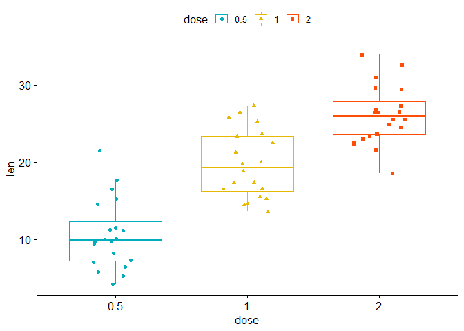<!-- -->

Este paquete, al basarse en el lenguaje de ggplot2, acepta que usemos
algunas de las funciones aprendidas. Como por ejemplo, mover la leyenda:

``` r
ggboxplot(Dientes, x = "dose", y = "len",
                color = "dose", palette =c("#00AFBB", "#E7B800", "#FC4E07"),
                add = "jitter", shape = "dose")+
  theme(legend.position = "bottom")
```

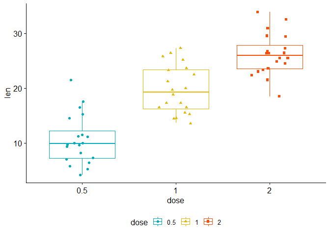<!-- -->

Calculesmos ahora el modelo y la prueba de tukey para Dientes:

``` r
ANOVA <- aov(len ~ as.factor(dose), data = Dientes)
summary(ANOVA)
```

    ##                 Df Sum Sq Mean Sq F value   Pr(>F)    
    ## as.factor(dose)  2   2426    1213   67.42 9.53e-16 ***
    ## Residuals       57   1026      18                     
    ## ---
    ## Signif. codes:  0 '***' 0.001 '**' 0.01 '*' 0.05 '.' 0.1 ' ' 1

Calculamos la prueba de Tukey:

``` r
library(rstatix)
```

    ## 
    ## Attaching package: 'rstatix'

    ## The following object is masked from 'package:stats':
    ## 
    ##     filter

``` r
TUKEY <- tukey_hsd(ANOVA)
```

**Nota**: La libreria rstatix, es una libreria que nos permite utilizar
las funciones clasicas de estadistica pero con el paquete dplyr y
operador pipe (%&gt;%), asi mismo, nos da pequeñas diferencias en los
formatos de salidas. En este ejemplo en particular, no podremos dibujar
el resultado final, sino utilizamos esta función.

Adicionalmente, algo interesante de este paquete, es que nos ofrece
colocar los p-value entre los grupos, para visualizar si es que existen
o no diferencias significativas.

``` r
ggboxplot(Dientes, x = "dose", y = "len",
                color = "dose", palette =c("#00AFBB", "#E7B800", "#FC4E07"),
                add = "jitter", shape = "dose")+
 stat_pvalue_manual(
    TUKEY, label = "p.adj", 
    y.position = c(29, 35, 39)
      )
```

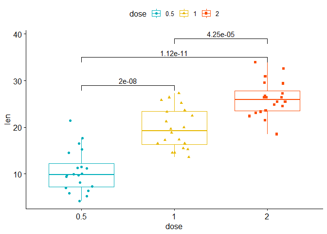<!-- -->

# 5. PCA con flechas

De la práctica \#4 de clases, quedo pendiente realizar un PCA con
flechas. Tenemos lo trabajado en la práctica:

``` r
library(dplyr)
library(tidyverse)
library(factoextra)
```

    ## Welcome! Want to learn more? See two factoextra-related books at https://goo.gl/ve3WBa

``` r
data("iris")
iris.PCA <- iris %>% select(-Species)
pca.iris <- prcomp(iris.PCA,scale=TRUE)
summary(pca.iris)
```

    ## Importance of components:
    ##                           PC1    PC2     PC3     PC4
    ## Standard deviation     1.7084 0.9560 0.38309 0.14393
    ## Proportion of Variance 0.7296 0.2285 0.03669 0.00518
    ## Cumulative Proportion  0.7296 0.9581 0.99482 1.00000

``` r
fviz_pca_ind(pca.iris, 
             geom.ind = "point", 
             pointshape = 21, 
             pointsize = 2, 
             fill.ind = iris$Species, 
             col.ind = "black", 
             palette = "jco", 
             addEllipses = TRUE, 
             label = "var", 
             col.var = "black", 
             repel = TRUE, 
             legend.title = "Especies") + 
  ggtitle("Agrupamiento por coponentes principales") + 
  theme(plot.title = element_text(hjust = 0.5))
```

<!-- -->

Para añadir las flechas, utilizamos la función **"fviz\_pca\_biplot()**:

``` r
fviz_pca_biplot(pca.iris, 
                # Fill individuals by groups
                geom.ind = "point",
                pointshape = 21,
                pointsize = 2.5,
                fill.ind = iris$Species,
                col.ind = "black",
                # Color variable by groups
                col.var = factor(c("sepal", "sepal", "petal", "petal")),
                addEllipses = TRUE,
                legend.title = list(fill = "Species", color = "Clusters"),
                repel = TRUE)
```

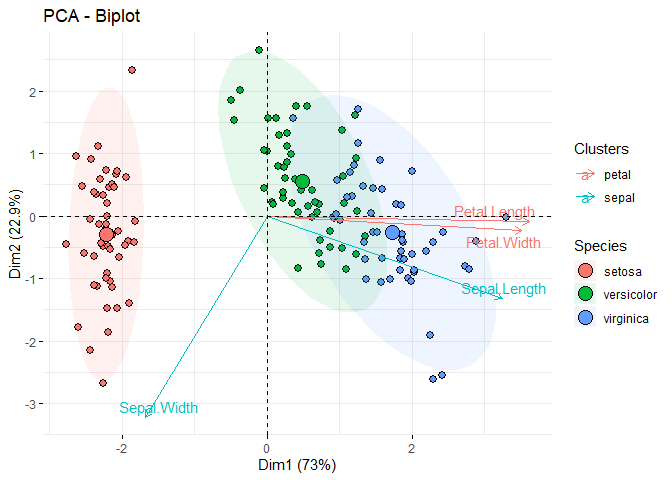<!-- -->
