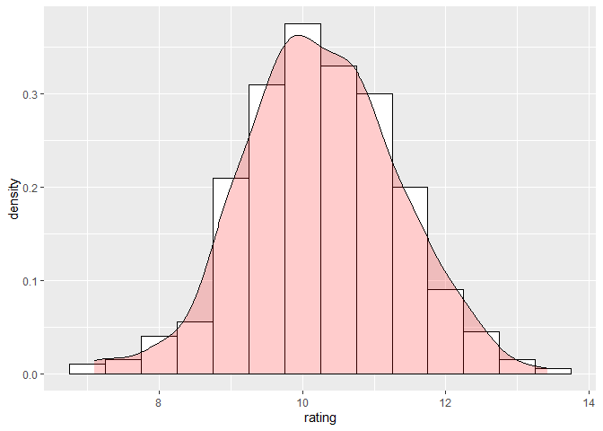

Distribuciones, estimaciones e intervalos
================

# 1. Muestreo: Aprendiendo a escribir funciones

Lamentablemente no he podido encontrar un paquete especifico para el
calculo de muestras, sin embargo encontré una pagina web con el mismo
problema con el que me encontré. En ves de seguir buscando por el
paquete ideal, en esta pagina, se plantea solucionar el problema
escribiendo su propia función para calcular el tamaño muestral
(<http://news.mrdwab.com/post/sample-size-calculator/>). Esta situación
me pareció ideal para explicarles que en R ustedes también pueden crear
sus propias funciones, que quien sabe, puede ser el comienzo para que
algún día creen sus propios paquetes para la comunidad R.

Una función esta definida por 4 zonas generales, tales como se puede
observar el la siguiente figura: [](Figuras/Funciones1.PNG)

Tenemos primero, el nombre de la función, el cual puede ser cualquiera
de su elección. Segundo tenemos que definir los parámetros o argumentos
que queramos definir en nuestra función, en esta zona también de definir
los valores que tomaran estos parámetros. Tercero, tenemos que escribir
el cuerpo de la función (donde pasa toda la acción). Por ultimo tenemos
que devolver el valor deseado en la ultima zona de la función.

Para entender esto, vamos a crear una función simple de sumatoria (si
bien ya existe una en el R básico, esta solo nos servirá para entender
como podemos crear cualquier tipo de función en R). La función de suma
que crearemos sera de la siguiente manera:

``` r
suma <- function(a, b){
  n <- a + b
  return(n)
}
```

Al momento de crear esta función y correrla en R, veremos que aparece en
nuestro ambiente (pestaña environment) una nueva función con el nombre
de suma. Ahora que esta creada podemos usarla sin problemas. Para ello,
solo debemos de escribir la nueva función suma(), y dentro de los
paréntesis pondremos 2 valores (a y b) esperados para dicha función:

``` r
suma(5,3)
```

    ## [1] 8

Si corremos esta función, veremos que efectivamente nuestra nueva
función suma hace lo que le programamos que haga. El nombre de la
función es “suma”, los argumentos o parámetros son a y b, el cuerpo de
la función es n &lt;- a + b. Y por ultimo, tenemos que el valor de
retorno es return(n).

Saber crear una función en R, abre posibilidades inimaginables, ustedes
pueden crear un paquete para un análisis especifico o un nuevo modelo
que quieran crear. En este caso, pararemos en este punto para proseguir
con copiar las funciones que crearon en la pagina web compartida y ver
como podríamos crear nuestras funciones para todos los casos de tamaño
muestral aprendidas en clase.

## 1.1. Funcion para un muestreo simple de una proporcion con poblacion infinita (o finita)

La función que se creo es la siguiente:

``` r
samp.size = function(z.val, margin, c.interval, population) {
    ss = (z.val^2 * margin * (1 - margin))/(c.interval^2)
    return(ss/(1 + ((ss - 1)/population)))
}
```

Pueden evaluar cada uno de los puntos, argumentos, cuerpo de la función,
basados en la formula aprendida en clase:
[](Figuras/muestreo.proporcion1.PNG)

Pueden dedicar todo el tiempo para evaluar que se hizo en la función,
pero ahora vamos a concentrarnos en como usarla. Para ello vamos a
probar con un ejemplo realizado en clase:

Queremos estimar la proporción de votantes que están insatisfechos con
una medida política. No conocemos la proporción poblacional (es
desconocida) Se asume un muestro aleatorio simple de una población de
tamaño infinito Se admite un error de estimación del 2 y un nivel de
significancia del 5 Determinar el tamaño de la muestra. El resultado que
obtuvimos en clase era de: 93. Veamos cuanto nos sale utilizando la
función creada.

``` r
samp.size(z.val =1.96, margin = 0.5, c.interval = 0.02, 10000000)
```

    ## [1] 2400.424

El resultado es el mismo obtenido en clase (2401 si se redondea hacia
arriba). Como se darán cuenta el tamaño muestra se ha colocado a partir
de 10 millones para arriba (lo cual pueden considerar como población
infinita). Pueden jugar con el valor de la población para ver como
impacta en el muestreo. De esta manera también pueden crear una función
para cada uno de los tipos de muestreo aprendidos en clase.

En cuanto a como calcular el tamaño muestral para un estimado
cuantitativo como la media, pueden crear una función, aunque también hay
muchas calculadoras en la web que pueden configurar fácilmente. Una de
estas se comparte a continuación:

-   <https://www.checkmarket.com/sample-size-calculator/>

## 1.2 Paquete samplingbook, funciones para muestreo aleatorio simple:

Terminando esta sesión logre encontrar una librería o paquete llamado
“samplingbook”. En esta hay dos funciones interesantes que nos permiten
calcular el tamaño muestral para muestreos aleatorios simples para la
media y proporciones. Estas funciones son:

-   sample.size.mean()
-   sample.size.prop()

Dejo así mismo la documentación del paquete
<https://www.rdocumentation.org/packages/samplingbook/versions/1.2.2> Al
parecer estas formulas serian muy parecidas a la creada anteriormente.
Sin embargo, estas son solo para aquellos casos donde se trata de un
muestreo aleatorio simple(MAS). En el caso de muestreos aleatorios
sistemáticos, estratificado o por conglomerados, se tendrían que crear
nuevas funciones en función a la teoría aprendida en clase. Adicional
mente, estas funciones si consideran en su formula, si conocemos
inicialmente la varianza (siendo parte de los argumentos).

# 2. Estimaciones: Paquete MASS, funcion fitdistr()

Comience siempre por instalar el paquete MASS y luego activarlo (si ya
lo tiene instalado, solo actívelo)

``` r
library(MASS)
```

La función fitdistr() utiliza el método de la máxima verosimilitud para
obtener las estimaciones puntuales en R. Esta función espera un primer
argumento “x” que es la muestra (un vector numérico, una variable, una
columna de valores, etc.). Así mismo también espera que le digamos el
nombre de la distribución, dentro de ellos podemos darle los nombre
siguientes:

-   chi-squared
-   exponential
-   f
-   geometric
-   lognormal
-   normal
-   poisson
-   binomial

Si fitdistr() no dispone de una formula cerrada para el estimador de
algún parámetro, la misma función usará un algoritmo numérico para
aproximarlo, que requiere de un valor inicial para arrancar. Este valor
(o valores) se puede especificar en la función inicial, utilizando el
argumento start =.

##### Ejemplo 1:

Tenemos una muestra de tamaño 50, de una variable de Poisson de
**parámetro** lambda igual a 5. (Para crear bases de datos con
distribuciones especificas puede ver el ANEXO 1 de este documento).

``` r
set.seed(1)
muestra.poisson <- rpois(50, lambda = 5)

muestra.poisson
```

    ##  [1]  4  4  5  8  3  8  9  6  6  2  3  3  6  4  7  5  6 11  4  7  9  3  6  3  4
    ## [26]  4  1  4  8  4  5  5  5  3  7  6  7  2  6  4  7  6  7  5  5  7  1  5  6  6

Observamos que se ha creado un conjunto de 50 valores que se distribuyen
a través de una distribución de Poisson con valor de lambda igual a 5.

La tarea ahora es estimar el valor del parámetro lambda (poblacional) a
partir de la muestra anterior. Para ello, utilizaremos la función
fitdistr()

``` r
fitdistr(muestra.poisson, densfun = "poisson")
```

    ##     lambda  
    ##   5.2400000 
    ##  (0.3237283)

La función fitdistr() nos ha dado el valor de 4.24, valor que se
aproxima al valor real de 5, con un error estándar de 0.32.

##### Ejemplo 2:

¿Qué estimaciones hubiésemos obtenido de la media poblacional y la
desviación estándar poblacional si suponemos una distribución normal?

``` r
set.seed(1)
muestra.normal <- rnorm(50, mean=0, sd = 1)
muestra.normal
```

    ##  [1] -0.62645381  0.18364332 -0.83562861  1.59528080  0.32950777 -0.82046838
    ##  [7]  0.48742905  0.73832471  0.57578135 -0.30538839  1.51178117  0.38984324
    ## [13] -0.62124058 -2.21469989  1.12493092 -0.04493361 -0.01619026  0.94383621
    ## [19]  0.82122120  0.59390132  0.91897737  0.78213630  0.07456498 -1.98935170
    ## [25]  0.61982575 -0.05612874 -0.15579551 -1.47075238 -0.47815006  0.41794156
    ## [31]  1.35867955 -0.10278773  0.38767161 -0.05380504 -1.37705956 -0.41499456
    ## [37] -0.39428995 -0.05931340  1.10002537  0.76317575 -0.16452360 -0.25336168
    ## [43]  0.69696338  0.55666320 -0.68875569 -0.70749516  0.36458196  0.76853292
    ## [49] -0.11234621  0.88110773

Utilizamos la función fitdistr() para estimar el valor de la media.

``` r
fitdistr(muestra.normal, densfun = "normal")
```

    ##      mean         sd    
    ##   0.1004483   0.8230380 
    ##  (0.1163952) (0.0823038)

Vemos que la media estimada tiene un valor de 0.1004 y la desviación
estándar 0.82, ambos con sus respectivos errores.

La función fitdistr() del paquete MASS, sirve para calcular los
estimadores máximo verosímiles (puntuales) de los parámetros de una
distribución a partir de una muestra.

##### Ejemplo realizado en clase:

Asumamos que una variable aleatoria X que sigue una distribución
exponencial con el parámetro lambda. Una muestra aleatoria de 10
unidades es sacada de la población, la data se puede ver en la siguiente
tabla. Calcular el valor estimado para lambda (crearemos los valores de
la tabla en el vector1):

``` r
vector <- c(5.4, 9.8, 6.3, 7.9, 9.2, 10.7, 12.5, 15.0, 13.9, 17.2)
fitdistr(vector, densfun = "exponential")
```

    ##       rate   
    ##   0.09267841 
    ##  (0.02930749)

# 3. Intervalos de confianza: Paquete DescTools

## 3.1 Intervalos de confianza para la media poblacional

Para hallar los intervalos de confianza para la media utilizaremos la
función MedianCI() del paquete DescTools.

##### Ejemplo:

Quisiéramos estimar el tiempo de procesamiento promedio de una cierta
pieza de un automóvil. Sabemos que la desviación estándar es igual a
1.2. Para realizar esta estimación, una muestra aleatoria de 400 partes
ha sido colectada, obteniéndose una media de 5.4 horas en promedio para
la producción de dicha pieza. De esta manera, construya al 95% de
confianza el intervalo de confianza de la media poblacional.

En el problema nos brindan el valor de la media muestral. Sin embargo,
en la vida real hay que calcularla de una base de datos. Esta base de
datos vamos a crearla con una distribución normal (la que utilizamos
para hacer estos estimados)

``` r
Piezas.Automovil <- rnorm(1:400, mean = 5.40, sd = 1.2)
```

Hemos creado una muestra de 400 elemento (n), con una media de 5.4
(mean) y una desviación estándar de 1.2 (sd). Ahora calcularemos con la
ayuda de MedianCI(), los intervalos de confianza:

``` r
library(DescTools)
mean(Piezas.Automovil)
```

    ## [1] 5.412437

``` r
MedianCI(Piezas.Automovil, conf.level = 0.95, sides = "two.sided", method = "exact")
```

    ##   median   lwr.ci   upr.ci 
    ## 5.342835 5.202749 5.489210 
    ## attr(,"conf.level")
    ## [1] 0.9597693

Esta función no solo nos brinda los intervalos de confianza de la media,
sino que así mismo nos brinda la estimación puntual del valor de la
media poblacional.

La documentación de la función MedianCI() la pueden encontrar en el
siguiente link:
<https://www.rdocumentation.org/packages/DescTools/versions/0.99.39/topics/MeanCI>

##### **Nota**: Existen pequeñas diferencias con el ejemplo realizado en clase debido a un componente de aleatoridad al momento de crear la data. No considerar estas diferencias como un error en la funcion.

## 3.2 Intervalos de confianza para la proporción poblacional

Para este caso utilizaremos la función binomCI() del paquete
“DescTools”. Pasamos inmediatamente al ejemplo.

##### Ejemplo:

Una fabrica descubrió que la proporción de los productos defectuosos, en
la producción de 1000 piezas de una computadora, es de 230. Construir,
con un nivel de confianza del 95% los intervalos de confianza para la
verdadera proporción de los productos defectuosos.

Para este caso, no hay necesidad de crear una base de datos especial, ya
que podemos colocar los datos que nos da el problema directamente en la
formula. En una base de datos real, de tipo binaria, habría que contar
el numero de éxitos para determinarlo y colocarlo en la formula (en el
caso del ejemplo es 230). De esta manera, utilizamos BinomCI():

``` r
BinomCI(230, 1000, conf.level = 0.95)
```

    ##       est    lwr.ci    upr.ci
    ## [1,] 0.23 0.2049797 0.2570868

Como el ejemplo anterior, el resultado no solo nos brindara los
intervalos de confianza, sino que también nos devolverá de la proporción
poblacional estimada a partir de la muestra realizada.

La documentación de la función VarCI() la pueden encontrar en el
siguiente link:
<https://www.rdocumentation.org/packages/DescTools/versions/0.99.39/topics/BinomCI>

## 3.3 Intervalos de confianza para la varianza poblacional

En este caso utilizaremos la función VarCI() del paquete “DescTools”.
Pasamos inmediatamente al ejemplo.

##### Ejemplo:

Considere la población de estudiantes de la carrera de administración de
negocios y la edad de sus estudiantes como la variable de interés. Se
obtiene una muestra de 101 alumnos de una población normal y con un
valor de la varianza de 18.22. Construya el intervalo de confianza al
nivel de confianza del 90% para la varianza poblacional.

Construimos la base de datos primero:

``` r
desviacion.estandar <- sqrt(18.22)
Edad.estudiantes <- rnorm(1:101, sd=desviacion.estandar)
```

Utilizamos la función VarCI() para hallar los intervalos de confianza:

``` r
VarCI(Edad.estudiantes, method = "norm", conf.level = 0.9)
```

    ##      var   lwr.ci   upr.ci 
    ## 21.64265 15.83924 27.64859

Como hemos visto anteriormente, el resultado no solo nos brindara los
intervalos de confianza, sino que también nos devolverá de la varianza
poblacional estimada a partir de la muestra realizada.

La documentación de la función VarCI() la pueden encontrar en el
siguiente link:
<https://www.rdocumentation.org/packages/DescTools/versions/0.99.39/topics/VarCI>

# 4. Como graficar distribuciones con ggplot2

Recordar que para realizar una gráfica de distribuciones de variables
continuas, necesitamos utilizar un gráfico de tipo histograma. Para
graficar un histograma, fabricamos una base de datos de tipo tibble con
400 unidades observacionales (filas), 200 de ellas de tipo A y 200 de
ellas tipo B. Así mismo nos aseguramos que ambas categorías tengan una
distribución normal, pero con una pequeña diferencia en sus medias.
Llamaremos a esta base de datos, “Data” (establecemos una semilla para
que nos salga siempre el mismo resultado a todos, ya que al crear una
distribución normal, esta se crea aleatoriamente):

``` r
library(tidyverse)
```

    ## Warning: package 'tidyverse' was built under R version 4.0.3

    ## -- Attaching packages ---------------------------------------------------------------------------------------------- tidyverse 1.3.0 --

    ## v ggplot2 3.3.3     v purrr   0.3.4
    ## v tibble  3.0.0     v dplyr   1.0.0
    ## v tidyr   1.0.2     v stringr 1.4.0
    ## v readr   1.3.1     v forcats 0.5.0

    ## Warning: package 'ggplot2' was built under R version 4.0.3

    ## -- Conflicts ------------------------------------------------------------------------------------------------- tidyverse_conflicts() --
    ## x dplyr::filter() masks stats::filter()
    ## x dplyr::lag()    masks stats::lag()
    ## x dplyr::select() masks MASS::select()

``` r
set.seed(1234)
Data <- tibble(cond = factor(rep(c("A","B"), each=200)), 
                  rating = c(rnorm(200, mean = 10),rnorm(200, mean=10.5)))
```

Para observar la distribución de esta data utilizaremos un histograma,
de la siguiente manera:

``` r
ggplot(Data, aes(x=rating)) + 
  geom_histogram(binwidth=0.8)
```

<!-- -->

Podemos cambiar los colores para una mejor visualización:

``` r
ggplot(Data, aes(x=rating)) +
  geom_histogram(binwidth=.5, colour="black", fill="white")
```

<!-- -->

Los histogramas ya nos permiten ver la distribución, pero esta
distribución se podría ver mucho mejor si dibujamos la curva continua,
esto se logra con una nueva función de densidad de ggplot
(geom\_density()), como veremos a continuación:

``` r
ggplot(Data, aes(x=rating)) + geom_density()
```

<!-- -->

Al igual que el histograma, podemos realizar variaciones e incluso
colocar los dos gráficos superpuestos:

``` r
ggplot(Data, aes(x=rating)) + 
  geom_histogram(aes(y=..density..),  
                 binwidth=.5,
                 colour="black", fill="white") +
  geom_density(alpha=.2, fill="red") 
```

<!-- -->

Con la función geom\_vline() de ggplot2, también podemos evidenciar por
donde corta la media de la población:

``` r
ggplot(Data, aes(x=rating)) +
  geom_histogram(binwidth=.5, colour="black", fill="white") +
  geom_vline(aes(xintercept=mean(rating, na.rm=T)),   
             color="red", linetype="dashed", size=1)
```

<!-- -->

##### ¿Pero para que creamos una base de datos con dos categorias?

Se habrán percatado que tenemos una categoría A y B en nuestra base de
datos “Data”. En una base de datos real, la categorías son muy comunes,
y poder visualizar la distribución de cada categoría en un gráfico nos
puede brindar mucha información acerca del comportamiento de nuestros
datos. De esta manera, vamos a graficar tanto histogramas, como curvas
de densidad para las dos categorías en el mismo gráfico:

Histograma:

``` r
ggplot(Data, aes(x=rating, fill=cond)) +
    geom_histogram(binwidth=.5, alpha=.5, position="identity")
```

<!-- -->

Curva de densidad:

``` r
ggplot(Data, aes(x=rating, fill=cond)) + geom_density(alpha=.3)
```

<!-- -->

##### ANEXO 1

###### 1. Distribucion Normal

-   rnorm(n, mean = 0, sd = 1) Donde:
-   n es el numero de observaciones
-   mean es el valor de la media poblacional
-   sd, es la desviación estándar poblacional
    <https://www.rdocumentation.org/packages/stats/versions/3.6.2/topics/Normal>

###### 2. Distribucion Poisson

-   rpois(n, lambda) Donde:
-   n, número de valores aleatorios de regreso
-   lambda, valor de lambda (se espera un vector)
    <https://www.rdocumentation.org/packages/stats/versions/3.6.2/topics/Poisson>

###### 3. Distribucion Binomial

-   rbinom(n, size, prob) Donde:
-   n, numero de observaciones
-   size, es el numero de pruebas realizadas (cero o más)
-   prob, probabilidad de exito para cada prueba realizada
    <https://www.rdocumentation.org/packages/stats/versions/3.6.2/topics/Binomial>

###### 4. Distribucion Exponencial

-   rexp(n, rate = 1) Donde:
-   n, numero de observaciones
-   rate, tasa de vectores
    <https://www.rdocumentation.org/packages/stats/versions/3.6.2/topics/Exponential>

###### 5. Distribucion Chi-cuadrado

-   rchisq(n, df, ncp = 0) Donde:
-   n, numero de observaciones
-   df, grados de libertad
-   ncp, parámetro de no centralidad (no negativo)
    <https://www.rdocumentation.org/packages/stats/versions/3.6.2/topics/Chisquare>

###### 6. Distribucion F (fisher)

-   rf(n, df1, df2, ncp) Donde:
-   n, numero de observaciones
-   df1, grados de libertad
-   df2, grados de libertad
-   ncp, parámetros no centrales (si se omite, se asume la distribución
    central de F)
    <https://www.rdocumentation.org/packages/stats/versions/3.6.2/topics/FDist>

###### 7. Distribucion t-Student

-   rt(n, df, ncp) Donde:
-   n, numero de observaciones
-   df, grados de libertad
-   ncp, parámetros no centrales (si se omite, se asume la distribución
    central de t)
    <https://www.rdocumentation.org/packages/stats/versions/3.6.2/topics/TDist>

##### ANEXO 2: Paginas web de interes

-   Interesante aplicación web para entender la distribución normal:
    <https://azures.shinyapps.io/normdist/>

-   Interesante aplicación web donde podremos entender a través de
    simulaciones el teorema del límite central para medias:
    <https://istats.shinyapps.io/sampdist_cont/>

-   Interesante aplicación web para entender la distribución normal y el
    teorema del límite central para medias:
    <https://openintro.shinyapps.io/CLT_mean/>

-   Interesante aplicación web para entender el teorema del límite
    central para proporciones:
    <https://openintro.shinyapps.io/CLT_prop/>

-   Interesante aplicación web para entender el comportamiento y
    interpretación de las funciones de densidad de probabilidad de
    diferentes distribuciones:
    <https://openintro.shinyapps.io/dist_calc/>

-   Para investigar, pagina web con diferentes aplicaciones creadas en
    R, de diferentes temas de estadística:
    <https://artofstat.com/web-apps>

-   Para futuro: interesante aplicación web para entender la regresión
    lineal simple: <https://openintro.shinyapps.io/slr_diag/>

##### ANEXO 3: Simulacion de creacion de intervalos.

A continuación simularemos un escenario para entender el concepto de
intervalos de confianza y los niveles de confianza. Consideramos una
población de 1000000 valores con una distribución normal de parámetros
mu 1.5 y desviación estándar (sigma) igual a 1. La construimos:

``` r
set.seed(1)
mu <- 1.5
sigma <- 1
alpha <- 0.05
Poblacion <- rnorm(10^6, mu, sigma)
head(Poblacion)
```

    ## [1] 0.8735462 1.6836433 0.6643714 3.0952808 1.8295078 0.6795316

Ahora vamos a generar 100 muestreos aleatorios simples de tamaño 50 de
dicha población para posteriormente generar un intervalo de confianza al
95% para el parámetro mu para cada muestra.

Primero definiremos una función para que, dada una muestra, un valor
sigma y un nivel de significancia alfa nos genere el intervalo
correspondiente para el parámetro mu al nivel de confianza
100\*(1-alpha)%. Lo llamaremos ICZ:

``` r
ICZ <- function(x, sigma, alpha){
  c(mean(x)-qnorm(1-alpha/2)*sigma/sqrt(length(x)),
    mean(x)+ qnorm(1-alpha/2)*sigma/sqrt(length(x)))
}
```

Usando la función replicate() de R generaremos la muestras y los
intervalos de confianza correspondientes usando la función anterior:

``` r
set.seed(1074)
M <- replicate(100, ICZ(sample(Poblacion, 50, replace = T),
                        sigma, alpha))
```

El objeto M de R es una matriz de 2 filas y 100 columnas donde la
columna i-esima representa el intervalo de confianza para la muestra
i-esima generada.

Finalmente vamos a dibujar todos los intervalos anteriores y
resaltaremos el color rojo aquellos en los que el parámetro mu es igual
a 1.5 no este en ellos. Esperamos que haya aproximadamente 5 en los que
esta condición falle.

<!-- -->
\#\#\#\#\# **Nota**: En el ANEXO 2 podra encontrar un número variado de
aplicaciones web que puedan ayudarlo a entender el concepto de
distribuciones y para que sirven (complemento de lo realizado en clase).
